# **Microsoft Azure Fundamentals Course**

Información resumida de [Adam Marczak - Azure for Everyone](https://www.youtube.com/channel/UCdmEIMC3LBil4o0tjaTbj0w) y [Microsoft Learn AZ-900 Contenido Autodirigido](https://docs.microsoft.com/es-es/learn/certifications/exams/az-900)

## **Temario**
- [**Microsoft Azure Fundamentals Course**](#microsoft-azure-fundamentals-course)
  - [**Temario**](#temario)
  - [**Cloud Computing y Conceptos clave**](#cloud-computing-y-conceptos-clave)
    - [**Cloud Computing**](#cloud-computing)
    - [**Conceptos clave**](#conceptos-clave)
  - [**Recorrido rápido por los servicios generales de Azure**](#recorrido-rápido-por-los-servicios-generales-de-azure)
    - [**Process**](#process)
    - [**Network**](#network)
    - [**Storage**](#storage)
    - [**Databases**](#databases)
    - [**Web**](#web)
    - [**IoT**](#iot)
    - [**Macrodata**](#macrodata)
    - [**AI**](#ai)
    - [**DevOps**](#devops)
  - [**Principios de economía de escala**](#principios-de-economía-de-escala)
  - [**CapEx vs OpEx y sus diferencias**](#capex-vs-opex-y-sus-diferencias)
  - [**Modelo basado en el consumo**](#modelo-basado-en-el-consumo)
  - [**IaaS vs PaaS vs SaaS Modelo de servicio cloud**](#iaas-vs-paas-vs-saas-modelo-de-servicio-cloud)
    - [**Matriz de responsabilidad**](#matriz-de-responsabilidad)
  - [**Modelos de implementación de nube pública, privada e híbrida**](#modelos-de-implementación-de-nube-pública-privada-e-híbrida)
    - [**Nube pública**](#nube-pública)
    - [**Nube privada**](#nube-privada)
    - [**Nube híbrida**](#nube-híbrida)
  - [**Geografía, Regiones y Zonas de disponibilidad**](#geografía-regiones-y-zonas-de-disponibilidad)
    - [**Data Center**](#data-center)
    - [**Región**](#región)
    - [**Zona de disponibilidad**](#zona-de-disponibilidad)
    - [**Conjunto de disponibilidad**](#conjunto-de-disponibilidad)
    - [**Pares de regiones**](#pares-de-regiones)
    - [**Geografías**](#geografías)
  - [**Resources, Resources Groups y Resource Manager**](#resources-resources-groups-y-resource-manager)
    - [**Resource**](#resource)
    - [**Resources Groups (Grupo de recursos)**](#resources-groups-grupo-de-recursos)
    - [**Resource Manager (Administrador de recursos)**](#resource-manager-administrador-de-recursos)
    - [**Información adicional**](#información-adicional)
  - [**Servicios de cómputo**](#servicios-de-cómputo)
    - [**Virtualización**](#virtualización)
    - [**Azure Virtual Machine (Máquina virtual)**](#azure-virtual-machine-máquina-virtual)
    - [**Azure Virtual Machine Scale Sets (Conjuntos de escalado de máquinas virtuales)**](#azure-virtual-machine-scale-sets-conjuntos-de-escalado-de-máquinas-virtuales)
    - [**Azure Batch**](#azure-batch)
    - [**Azure Virtual Desktop**](#azure-virtual-desktop)
    - [**Contenedores**](#contenedores)
    - [**Azure Containers Instance (Instancias de contenedores)**](#azure-containers-instance-instancias-de-contenedores)
    - [**Azure Kubernetes Services (AKS)**](#azure-kubernetes-services-aks)
    - [**Azure App Service**](#azure-app-service)
    - [**Azure Functions**](#azure-functions)
    - [**Resumen**](#resumen)
  - [**Servicios de red**](#servicios-de-red)
    - [**Azure Networking (Redes Azure)**](#azure-networking-redes-azure)
    - [**Azure Virtual Network (Red virtual)**](#azure-virtual-network-red-virtual)
    - [**Azure VPN Gateway**](#azure-vpn-gateway)
    - [**Azure Load Balancer (Equilibrador de carga)**](#azure-load-balancer-equilibrador-de-carga)
    - [**Azure Application Gateway**](#azure-application-gateway)
    - [**Azure Content Delivery Network (Red de entrega de contenidos)**](#azure-content-delivery-network-red-de-entrega-de-contenidos)
  - [**Servicios de almacenamiento**](#servicios-de-almacenamiento)
    - [**Tipos de datos**](#tipos-de-datos)
    - [**Storage Account (Cuenta de almacenamiento)**](#storage-account-cuenta-de-almacenamiento)
    - [**Blob Storage (Almacenamiento de blobs)**](#blob-storage-almacenamiento-de-blobs)
    - [**Queue Storage (Almacenamiento en cola)**](#queue-storage-almacenamiento-en-cola)
    - [**Table Storage (Almacenamiento de tablas)**](#table-storage-almacenamiento-de-tablas)
    - [**File Storage (Almacenamiento de archivos)**](#file-storage-almacenamiento-de-archivos)
    - [**Disk Storage (Almacenamiento de disco)**](#disk-storage-almacenamiento-de-disco)
  - [**Servicios de bases de datos**](#servicios-de-bases-de-datos)
    - [**Tipos de datos en las BD**](#tipos-de-datos-en-las-bd)
    - [**Azure Cosmos DB**](#azure-cosmos-db)
    - [**Azure SQL Database**](#azure-sql-database)
    - [**Azure SQL product family**](#azure-sql-product-family)
  - [**Azure Marketplace**](#azure-marketplace)
  - [**Servicios IoT**](#servicios-iot)
    - [**Azure IoT Hub**](#azure-iot-hub)
    - [**Azure IoT Central**](#azure-iot-central)
    - [**Azure Sphere**](#azure-sphere)
  - [**Servicios Big Data & Analytics**](#servicios-big-data--analytics)
    - [**Azure Synapse Analytics**](#azure-synapse-analytics)
    - [**Azure HDInsight**](#azure-hdinsight)
    - [**Azure Databricks**](#azure-databricks)
  - [**Servicios de IA**](#servicios-de-ia)
    - [**Azure Machine Learning**](#azure-machine-learning)
  - [**Servicios serverless computing**](#servicios-serverless-computing)
    - [**Azure Functions**](#azure-functions-1)
    - [**Azure Logic Apps**](#azure-logic-apps)
    - [**Azure Event Grid**](#azure-event-grid)
  - [**Soluciones DevOps**](#soluciones-devops)
    - [**Azure DevOps**](#azure-devops)
    - [**Azure DevTest Labs**](#azure-devtest-labs)
  - [**Azure Tools**](#azure-tools)
    - [**Azure Portal**](#azure-portal)
    - [**Azure PowerShell**](#azure-powershell)
    - [**Azure CLI**](#azure-cli)
    - [**Azure Cloud Shell**](#azure-cloud-shell)
  - [**Azure Advisor**](#azure-advisor)
  - [**Grupos de seguridad Azure**](#grupos-de-seguridad-azure)
    - [**Grupos de seguridad de red**](#grupos-de-seguridad-de-red)
    - [**Grupos de seguridad de aplicaciones**](#grupos-de-seguridad-de-aplicaciones)
  - [**Rutas definidas por el usuario (UDR) con tablas de rutas**](#rutas-definidas-por-el-usuario-udr-con-tablas-de-rutas)
    - [**Enrutamiento(Routing)**](#enrutamientorouting)
    - [**User-defined Routes(UDR)**](#user-defined-routesudr)
  - [**Azure Firewall**](#azure-firewall)
  - [**Azure DDoS Protección**](#azure-ddos-protección)
  - [**Azure Identity Services**](#azure-identity-services)
    - [**Identidad**](#identidad)
    - [**Autenticación**](#autenticación)
    - [**Autorización**](#autorización)
    - [**Gestión de Acceso**](#gestión-de-acceso)
    - [**Azure AD**](#azure-ad)
    - [**Autenticación multifactor (MFA)**](#autenticación-multifactor-mfa)
  - [**Azure Security Center**](#azure-security-center)
  - [**Azure Sentinel**](#azure-sentinel)
  - [**Azure Key Vault**](#azure-key-vault)
  - [**Azure Dedicated Host**](#azure-dedicated-host)
  - [**Azure Role-based Access Control (RBAC)**](#azure-role-based-access-control-rbac)
  - [**Azure Resource Locks**](#azure-resource-locks)
  - [**Azure Resource Tags**](#azure-resource-tags)
  - [**Azure Policy**](#azure-policy)
  - [**Azure Blueprints**](#azure-blueprints)
  - [**Cloud Adoption Framework for Azure**](#cloud-adoption-framework-for-azure)
    - [**Adopción de la nube**](#adopción-de-la-nube)
    - [**Marco de adopción de la nube**](#marco-de-adopción-de-la-nube)
    - [**Estrategía**](#estrategía)
    - [**Plan**](#plan)
    - [**Comienzo**](#comienzo)
    - [**Adopción**](#adopción)
    - [**Gobierno y Administración**](#gobierno-y-administración)
    - [**Organizar**](#organizar)
  - [**Core tenets of Security,Privacy,Compliance(Trust Center,DPA,OST y más)**](#core-tenets-of-securityprivacycompliancetrust-centerdpaost-y-más)
    - [**Regiones soberanas de Azure**](#regiones-soberanas-de-azure)
  - [**Cost Affecting Factors**](#cost-affecting-factors)
  - [**Cost Reduction Methods, Reservations, Hybrid benefit, Spot VM, Pricing y TCO**](#cost-reduction-methods-reservations-hybrid-benefit-spot-vm-pricing-y-tco)
    - [**Reservaciones en Azure**](#reservaciones-en-azure)
    - [**Máquinas virtuales al contado de Azure**](#máquinas-virtuales-al-contado-de-azure)
    - [**Beneficio de uso híbrido**](#beneficio-de-uso-híbrido)
    - [**Herramientas**](#herramientas)
  - [**Azure Cost Managment**](#azure-cost-managment)
    - [**Administración de costos de Azure**](#administración-de-costos-de-azure)
    - [**Minimización de costos en Azure**](#minimización-de-costos-en-azure)
  - [**SLA y Composite SLA en Azure**](#sla-y-composite-sla-en-azure)
    - [**Formulas**](#formulas)
    - [**Elementos clave**](#elementos-clave)
  - [**Ciclo de vida de un servicio en Azure | Public preview and General availability**](#ciclo-de-vida-de-un-servicio-en-azure--public-preview-and-general-availability)
    - [**Ciclo de vida del servicio**](#ciclo-de-vida-del-servicio)
    - [**Información clave de vista previa pública**](#información-clave-de-vista-previa-pública)

## **Cloud Computing y Conceptos clave**
### **Cloud Computing**
**Cloud Computing o Informática en la nube** es un modelo de prestación de servicios a través de internet (nube). Esto incluye pero no se limita a
- **Compute power** - Es decir, servidores como Windows, Linux, entornos de alojamiento, etc.
- **Storage** - Como archivos y/o bases de datos
- **Networking** - En **Azure** pero también fuera cuando se conecta a la red de su empresa
- **Analytics** - Servicios de visualización y datos de telemetría  
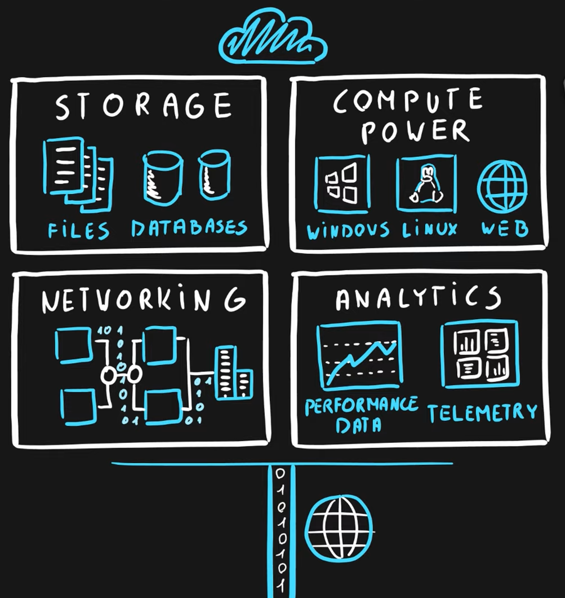

### **Conceptos clave**
**Notará una similitud en Scalability y Elasticity. Pero la diferencia radica en que Scalability es una propiedad de los recursos que ofrece Azure y Elasticity es la gestión dinámica(o también automática) que ofrece Azure usando la propiedad Scalability de los recursos**

- **Scalability** - Es la capacidad de escalar, así que asigna y desasigna recursos en cualquier momento.  
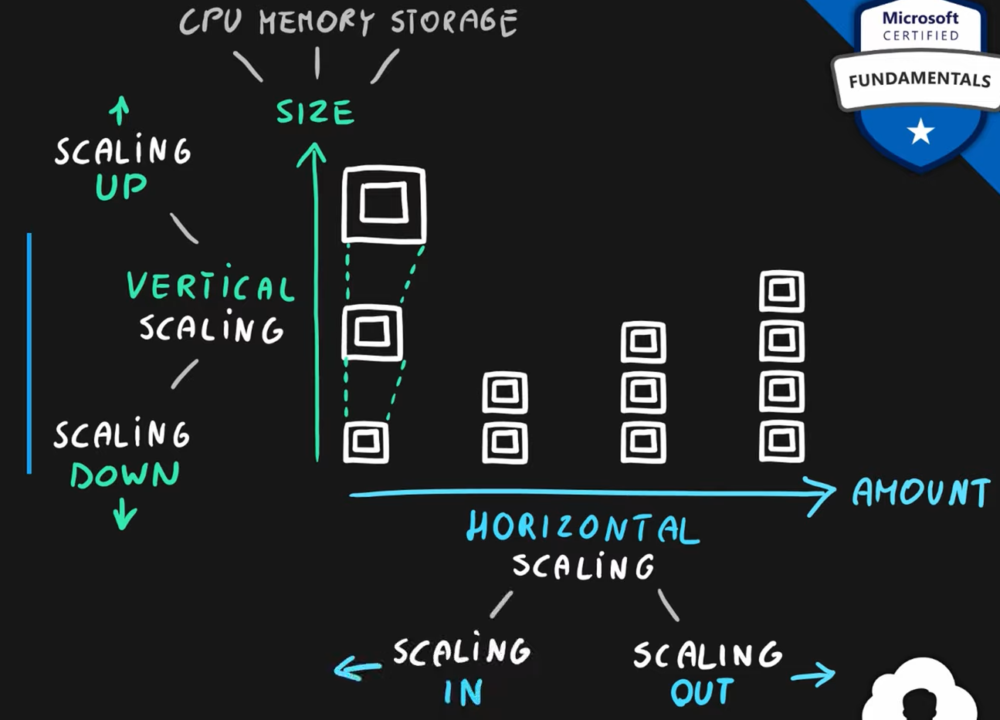

- **Elasticity** - Es la capacidad de escalar dinámicamente.  
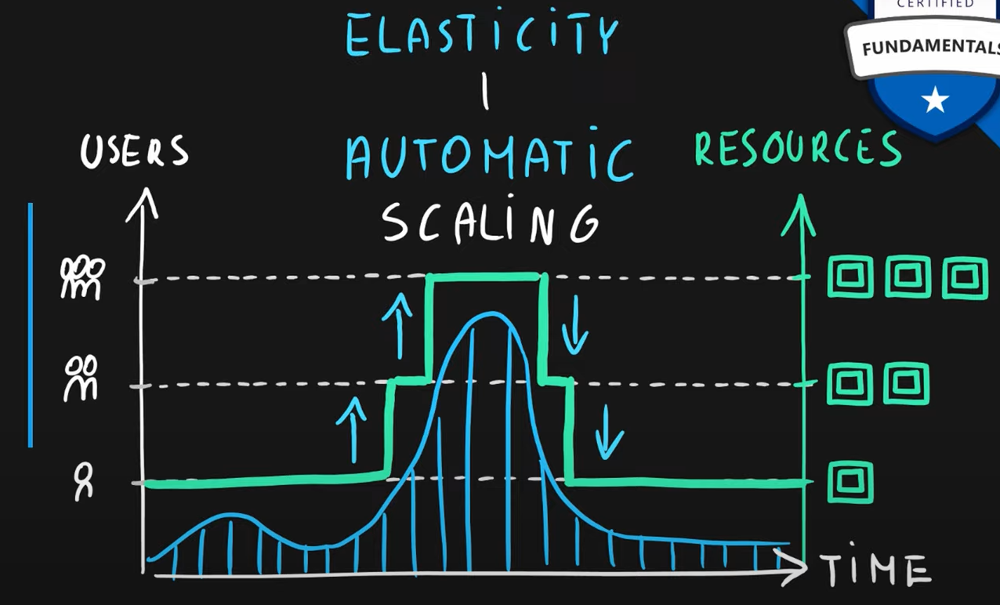

- **Agility** - Es la capacidad de reaccionar rápido (escala rápidamente).  
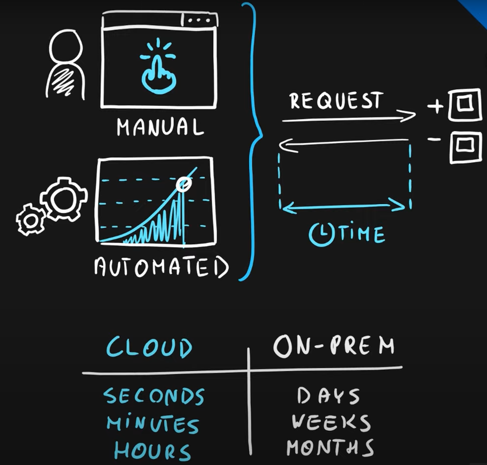

- **Fault tolerance** - Es la capacidad de mantener el tiempo de actividad del sistema mientras ocurren fallas físicas y de componentes de servicio.  
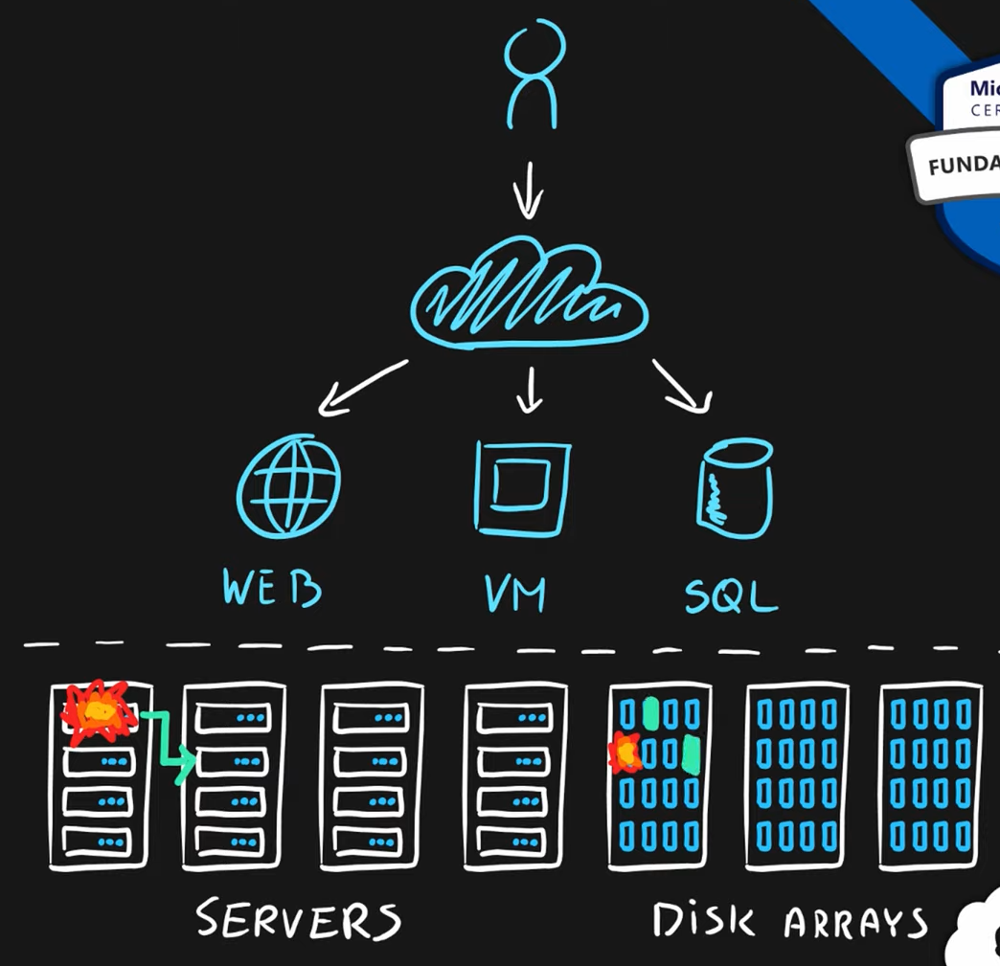

- **Disaster Recovery** - Es el proceso y principio de diseño que permite que un sistema se recupere de desastres naturales o inducidos por el hombre.  
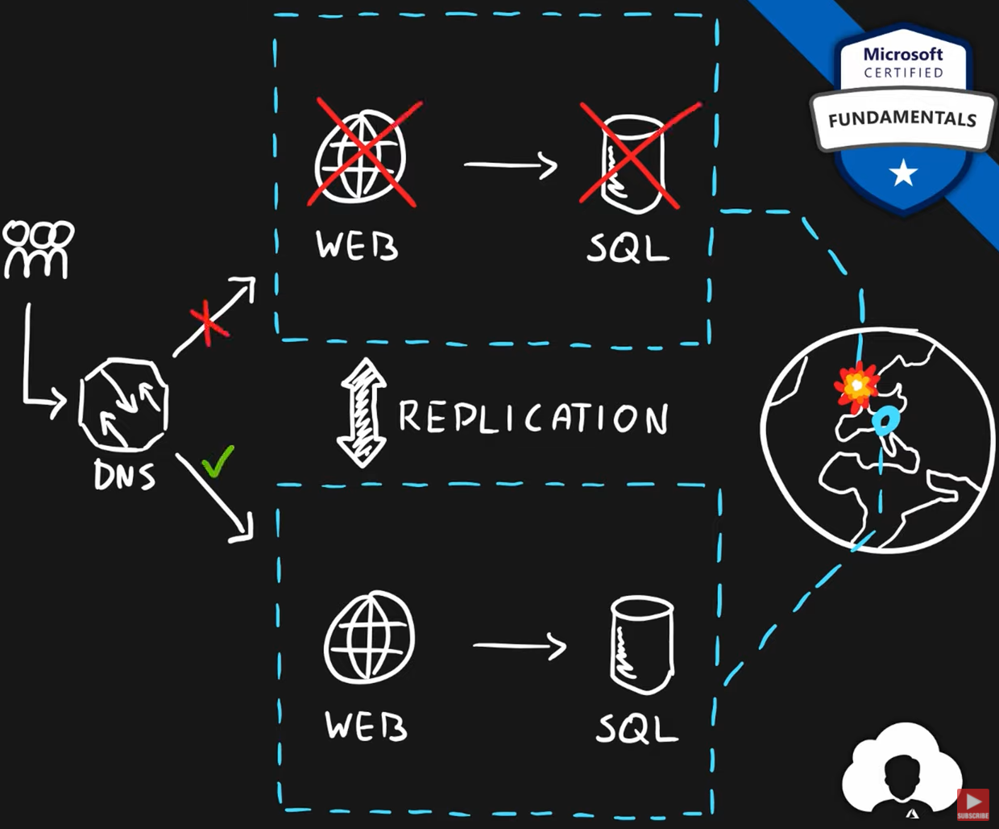 

- **High Availability** - Es el nivel acordado de tiempo de actividad operativa para el sistema. Es un cálculo simple del tiempo de actividad del sistema frente a toda la vida útil del sistema.  
`disponibilidad = tiempo de actividad/(tiempo de actividad + tiempo de inactividad)`  
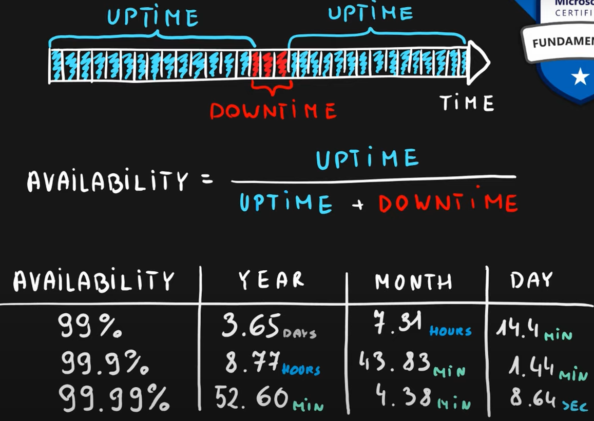  

## **Recorrido rápido por los servicios generales de Azure**
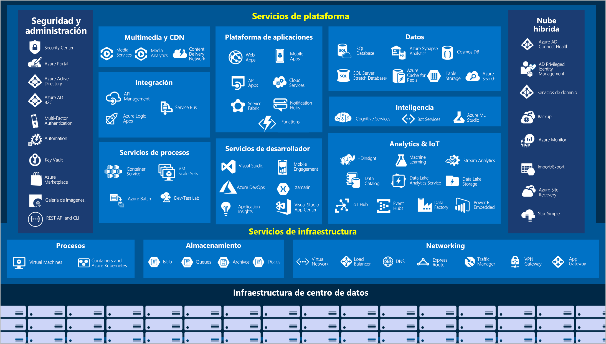

### **Process**
**Azure Virtual Machines** - Máquinas virtuales (VM) Windows o Linux hospedadas en Azure.  
**Azure Virtual Machine Scale Sets** - Escalado de máquinas virtuales Windows o Linux hospedadas en Azure.  
**Azure Kubernetes Service** - Administración de clústeres para máquinas virtuales que ejecutan servicios en contenedores.  
**Azure Service Fabric** - Plataforma de sistemas distribuidos que se ejecuta en Azure o en el entorno local.  
**Azure Batch** - Servicio administrado para aplicaciones informáticas de alto rendimiento y paralelas.  
**Azure Container Instances** - Aplicaciones en contenedores que se ejecutan en Azure sin necesidad de aprovisionar servidores ni máquinas virtuales.  
**Azure Functions** - Un servicio de procesos sin servidor y controlado por eventos.  
### **Network**
**Azure Virtual Network** - Conecta máquinas virtuales a conexiones de red privada virtual (VPN) entrantes.  
**Azure Load Balancer** - Equilibra las conexiones entrantes y salientes a aplicaciones o puntos de conexión de servicio.  
**Azure Application Gateway** - Optimiza la entrega de granjas de servidores de aplicaciones y, al mismo tiempo, aumenta la seguridad de las aplicaciones.  
**Azure VPN Gateway** - Accede a redes de Azure Virtual Network mediante puertas de enlace de VPN de alto rendimiento.  
**Azure DNS** - Proporciona respuestas DNS ultrarrápidas y disponibilidad de dominio extremadamente alta.  
**Azure Content Delivery Network** - Entrega contenido de gran ancho de banda a los clientes globalmente.  
**Azure DDoS Protection** - Protege las aplicaciones hospedadas en Azure frente a ataques por denegación de servicio distribuido (DDoS).  
**Azure Traffic Manager** - Distribuye el tráfico de red entre las regiones de Azure en todo el mundo.  
**Azure ExpressRoute** - Se conecta a Azure mediante conexiones seguras de gran ancho de banda dedicadas.  
**Azure Network Watcher** - Supervisa y diagnostica problemas de red mediante el análisis basado en el escenario.  
**Azure Firewall** - Implementa un firewall de alta seguridad y alta disponibilidad con escalabilidad ilimitada.  
**Azure Virtual WAN** - Crea una red de área extensa (WAN) unificada que conecta sitios locales y remotos.  
### **Storage**
**Azure Blob Storage** - Servicio de almacenamiento para objetos muy grandes, como archivos de vídeo o mapas de bits.  
**Azure File Storage** - Recursos compartidos de archivos que puede administrar como un servidor de archivos y acceder a ellos del mismo modo.  
**Azure Queue Storage** - Almacén de datos para la puesta en cola y la entrega confiable de mensajes entre aplicaciones.  
**Azure Table Storage** - Table Storage es un servicio que almacena datos estructurados no relacionales (también conocidos como datos NoSQL estructurados) en la nube, lo que proporciona un almacén de claves y atributos con un diseño sin esquema.  
### **Databases**
**Azure Cosmos DB** - Base de datos distribuida globalmente que admite opciones NoSQL.  
**Azure SQL Database** - Base de datos relacional totalmente administrada con escalado automático, inteligencia integral y seguridad sólida.  
**Azure Database for MySQL** - Base de datos relacional MySQL totalmente administrada y escalable con alta disponibilidad y seguridad.  
**Azure Database for PostgreSQL** - Base de datos relacional PostgreSQL totalmente administrada y escalable con alta disponibilidad y seguridad.  
**SQL Server en Azure Virtual Machines** - Servicio que hospeda aplicaciones empresariales de SQL Server en la nube.  
**Azure Synapse Analytics** - Almacén de datos totalmente administrado con seguridad integral en todos los niveles de escala sin costo adicional.  
**Azure Database Migration Service** - Servicio que migra bases de datos a la nube sin cambios en el código de aplicación.  
**Azure Cache for Redis** - Servicio totalmente administrado que almacena en caché datos estáticos y usados con frecuencia para reducir la latencia de datos y aplicaciones.  
**Azure Database for MariaDB** - Base de datos relacional MariaDB totalmente administrada y escalable con alta disponibilidad y seguridad.  
### **Web**
**Azure App Service** - Creación rápida de aplicaciones en la nube eficaces basadas en web.  
**Azure Notification Hubs** - Envíe notificaciones push a cualquier plataforma desde cualquier back-end.  
**Azure API Management** - Publique API para desarrolladores, asociados y empleados de forma segura y a escala.  
**Azure Cognitive Search** - Esta búsqueda completamente administrada se implementa como servicio.  
**Característica Web Apps de Azure App Service** - Cree e implemente rápidamente aplicaciones web críticas a escala.  
**Servicio Azure SignalR** - Agregue funcionalidades web en tiempo real con facilidad.  
### **IoT**
**IoT Central** - Solución global de software como servicio (SaaS) de IoT totalmente administrada que facilita la conexión, la supervisión y la administración de los recursos de IoT a escala.  
**Azure IoT Hub** - Centro de mensajería que proporciona comunicaciones y supervisión seguras entre millones de dispositivos de IoT.  
**IoT Edge** - Servicio totalmente administrado que permite insertar los modelos de análisis de datos directamente en los dispositivos IoT, lo que les permite responder rápidamente a los cambios de estado sin necesidad de consultar modelos de IA basados en la nube.  
### **Macrodata**
**Azure Synapse Analytics** - Ejecute análisis a gran escala mediante un almacenamiento de datos empresarial basado en la nube que aprovecha las ventajas del procesamiento paralelo masivo para ejecutar rápidamente consultas complejas en petabytes de datos.  
**HDInsight de Azure** - Procese grandes cantidades de datos con los clústeres administrados de Hadoop en la nube.  
**Azure Databricks** - Integre este servicio de análisis colaborativo basado en Apache Spark con otros servicios de macrodatos en Azure.  
### **AI**
**Azure Machine Learning Service** - Entorno basado en la nube que puede usar para desarrollar, entrenar, probar, implementar, administrar y realizar un seguimiento de los modelos de aprendizaje automático. Puede generar y ajustar automáticamente un modelo. Le permite comenzar a entrenar en el equipo local y luego escalar horizontalmente a la nube.  
**Azure ML Studio** - Área de trabajo visual colaborativa donde puede compilar, probar e implementar soluciones de aprendizaje automático mediante algoritmos de aprendizaje automático predefinidos y módulos de control de datos.  
**Cognitive Services** - Es un conjunto de productos estrechamente relacionados. Puede usar estas API precompiladas en las aplicaciones para solucionar problemas complejos:  
  - **Visión** - Use algoritmos de procesamiento de imágenes para identificar, subtitular, indexar y moderar imágenes y vídeos.  
  - **Voz** - Convierta voz en texto, use la voz para la comprobación o agregue reconocimiento del hablante a la aplicación.  
  - **Asignación de conocimiento** - Asigne información y datos complejos para resolver tareas como las de recomendaciones inteligentes y búsqueda semántica.  
  - **Bing Search** - Agregue las Bing Search API a sus aplicaciones y aproveche la capacidad de combinar miles de millones de páginas web, imágenes, vídeos y noticias con una sola llamada API.  
  - **Procesamiento de lenguaje natural** - Permita que las aplicaciones procesen lenguaje natural con scripts precompilados, evalúen opiniones y aprendan a reconocer lo que quieren los usuarios.  
### **DevOps**
**Azure DevOps** - Use herramientas de colaboración de desarrollo como canalizaciones de alto rendimiento, repositorios Git privados gratuitos, paneles Kanban configurables y completas pruebas de carga basadas en la nube y automatizadas. Anteriormente conocido como Visual Studio Team Services.  
**Azure DevTest Labs** - Cree rápidamente entornos de Windows y Linux a petición para probar o realizar demostraciones de las aplicaciones directamente desde canalizaciones de implementación.  
## **Principios de economía de escala**
El principio de economías de escala establece que a medida que las empresas crecen, se vuelven más efectivas en la gestión de operaciones compartidas. Ya sea recursos humanos y contratación, impuestos, contabilidad, operaciones internas, marketing, grandes compras a través de contratos que significan mejores descuentos, etc.  
Por eso, las empresas pueden ahorrar/ganar más, lo que a cambio les permite reducir el costo de sus servicios para sus clientes. Esto se llama **'precio por unidad'**.  
No es posible ir a 0 porque, al final, se debe ejecutar alguna infraestructura subyacente para proporcionar los servicios. Pero cuanto mayor sea la escala, más beneficios se pueden transferir a los clientes.  
De hecho, en la escala actual, Microsoft ya puede ofrecer múltiples servicios de forma gratuita debido a lo pequeña que es una fracción del costo para ellos.  

    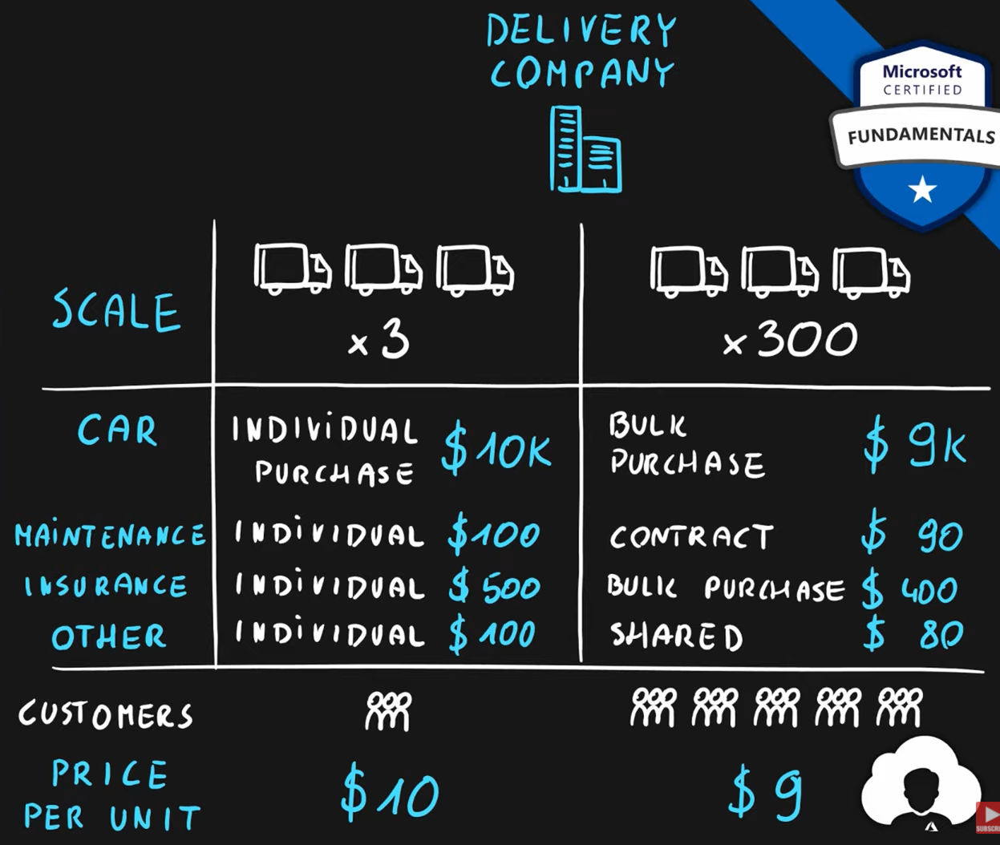  
    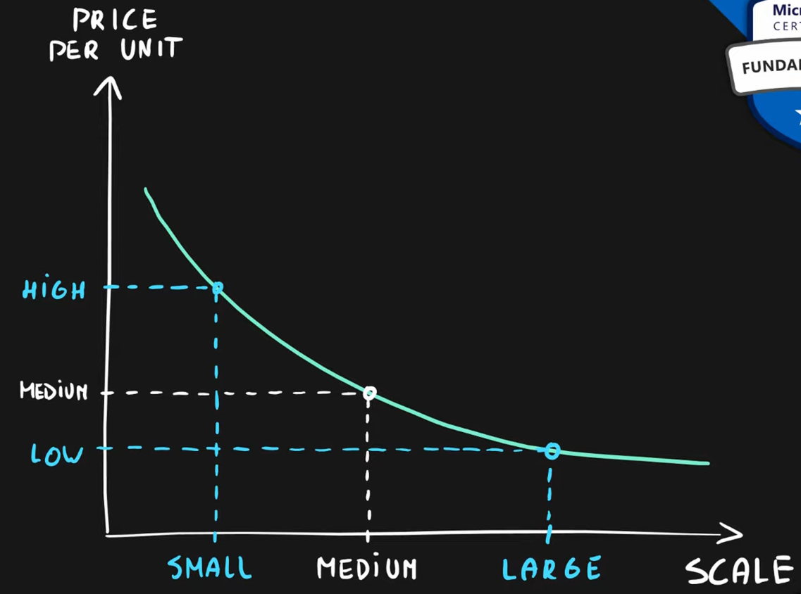  

 

## **CapEx vs OpEx y sus diferencias**
Diferencias entre gastos de capital(CapEx) y gastos operativos(OpEx)

/  |Gastos de capital|Gastos operacionales
---|---|---
Costo inicial|Significativo|Ninguno
Costo continuo|Bajo|Basado en el uso
Deducción fiscal|Tiempo extraordinario|Mismo año
Terminación anticipada|No|En cualquier momento
Mantenimiento|Significativo|Bajo
Valor en el tiempo|Disminuyen|Sin cambio

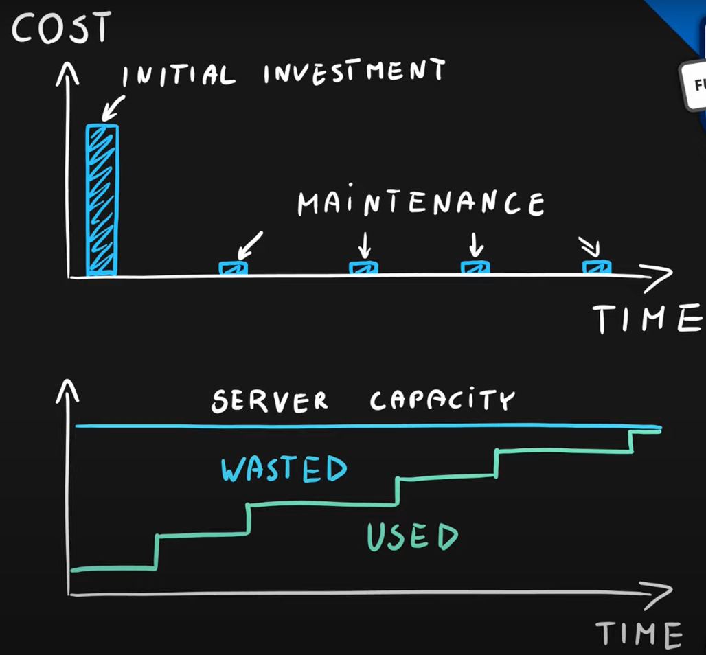 
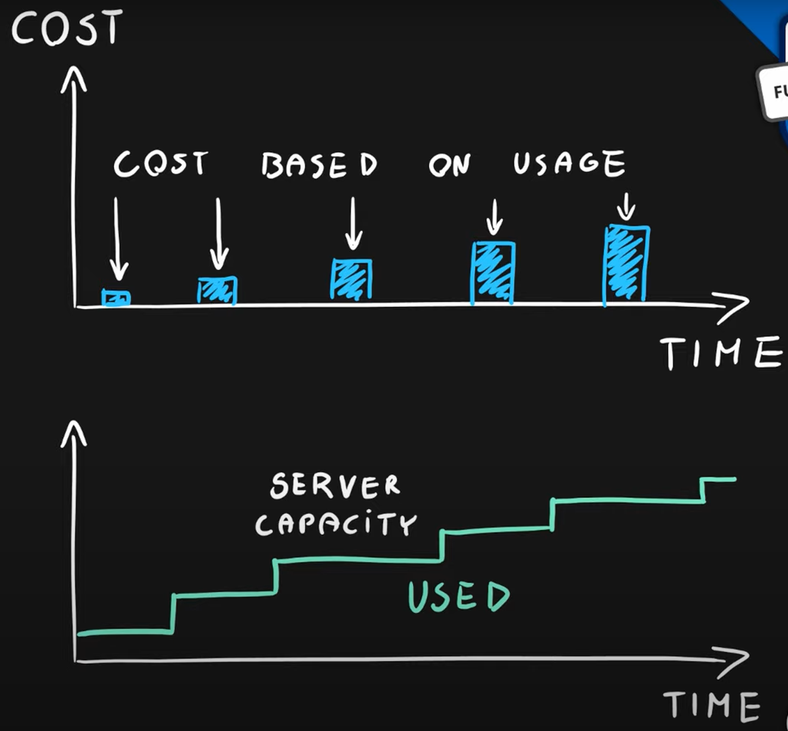 

  

Pregunta: `Having your own datacenter infraesutrcture has a big ______ cost associated`.  
Respuesta: `Initial`.  

## **Modelo basado en el consumo**
El modelo basado en el consumo es un modelo de precios que se utiliza en la nube para que a los clientes solo se les cobre en función de su uso de recursos.  
Este modelo se caracteriza por  

- **Sin costo inicial asociado**
- **No se desperdician recursos** como tal, *no se incurre en cargos por recursos no utilizados*. No utilizado en este caso es diferente por servicio. Por ejemplo, Se considera que se usa el almacenamiento de blobs que almacena cualquier dato, ya que consume el espacio de almacenamiento. Las máquinas virtuales que se ejecutan consumen CPU, memoria y otros recursos incluso si no hay tráfico. Por lo tanto, se consideran utilizados y generarán cargos.
- **Paga por lo que necesitas**
- **Deja de pagar cuando no lo haces**  
**El consumo** es la métrica virtual que se usa para calcular cuánto se usó cada recurso (servicio) en Azure. Cada servicio tiene muchas métricas más pequeñas que rastrean su consumo para ofrecer el mejor modelo de precios posible. Esas métricas se rastrean en un nivel muy granular.  
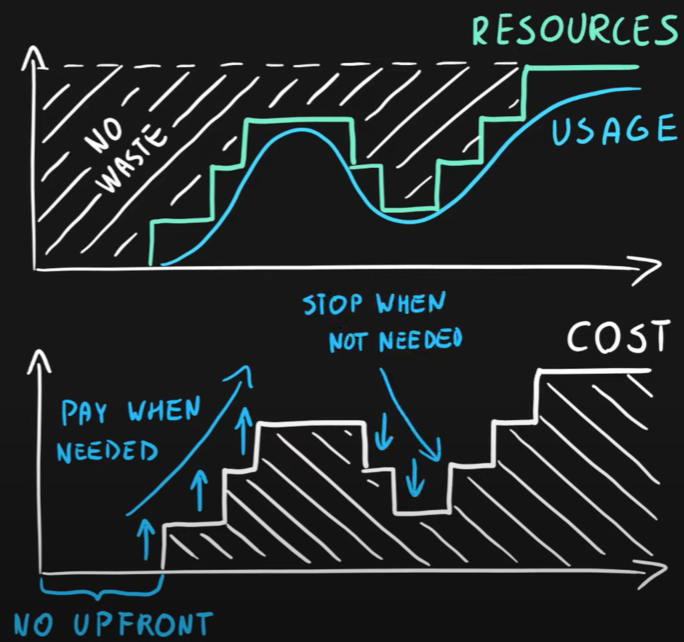 

[Consumption based Model - AZ-900 - Chapter Demo](https://youtu.be/NdqncsMtryY?list=PLGjZwEtPN7j-Q59JYso3L4_yoCjj2syrM) 

## **IaaS vs PaaS vs SaaS Modelo de servicio cloud**
Como servicio significa qué capa en particular administrará y todas las capas por encima.

- La capa de **Software** consiste en la aplicación (código y conjunto de la aplicación) y los datos de la aplicación. 
- La capa de **Platform** significa todo el software de soporte y el sistema oeprativo necesarios para alojar la aplicación.
- La capa de **Infraestructure** consta de hardware, la infraestructura y la virtualización necesarias para alojar la plataforma.

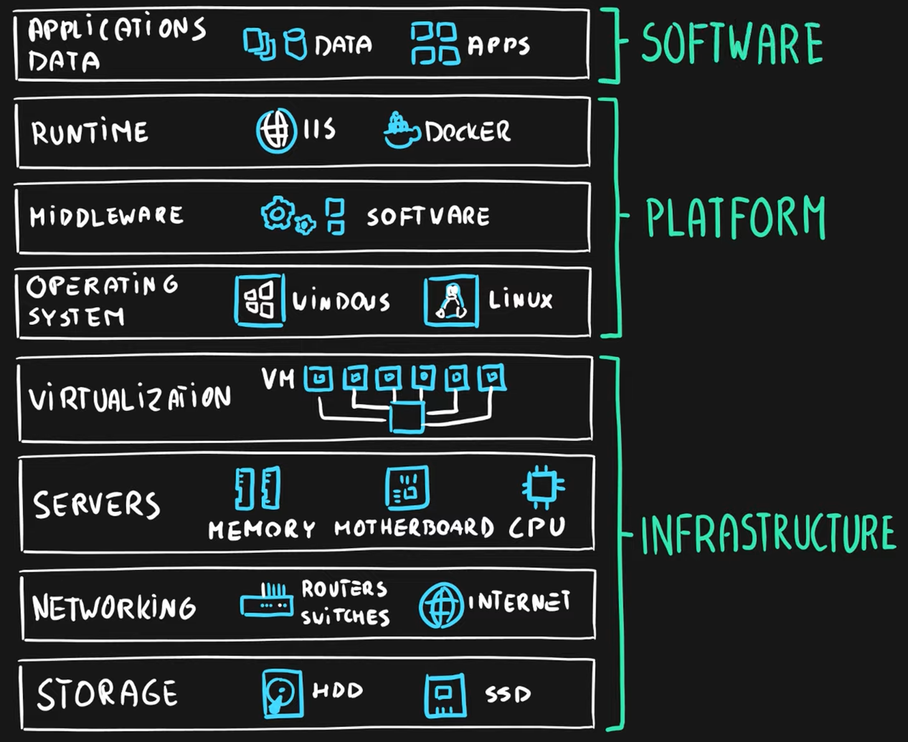 

### **Matriz de responsabilidad**
Como tal, la siguiente tabla representa las responsabilidades.  
Layer(Capa)     |On-Premises|IaaS          |PaaS           |SaaS
---             |---       |---           |---            |---
Application     |Tú        |Tú           |Tú            |Cloud provider
Data            |Tú        |Tú           |Tú            |Cloud provider
Runtime         |Tú        |Tú           |Cloud provider |Cloud provider
Middleware      |Tú        |Tú           |Cloud provider |Cloud provider
Operating System|Tú        |Tú           |Cloud provider |Cloud provider
Virtualization  |Tú        |Cloud provider|Cloud provider |Cloud provider
Servers         |Tú        |Cloud provider|Cloud provider |Cloud provider
Networking      |Tú        |Cloud provider|Cloud provider |Cloud provider
Storage         |Tú        |Cloud provider|Cloud provider |Cloud provider

\  |Algunos Casos de Uso| Algunos Servicios de Azure
---|---|---
IaaS|<ul><li>Migración de cargas de trabajo</li><li>Test y Desarrollo</li><li>Almacenamiento</li><li>Backups y Recovery</li></ul>|<ul><li>Virtual Machine</li><li>Virtual Network</li><li>Managed Disk</li></ul>
PaaS|<ul><li>Development framework</li><li>Analytics & Business intelligence</li></ul>|<ul><li>SQL</li><li>App Service</li><li>Logic Apps</li><li>Function Apps</li></ul>
SaaS|<ul><li>Compra de aplicaciones shell</li></ul>|<ul><li>One Drive</li><li>Outlook</li><li>Skype</li></ul>

**NOTA** : Si instala SQL Server en una máquina virtual manualmente o al usar una imagen lista para usar, sigue siendo una máquina virtual. Eso significa que los clientes aún necesitan administrar todos
los aspectos de la plataforma. Esto incluye el sistema operativo,configuraciones, parches, middleware, configuraciones de tiempo de ejecución de SQL Server, etc. Como tal, sigue siendo una infraestructura como servicio.  
Azure tiene una opción para Azure SQL Server en máquina virtual donde todas las actualizaciones/copias de seguridad están automatizadas pero incluso Microsoft en su sitio web considera esta opción como IaaS,pero la línea es muy delgada aquí.

## **Modelos de implementación de nube pública, privada e híbrida**
El modelo de implementación en la nube es una separación simple que describe dónde se implementan los recursos de la empresa. Siempre que sea en un entorno de proveedor de nube pública o en un centro de datos privado.
### **Nube pública**
✅ Cloud Provider  ✖  Own Datacenter    
**Caracteristicas claves**
- Todo se ejecuta en el hardware del proveedor de la nube
- Sin hardware local
- Algunos servicios comparten hardware con otros clientes 

<table>
  <tr>
    <th>Ventajas</th>
    <th>Desventajas</th>
  </tr>
  <tr>
    <td><ul><li>Sin CapEx</li><li>Alta disponibilidad</li><li>Agilidad</li><li>Precios por pago de uso</li><li>Sin mantenimiento de hardware</li><li>No se requieren habilidades técnicas profundas</li></ul></td>
    <td><ul><li>No se pueden cumplir todas las políticas de seguridad y cumplimiento</li><li>Sin propiedad sobre la infraestructura física</li><li>No se pueden hacer escenarios específicos raros</li></ul></td>
  </tr>
</table>

### **Nube privada**
✖  Cloud Provider  ✅ Own Datacenter  
**Caracteristicas claves**
- Todo se ejecuta en su propio centro de datos
- Se debe proporcionar autoservicio
- Tú mantienes el hardware

<table>
  <tr>
    <th>Ventajas</th>
    <th>Desventajas</th>
  </tr>
  <tr>
    <td><ul><li>Puede soportar cualquier escenario</li><li>Control total sobre la seguridad y la infraestructura</li><li>Puede cumplir con cualquier política de seguridad y cumplimiento</li></ul></td>
    <td><ul><li>Se requiere inversión inicial</li><li>Agilidad limitada restringida por la capacidad del servidor y las habilidades del equipo</li><li>Muy dependiente de las habilidades y la experiencia en TI</li></ul></td>
  </tr>
</table>

### **Nube híbrida**
✅ Cloud Provider  ✅ Own Datacenter  
**Caracteristicas claves**  
- Combina la nube pública y privada

<table>
  <tr>
    <th>Ventajas</th>
    <th>Desventajas</th>
  </tr>
  <tr>
    <td><ul><li>Gran flexibilidad</li><li>Puede ejecutar cualquier aplicación heredada en la nube privada</li><li>Puede utilizar la infraestructura existente</li><li>Cumplir con los requisitos de seguridad y cumplimientos</li><li>Puede aprovechar todos los beneficios de la nube pública</li></ul></td>
    <td><ul><li>Puede ser más caro</li><li>Complicado de manejar debido a un paisaje más grande</li><li>Más dependiente de las habilidades y la experiencia en TI de los tres modelos</li></ul></td>
  </tr>
</table>

## **Geografía, Regiones y Zonas de disponibilidad**
  * Products available by region: https://azure.microsoft.com/en-us/global-infrastructure/services/
  * 🌐 Azure Speed Test 2.0: http://azurespeedtest.azurewebsites.net/

### **Data Center**
- **Instalación física**.
- **Hosting** para grupo de **servidores** en red.
- Infraestructura propia de **energía**, **refrigeración** y **redes**.

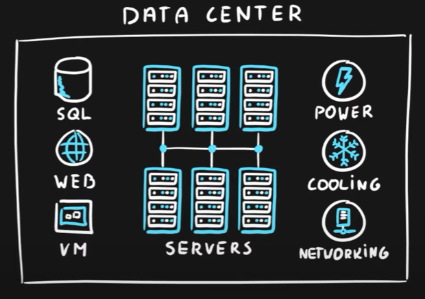 

### **Región**
- **Área geográfica** en el planeta.
- **Uno, pero generalmente más centros de datos** conectados con una **red de baja latencia** (<2 milisegundos).
- **Ubicación** para sus servicios.
- Algunos servicios están **disponibles solo en ciertas regiones**.
- Algunos servicios son **servicios globales**, por lo que no se asignan/implementan en una región específica.
- Disponible globalmente con más de **50+ regiones**.
- **Regiones gubernamentales** especiales (US DoD Central, US Gov Virginia, etc.).
- **Regiones asociadas** especiales (Este de China, Norte de China).

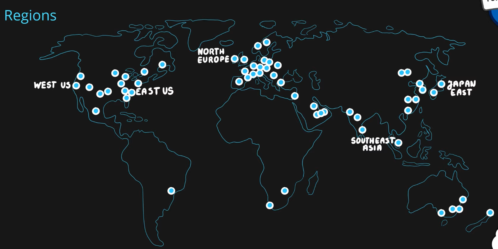 
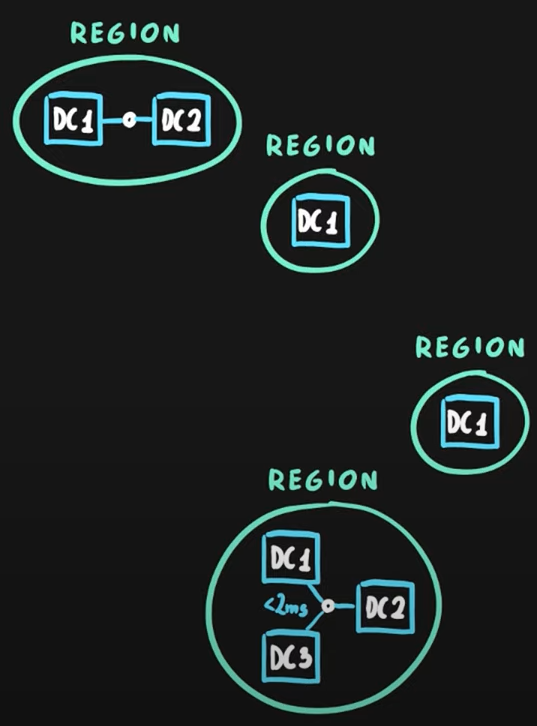 

### **Zona de disponibilidad**
Debido a que no tiene control sobre en qué centro de datos se implementa sus servicios, se ofrece esta característica única dónde cada **centro de datos recibe un número**, que representa un grupo de instalaciones separadas físicamente 

- **Característica regional**.
- Agrupación de instalaciones **separadas físicamente**.
- Diseñado para **proteger de fallas en el centro de datos**.
- Si la zona se cae, **otros continúan trabajando**.
- Dos **categorías** de servicio:
  - Servicios **zonales** (Máquinas Virtuales, Discos, etc.).
  - Servicios con **redundancia de zona** (SQL, Storage, etc.).
- **No todas** las regiones son **compatibles**.
- La **región** admitida **tiene tres o más zonas**.
- Una **zona de disponibilidad** es **uno o más centros de datos**(No necesariamente debe ser uno).

### **Conjunto de disponibilidad**
- **Característica de un DataCenter**.
- Ubicaciones separadas, pero dentro del mismo datacenter.  
- Garantizan que máquinas virtuales o servicios IaaS implementados en Azure se distribuyan entre varios nodos de hardware aislados en un clúster.

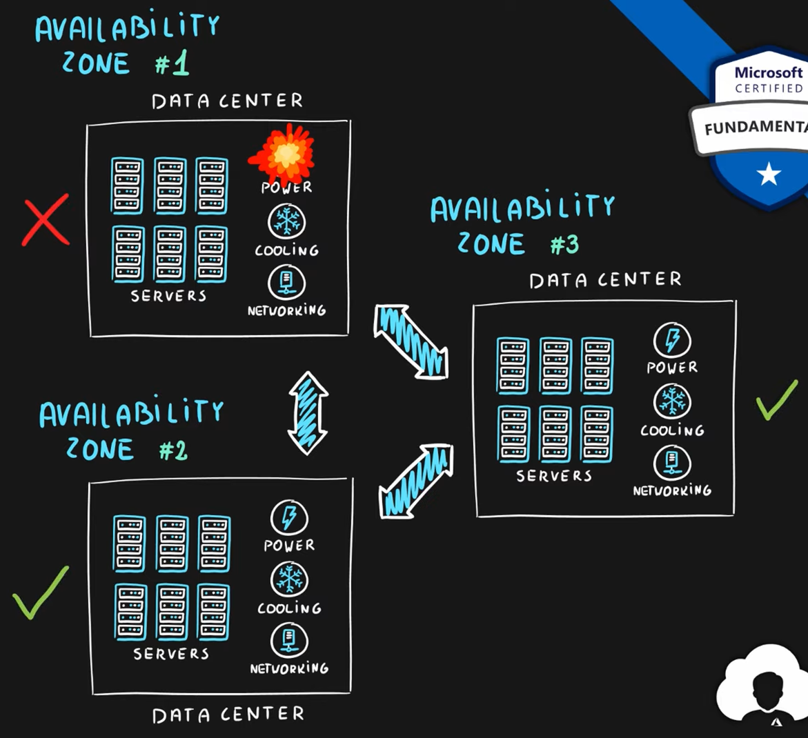 

### **Pares de regiones**
- Cada **región** está **emparejada** con otra región, lo que la convierte en un par de regiones.
- Los **pares de regiones son estáticos** y no se pueden elegir.
- Cada par reside dentro de la **misma geografía**.`La excepción es Brazil South`.
- **Aislamiento físico** con al menos 300 millas de distancia (cuando sea posible).
- Algunos servicios tienen **replicación proporcionada por la plataforma**.
- **Actualizaciones planificadas** en los pares.
- **Residencia de datos** mantenida para recuperación ante desastres.
Algunos ejemplos de regiones pares: 

Región Par A|Región Par B
---|---
East US|West US
UK West|UK South
North Europe|West Europe

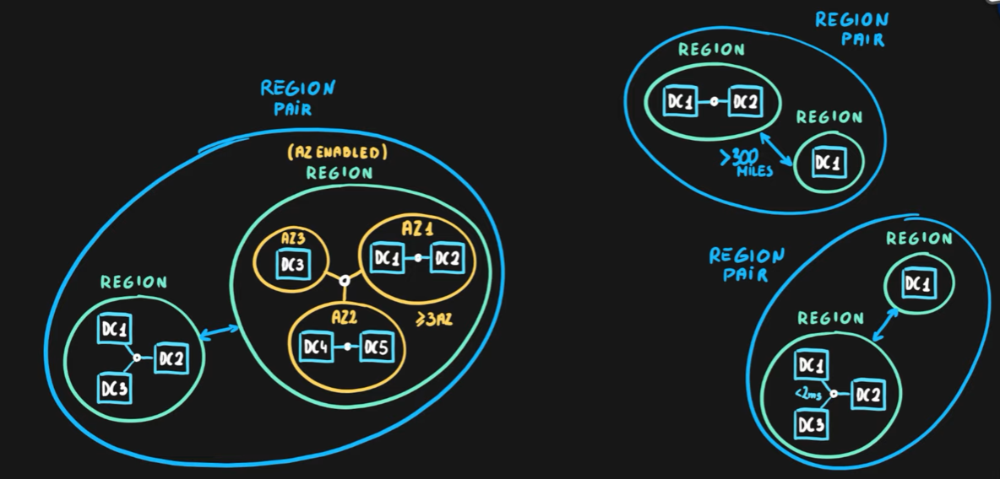 

### **Geografías**
- **Mercado discreto**
- Normalmente **contiene dos o más regiones**.
- Garantiza que se cumplan los requisitos de **residencia**, **soberanía**, **resiliencia** y **cumplimiento** de los **datos**.
- **Tolerante a fallas** para proteger de fallas en toda la región.
- Dividido en áreas : **Américas**, **Europa**, **Asia Pacífico**, **Oriente Medio** y **África**.
- Cada **región pertenece solo a una Geografía**.

## **Resources, Resources Groups y Resource Manager**
### **Resource**
- Objeto **utilizado para administrar servicios** en Azure.
- Representa el **ciclo de vida del servicio** (**o de otra forma: los servicios comprados**).
- Guardado como **definición JSON**.

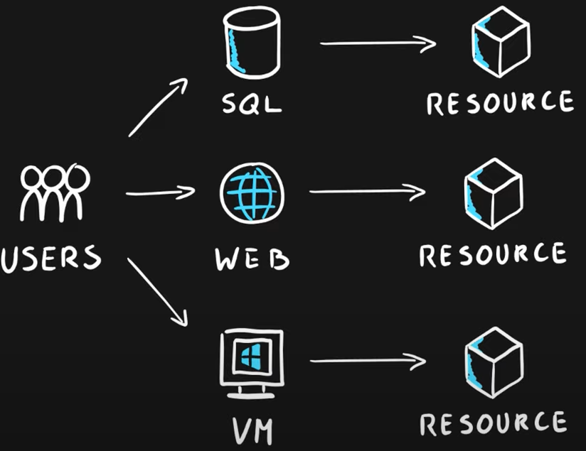

### **Resources Groups (Grupo de recursos)**
- **Agrupación** de recursos.
- Contiene recursos **lógicamente relacionados**.
- Normalmente se organiza por
  - **Tipo**
  - **Ciclo de vida** (aplicación, entorno)
  - **Departamento**
  - **Facturación**,
  - **Ubicación** o
  - **combinación de esos**

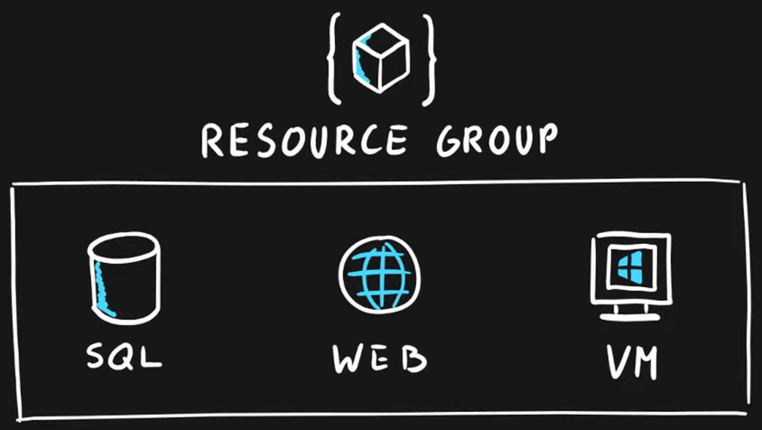

### **Resource Manager (Administrador de recursos)**
- **Capa de gestión** para todos los recursos y grupos de recursos
- Lenguaje **unificado**.
- **Controla el acceso** y **los recursos**.

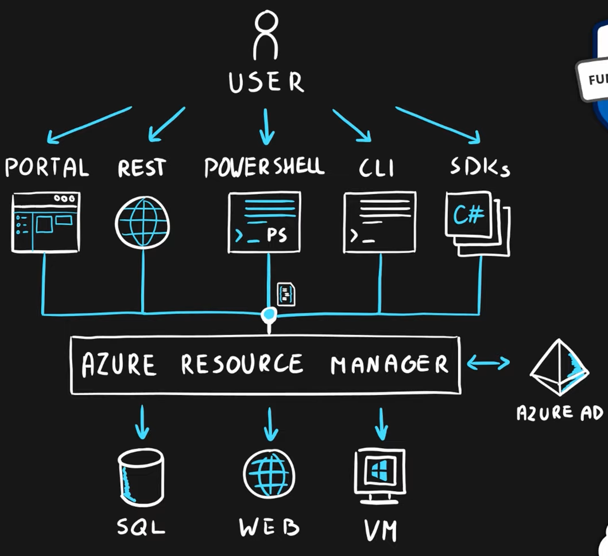

### **Información adicional**
- Cada **recurso** debe estar en **uno y solo un grupo de recursos**.
- Los **grupos de recursos tienen su propia ubicación** asignada.
- Los recursos de los grupos de recursos pueden **residir en ubicaciones diferentes**.
- Los recursos **se pueden mover** entre los grupos de recursos.
- Los **grupos de recursos no se pueden anidar**.
- Organícese en función de las necesidades de su organización, pero tenga en cuenta
  - Facturación
  - Seguridad y gestión de acceso
  - Ciclo de vida de la aplicación

## **Servicios de cómputo**
### **Virtualización**
- Emulación de máquinas físicas
- Configuración de hardware virtual diferente por máquina/aplicación
- Diferentes sistemas operativos por máquina/aplicación
- Separación total de ambientes
  - sistemas de archivos,
  - servicios,
  - puertos,
  - middleware,
  - configuración

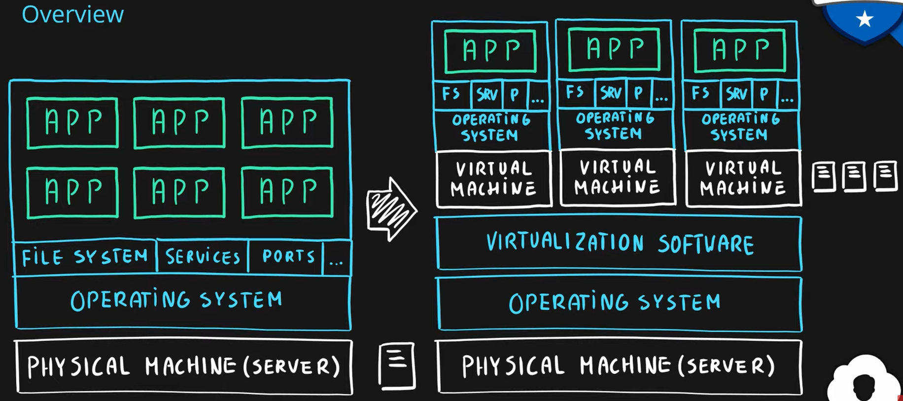

### **Azure Virtual Machine (Máquina virtual)**
- Infraestructura como servicio (IaaS)
- Control total sobre el sistema operativo y el software
- Soporta mercado e imágenes personalizadas
- El más adecuado para
  - Software personalizado que requiere una configuración de sistema personalizada
  - Escenarios de elevación y cambio
- Puede ejecutar cualquier aplicación/escenario
  - aplicaciones web y servicios web,
  - bases de datos,
  - aplicaciones de escritorio,
  - jumpboxes,
  - gateways, etc

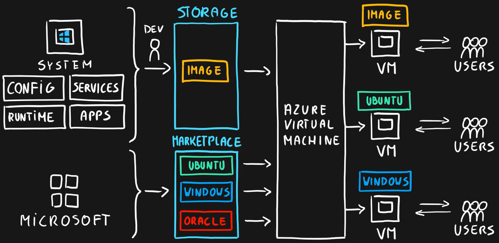

### **Azure Virtual Machine Scale Sets (Conjuntos de escalado de máquinas virtuales)**
- Infraestructura como servicio (IaaS)
- Conjunto de máquinas virtuales idénticas
- Funciones de escalado automático integradas
- Diseñado para cargas de trabajo manuales y de escalado automático, como servicios web,* procesamiento por lotes, etc.

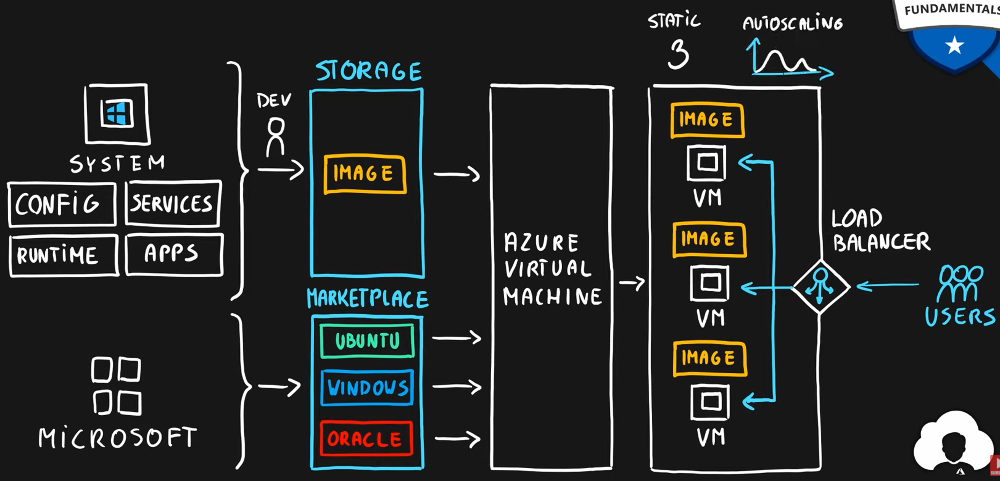

### **Azure Batch**
**Azure Batch** permite trabajo por lotes paralelos a gran escala y de informática de alto rendimiento (HPC) con la capacidad de escalar a decenas, cientos o miles de máquinas virtuales.

Puede haber situaciones en las que se necesite potencia informática sin procesar o potencia de cálculo a nivel de superequipo. Azure proporciona estas capacidades.

### **Azure Virtual Desktop**
Azure Virtual Desktop es un servicio de virtualización de escritorios y aplicaciones que se ejecuta en la nube.  
Permite que los usuarios usen una versión hospedada en la nube de Windows desde cualquier ubicación. Azure Virtual Desktop funciona en dispositivos como Windows, Mac, iOS, Android y Linux. Funciona con aplicaciones que se pueden usar para acceder a aplicaciones y escritorios remotos. También puede usar la mayoría de los exploradores modernos para acceder a experiencias hospedadas en Azure Virtual Desktop.

### **Contenedores**
- Usar el sistema operativo del host
- Emular el sistema operativo (las máquinas virtuales emulan el hardware)
- Ligero (sin O/S)
  - Esfuerzo de desarrollo
  - Mantenimiento
  - Requisitos de computación y almacenamiento
- Responda más rápido a los cambios de demanda
- Diseñado para casi cualquier escenario

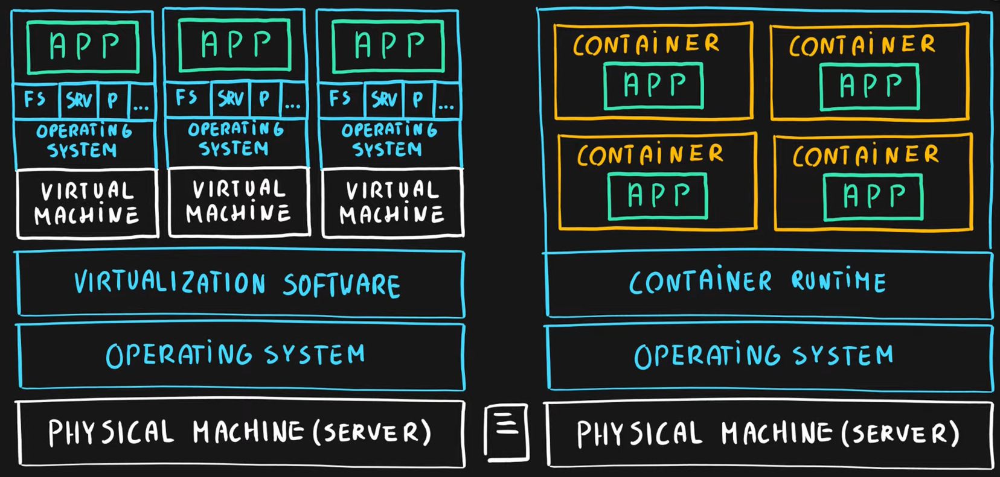

### **Azure Containers Instance (Instancias de contenedores)**
- La forma más sencilla y rápida de ejecutar un contenedor en Azure
- Plataforma como servicio (PaaS)
- Contenedores sin servidor
- Diseñado para
  - Servicios/aplicaciones web pequeñas y sencillas
  - Trabajos en segundo plano
  - Guiones programados

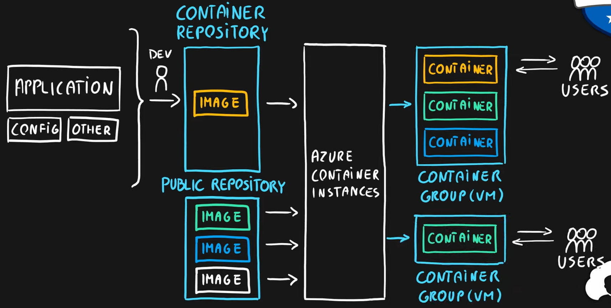

### **Azure Kubernetes Services (AKS)**
- Plataforma de orquestación de contenedores de código abierto
- Plataforma como servicio (PaaS)
- Altamente escalable y personalizable
- Diseñado para implementaciones de contenedores a gran escala (¡cualquier cosa realmente!)

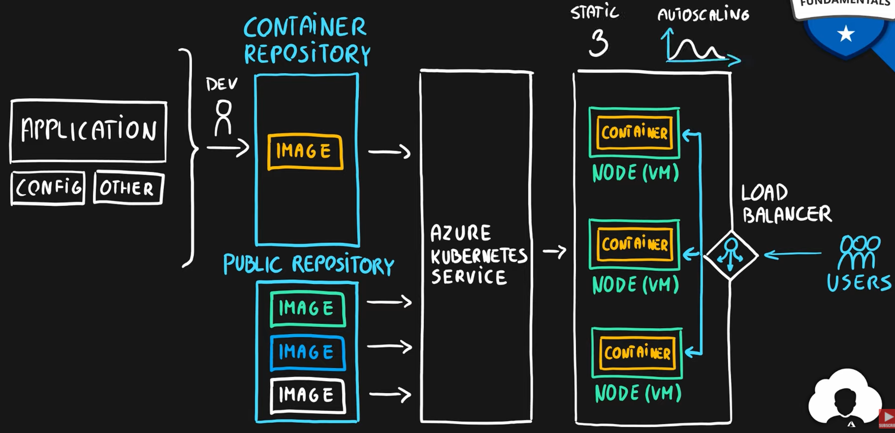

### **Azure App Service**
- Diseñado como servicio de aplicación web de nivel empresarial
- Plataforma como servicio (PaaS)
- Admite múltiples lenguajes de programación y contenedores

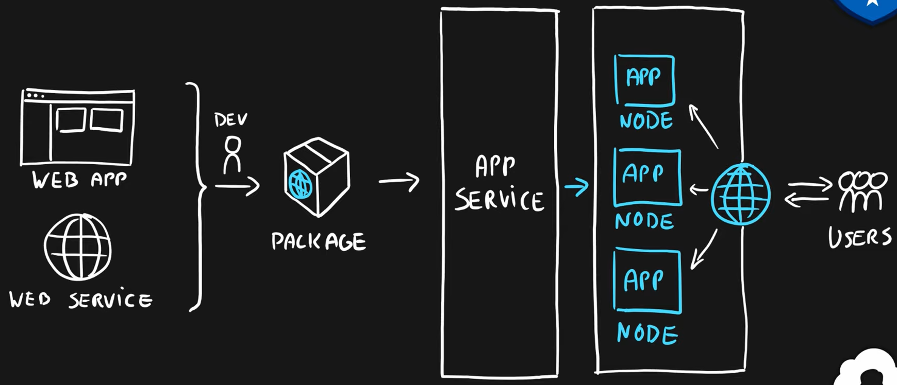

### **Azure Functions**
- Plataforma como servicio (PaaS)
- Serverless
- Dos modelos de alojamiento/precio
  - Consumo-plan basado
  - plan dedicado
- Diseñado para micro/nanoservicios

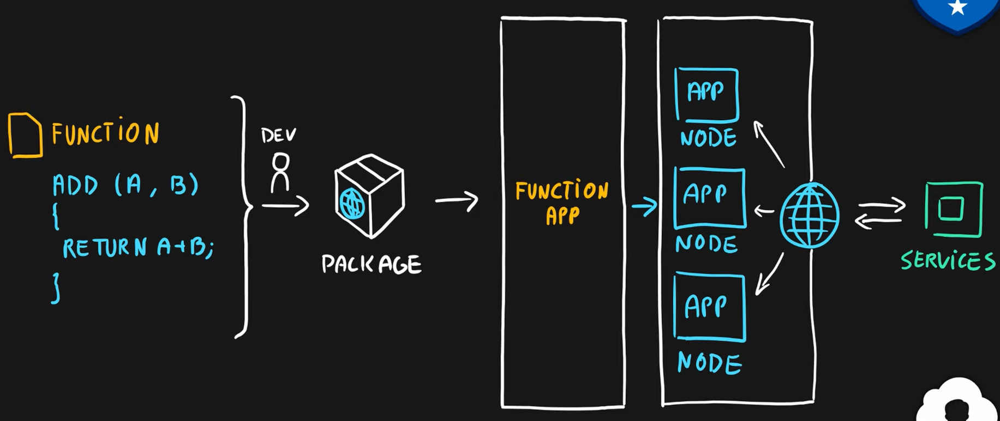

### **Resumen**
- Máquinas virtuales (IaaS) - software personalizado, requisitos personalizados, muy especializado, alto grado de control
- Conjuntos de escalado de máquinas virtuales (IaaS) - cargas de trabajo de escalado automático para máquinas virtuales
- Instancias de contenedor (PaaS) - alojamiento de contenedor simple, fácil de comenzar
- Servicio Kubernetes (PaaS) - Plataforma de alojamiento de contenedores * altamente escalable y personalizable
- Servicios de aplicaciones (PaaS) - aplicaciones web, muchas funciones de alojamiento web empresarial *, fácil de comenzar
- Funciones (PaaS) (Función como servicio) (Serverless) - micro/nanoservicios, excelente precio basado en el consumo, fácil de comenzar

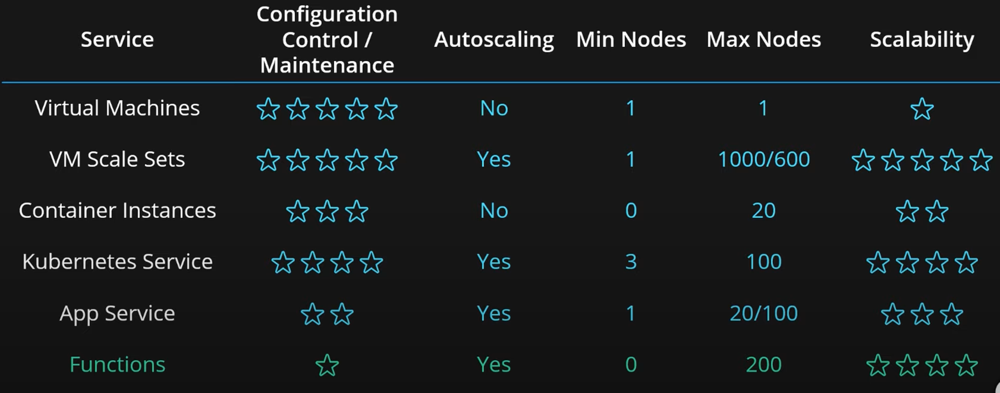

## **Servicios de red**
### **Azure Networking (Redes Azure)**
Categoria de servicio que permite a los clientes conectar sus recursos locales y en la nube, pero también ayuda con la protección y monitoreo de la red para esos servicios, así como ayudar a los cliente en la entrega de aplicaciones
- Conecte la nube y on-premises
- Funcionalidad de red on-premise

### **Azure Virtual Network (Red virtual)**
Las redes virtuales permiten a sus clientes crear, administrar, monitorear y proteger la conectividad entre los recursos de Azure, pero también entre los recursos de Azure y los suyos on-premises 
- Emulación de infraestructura de red física
- Componentes de red aislados lógicamente
- Segmentado en una o más subredes
- Las subredes son secciones discretas y no se pueden anidar
- Habilite la comunicación de los recursos entre sí, Internet y en las instalaciones
- Alcanzado a una sola región
- El emparejamiento de VNet permite la comunicación entre regiones
- Aislamiento, Segmentación, Comunicación, Filtrado y Enrutamiento entre recursos

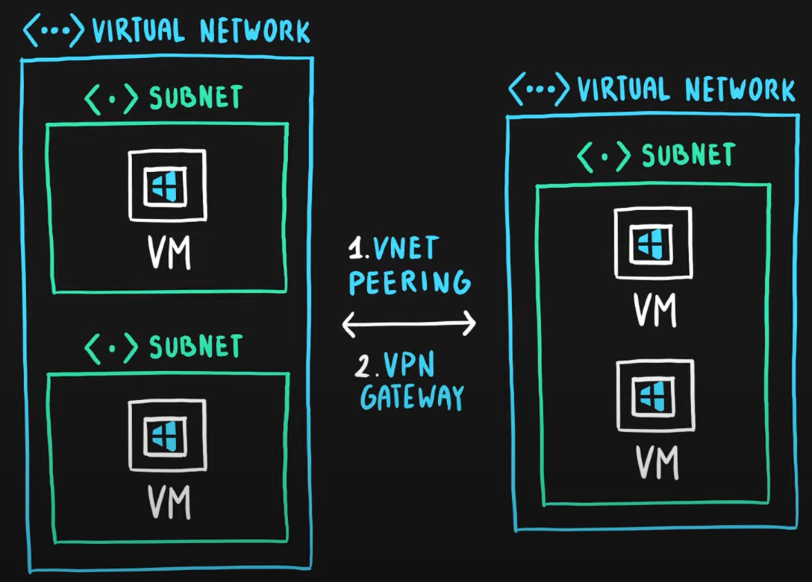

### **Azure VPN Gateway**
- Tipo específico de puerta de enlace de red virtual para el tráfico on-premise a Azure a través de la Internet pública de forma encriptada. También se puede usar para unir dos redes virtuales de Azure (no es muy común).

### **Azure Load Balancer (Equilibrador de carga)**
**Balanceo**: Distribución del tráfico entre múltiples recursos
- Iguala la distribución del tráfico
- Admite escenarios tanto entrantes como salientes
- Escenarios de alta disponibilidad
- Aplicaciones TCP (protocolo de control de transmisión) y UDP (protocolo de datagramas de usuario)
- Tráfico Interno y Externo
- Reenvío de puertos
- Alta escala con hasta millones de flujos

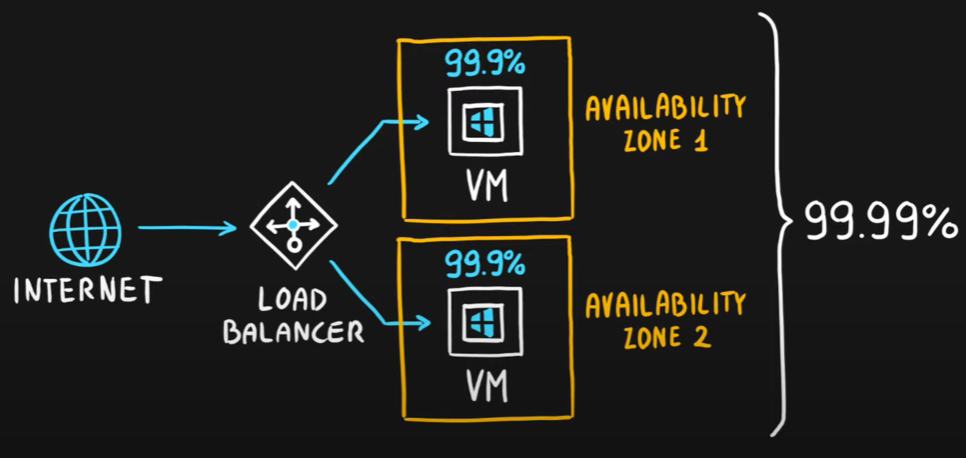
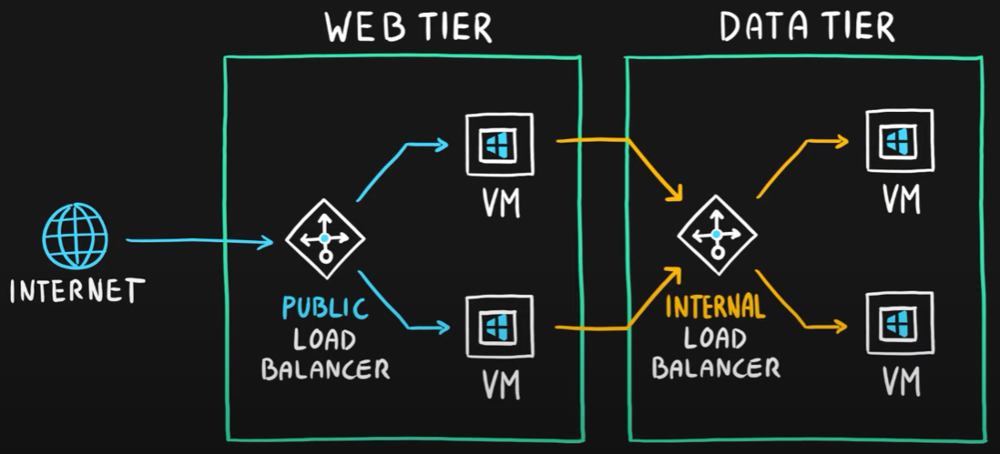

### **Azure Application Gateway**
- Equilibrador de carga de tráfico web (HTTP)
- Firewall de aplicaciones web
- Redirección del tráfico entrante
- Afinidad de sesión - Asegurarse que los usuarios siempre se dirijan a los mismos servidores
- Enrutamiento de URL
- Terminación SSL - Permite a los clientes descifrar el tráfico en **Application Gateway** y enviar una versión sin cifrar a los servicios de back-end para reducir la potencia de procesamiento requerida para descifrar cada solicitud individual.

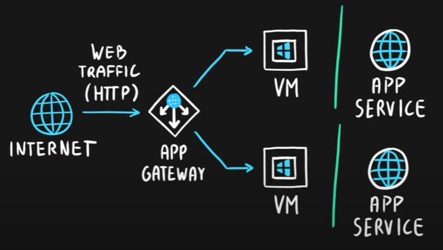
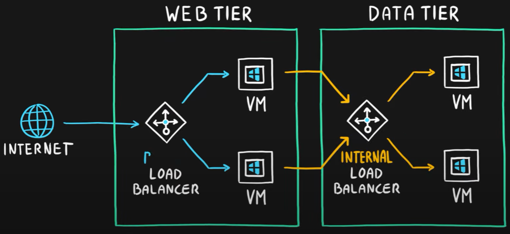
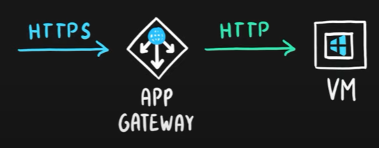

### **Azure Content Delivery Network (Red de entrega de contenidos)**
Distribuye y almacena en caché el contenido en múltiples bucaciones emergentes en todo el mundo para descargar nuestros servicios front-end pero también reduce la latencia de entrega de recursos a nuestros usuarios.
- Definir contenido
- Minimizar la latencia
- POP (puntos de presencia) con muchas ubicaciones

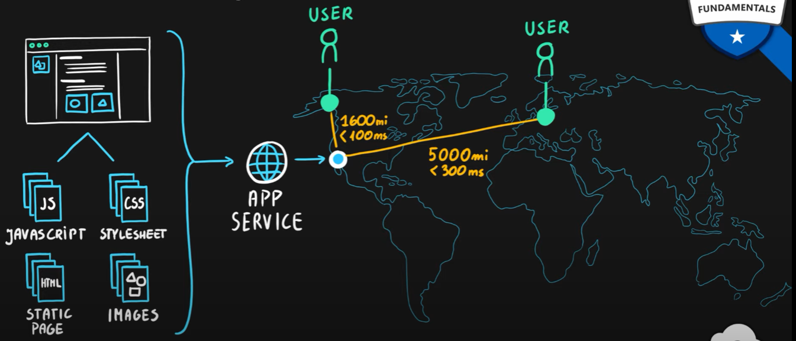
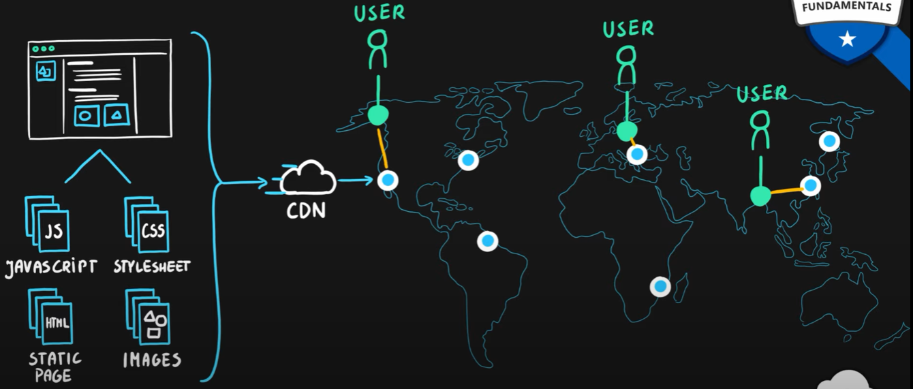

## **Servicios de almacenamiento**
### **Tipos de datos**
- **Estructurado**: datos que se pueden representar mediante tablas con un esquema muy estricto. Cada fila debe seguir un esquema definido. Algunas tablas tienen relaciones definidas entre ellas. Normalmente se utiliza en bases de datos relacionales.  
- **Semiestructurado**: datos que se pueden representar mediante tablas pero sin un esquema estricto definido.  
Las filas solo deben tener un identificador de clave único.  
- **Sin estructura**: cualquier archivo en cualquier formato. Como archivos binarios, archivos de aplicaciones, imágenes, películas, etc.  

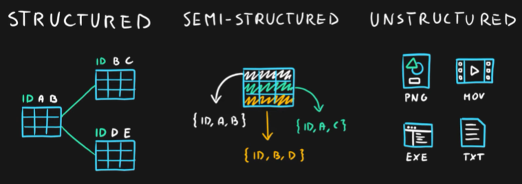

### **Storage Account (Cuenta de almacenamiento)**
- Grupo de servicios que incluyen
  - Almacenamiento de blobs,
  - Almacenamiento en cola,
  - Almacenamiento de tablas y
  - aAlmacenamiento de archivos
- Se utiliza para almacenar
  - Archivos,
  - Mensajes, y
  - Datos semiestructurados
- Altamente escalable (hasta petabytes de datos)
- Muy duradero (99,999999999 % - 11 nueves, hasta 16 nueves)
- Más barato por GB de almacenamiento

### **Blob Storage (Almacenamiento de blobs)**
- BLOB – objeto grande binario – archivo
- Diseñado para el almacenamiento de archivos de cualquier tipo
- Tres niveles de almacenamiento
  - Hot: datos de acceso frecuente
  - Cool: datos a los que se accede con poca frecuencia (menor disponibilidad, alta durabilidad)
  - Archive: rara vez (si es que alguna vez) se accede a los datos

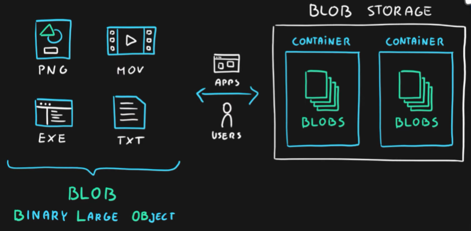

### **Queue Storage (Almacenamiento en cola)**
- Almacenamiento de pequeños datos (mensajes)
- Diseñado para procesamiento asíncrono escalable

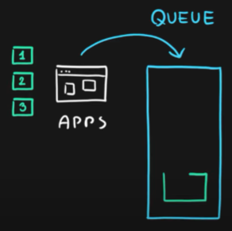
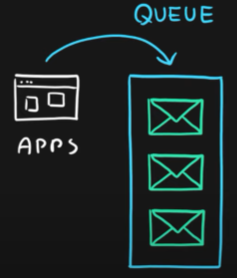
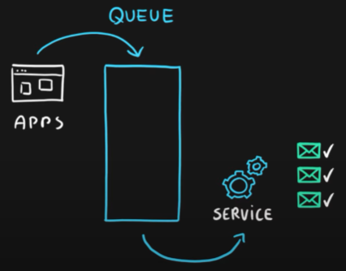

### **Table Storage (Almacenamiento de tablas)**
- Almacenamiento para datos semiestructurados (NoSQL)
  - Sin necesidad de uniones foráneas, claves foráneas, relaciones o esquemas estrictos
  - Diseñado para un acceso rápido
- Muchas interfaces de programación y SDK

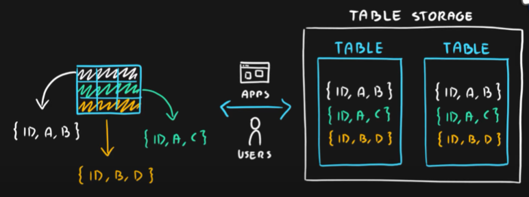

### **File Storage (Almacenamiento de archivos)**
- Almacenamiento para archivos a los que se accede a través de protocolos de unidades compartidas
- Diseñado para ampliar los recursos compartidos de archivos en las instalaciones o implementar escenarios de elevación y cambio

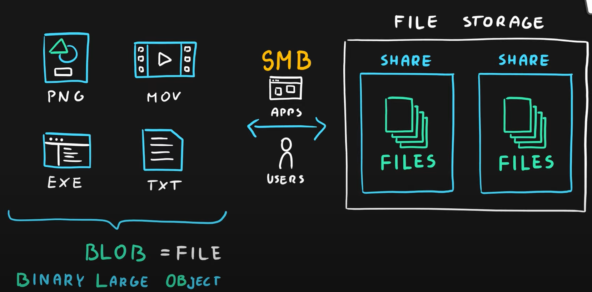

### **Disk Storage (Almacenamiento de disco)**
- Emulación de disco en la nube
- Almacenamiento persistente para máquinas virtuales
- Diferente
  - tamaños,
  - tipos (SSD, HDD)
  - niveles de rendimiento
- El disco puede ser administrado o no administrado  
**NOTA**: **Disk Storage** también es un subservicio de la cuenta de **Azure Storage**. esto significa que tanto los discos administrados como los no administrados son parte de él. incluso si el disco administrado se muestra como un recurso separado,
debajo sigue siendo el mismo servicio.

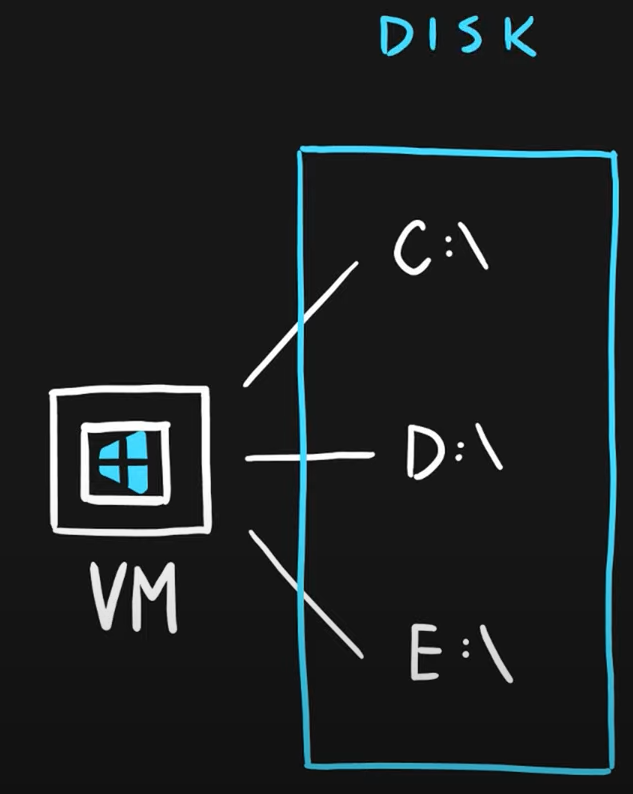

## **Servicios de bases de datos**
### **Tipos de datos en las BD**
Se explicó anteriormente. Revisar [Tipos de datos](#tipos-de-datos)
### **Azure Cosmos DB**
- Servicio de base de datos NoSQL (datos semiestructurados) distribuido globalmente
- Sin esquema
- Múltiples API (SQL, MongoDB, Cassandra, Gremlin, Table Storage)
- Diseñado para
  - Aplicaciones de alta capacidad de respuesta (en tiempo real) con respuestas de latencia muy baja <10 ms
  - Aplicaciones multirregionales

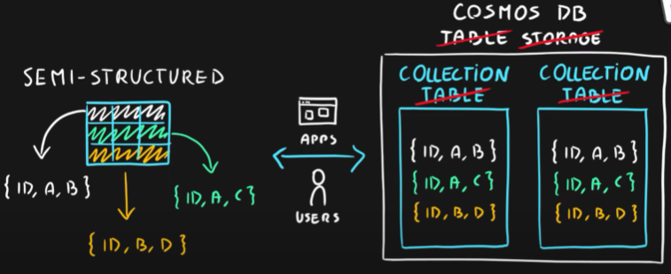
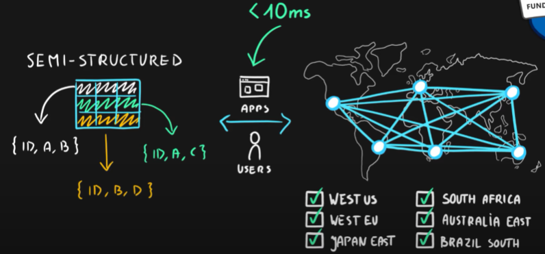

### **Azure SQL Database**
- Servicio de **base de datos relacional** en la nube (PaaS) (DBaaS - Database as a Service)
- **Servicio de datos estructurados** definido mediante esquema y relaciones
- **Capacidades de consulta enriquecidas** (SQL)
- Base de datos de **alto rendimiento**, fiable, totalmente gestionada y segura para la creación de aplicaciones

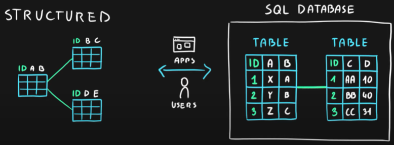
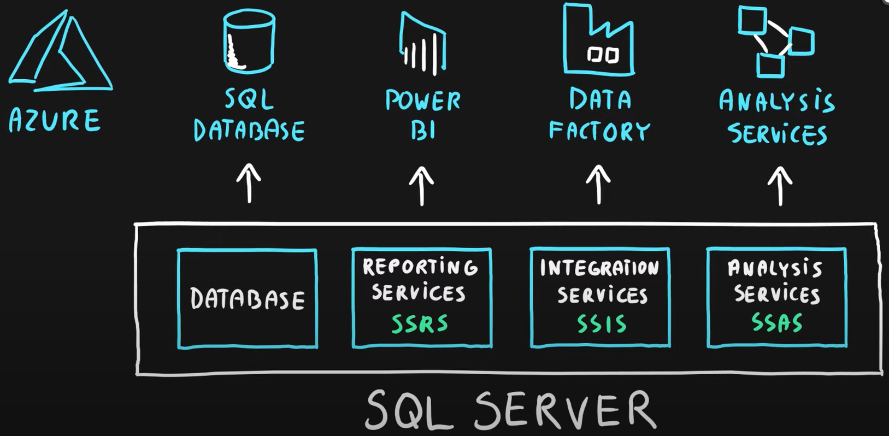

### **Azure SQL product family**
- Azure **SQL Database**: base de datos relacional confiable basada en SQL Server
- Azure **Database for MySQL**: versión de Azure SQL para el motor de base de datos MySQL
- Azure **Database for PostgreSQL**: versión de Azure SQL para el motor de base de datos de PostgreSQL
- **Instancia administrada de Azure SQL**: SQL Server completo administrado por un proveedor de la nube
- Azure **SQL en VM**: SQL Server completo en IaaS
- Azure **SQL DW (Synapse)**: versión de procesamiento paralelo masivo (MPP) de SQL Server

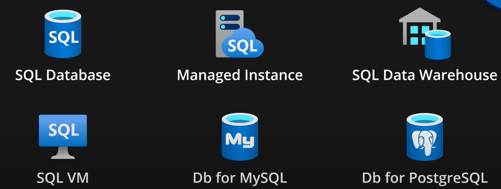

## **Azure Marketplace**
- Facilita la conexión entre usuarios y partners de Microsoft, proveedores de software independientes y neuvas empresas que ofrecen sus soluciones y servicios optimizados para ejecutarse en Azure.
- Piense en ello como una "Tienda Azure" donde compra servicios y soluciones para la plataforma Azure
- Cada producto es una plantilla que contiene **uno o varios servicios(cuya instancia es un recurso)**
- Los productos son entregados por **proveedores propios y externos**.
- Las soluciones pueden aprovechar todas las categorías de servicios como IaaS, PaaS y SaaS

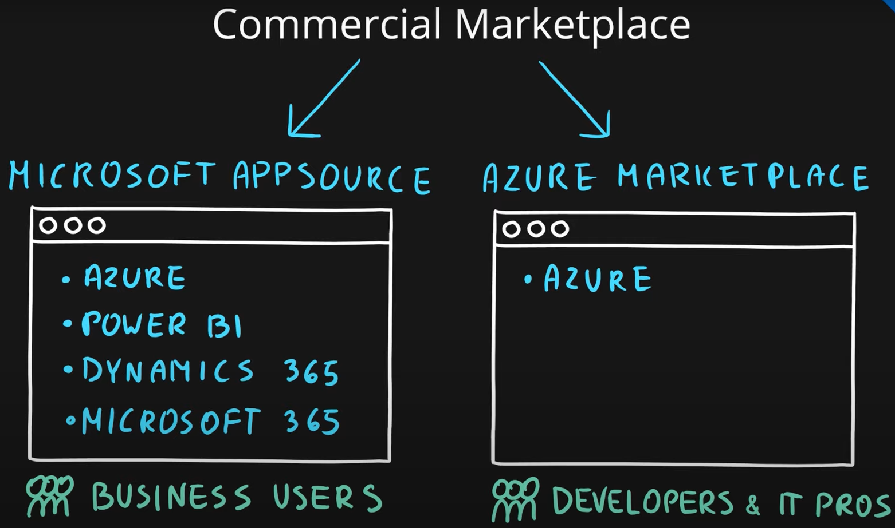

## **Servicios IoT**
Internet de las cosas (**IoT**) es una red de dispositivos conectados a Internet (**dispositivos IoT**) integrados en objetos cotidianos que permiten enviar y recibir datos, como **configuraciones** y **telemetría**.  
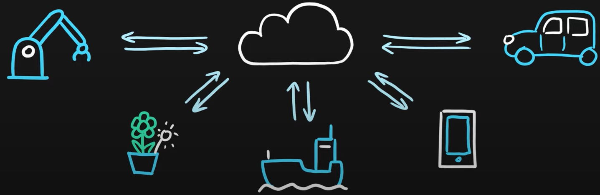

### **Azure IoT Hub**
- Servicio gestionado para comunicación bidireccional
- Plataforma como servicio (PaaS)
- Altamente seguro, escalable y confiable
- Se integra con una gran cantidad de servicios de Azure
- SDK programables para lenguajes populares (C, C#, Java, Python, Node.js)
- Múltiples protocolos (HTTPS, AMQP, MQTT)  

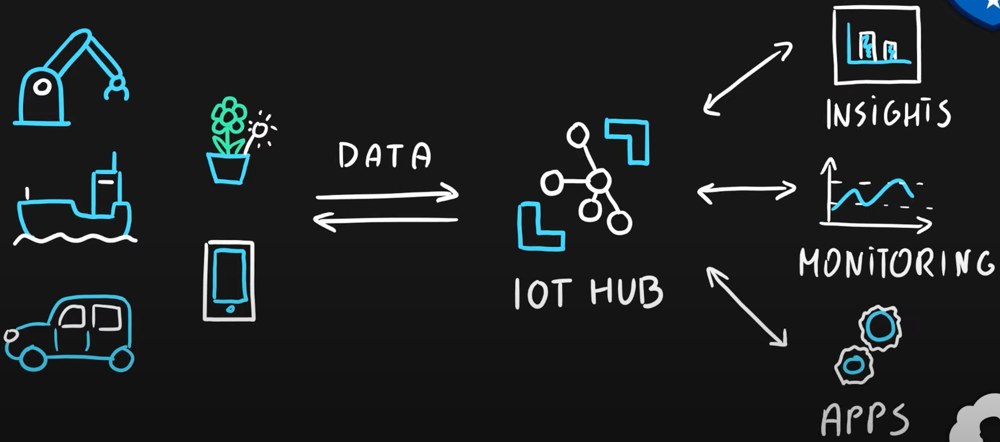

### **Azure IoT Central**
- Plataforma de aplicaciones IoT: software como servicio (SaaS)
- Plantillas de aplicaciones específicas de la industria
- No se requieren conocimientos técnicos profundos
- Servicio de conexión, gestión y monitorización de dispositivos IoT
- Altamente seguro, escalable y confiable
- Construido sobre el servicio IoT Hub y más de 30 servicios más  

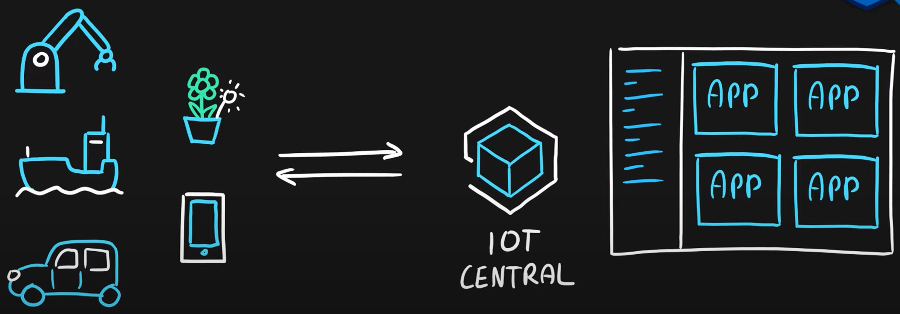

### **Azure Sphere**
- Soluciones seguras de IoT de extremo a extremo
  - Chips certificados por Azure Sphere (unidades de microcontrolador - MCU)
  - Sistema operativo Azure Sphere basado en Linux
  - Comunicación de dispositivo a nube de confianza de Azure Security Service 
 
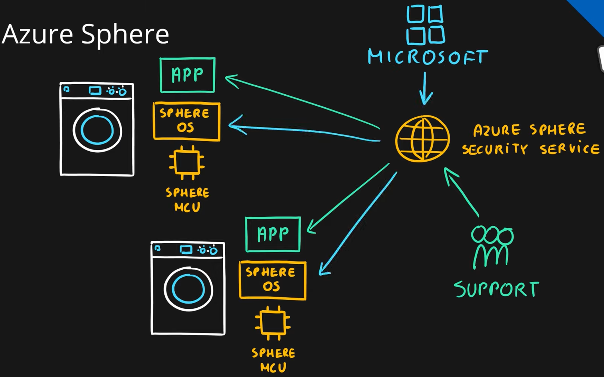

## **Servicios Big Data & Analytics**
Big Data es un campo de la tecnología que ayuda con la extracción, el procesamiento y el análisis de información que es demasiado grande o compleja para ser tratada por el software tradicional.  
**La regla de las tres V**
Los grandes datos suelen tener una de las siguientes características  
- **Velocidad**: qué tan rápido ingresan los datos o qué tan rápido los estamos procesando
  - Batch
  - Periódico
  - Casi en tiempo real
  - Tiempo real
- **Volumen**: cuántos datos estamos procesando
  - Megabytes
  - Gigabyte
  - Terabytes
  - Petabytes
- **Variedad**: cuán estructurados/complejos son los datos
  - Tables
  - bases de datos
  - Foto, Audio
  - Vídeo, Redes Sociales

### **Azure Synapse Analytics**
Plataforma de análisis de big data con una experiencia de espacio de trabajo unificado que admite la transformación de datos de extremo a extremo con el poder de SQL y Spark.

Azure Synapse Analytics es una evolución de un servicio SQL Datawarehouse que es una versión de procesamiento paralelo masivo de SQL Server. En una iteración reciente, Azure Synapse también brindó la capacidad de ejecutar consultas y scripts mediante Apache Spark y al incluir Data Factory como un componente integrado llamado Synapse Pipelines, ahora se considera una solución de extremo a extremo para grandes cargas de trabajo de datos.

- Plataforma de análisis de big data (PaaS)
- Múltiples componentes
  - Spark
  - Synapse SQL
    - Grupos de SQL (dedicados: pago por rendimiento aprovisionado)
    - SQL bajo demanda (ad-hoc: pago por TB procesados)
  - Synapse Pipelines (Data Factory - ETL)
  - Studio (Engloba todos los componentes como una experiencia unificada)

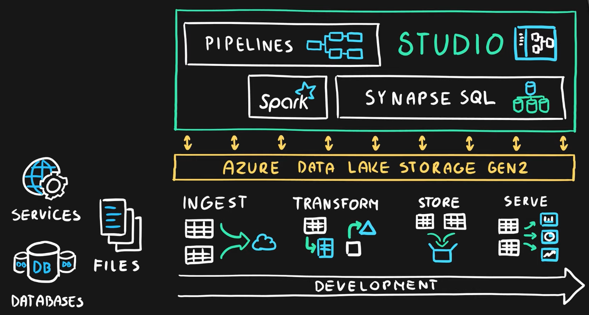

### **Azure HDInsight**
- Plataforma flexible multipropósito de big data (PaaS)
- Múltiples tecnologías compatibles (Hadoop, Spark, Kafka, HBase, Hive, Storm, Machine Learning)

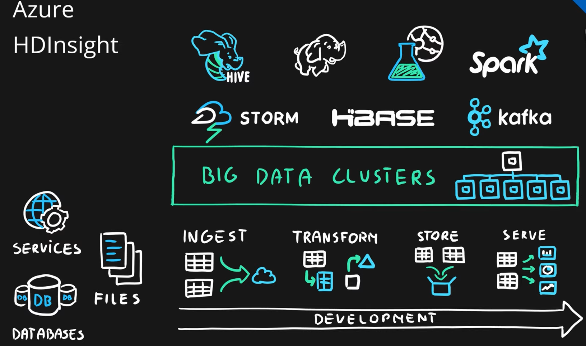

### **Azure Databricks**
- Plataforma de colaboración de big data (PaaS)
- Espacio de trabajo unificado para portátiles, clústeres, datos, administración de acceso y colaboración
- Basado en Apache Spark
- Se integra muy bien con los servicios de datos comunes de Azure

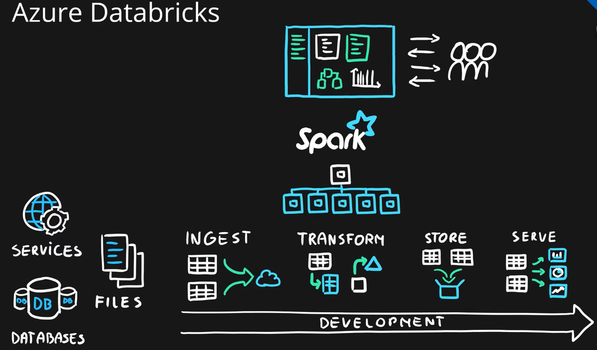

## **Servicios de IA**
**¿Qué es Artificial Intelligence?**  
La inteligencia artificial (IA) es la simulación de la inteligencia y las capacidades humanas mediante un software informático.  
**¿Qué es Machine Learning?**  
El aprendizaje automático es una subcategoría de la IA en la que se "enseña" un software de computadora a sacar conclusiones y hacer predicciones a partir de los datos.  
### **Azure Machine Learning**
- Plataforma basada en la nube para crear, administrar y publicar modelos de aprendizaje automático
- Plataforma como servicio (PaaS)
- Machine Learning Workspace: recurso de nivel superior (Top-Level)
- Machine Learning Studio: portal web para desarrollo extremo a extremo
- Características
  - Cuadernos: usando Python y R
  - ML automatizado: ejecute múltiples combinaciones de algoritmos/parámetros, elija el mejor modelo
  - Diseñador: interfaz gráfica para el desarrollo sin código
  - Datos y computación: administración de recursos de almacenamiento y computación
  - Pipelines: orqueste tareas de capacitación, implementación y administración de modelos

## **Servicios serverless computing**
La computación sin servidor es un entorno de ejecución alojado en la nube que permite a los clientes ejecutar sus aplicaciones en la nube mientras abstraen por completo la infraestructura subyacente.  
### **Azure Functions**
- Plataforma de codificación sin servidor (Funciones como servicio, FaaS)
- Diseñado para arquitecturas de nanoservicios y aplicaciones basadas en eventos
- Escala hacia arriba y hacia abajo muy rápidamente
- Altamente escalable
- Admite lenguajes y marcos populares (.NET y .NET Core, Java, Node.js, Python, PowerShell, etc.)

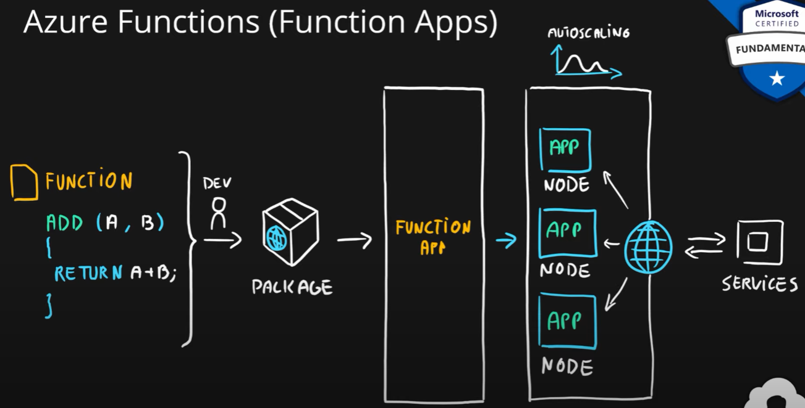

### **Azure Logic Apps**
- Servicio de integración empresarial sin servidor (PaaS)
- Más de 200 conectores para servicios populares
- Diseñado para la orquestación de
  - Procesos de negocios,
  - flujos de trabajo de integración para aplicaciones, datos, sistemas y servicios
- Solución sin código

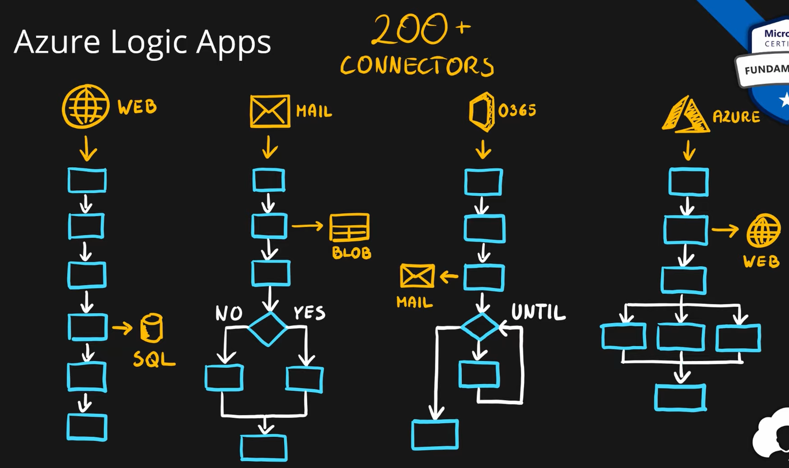

### **Azure Event Grid**
- Servicio de enrutamiento de eventos sin servidor completamente administrado
- Utiliza el modelo de publicación-suscripción
- Diseñado para aplicaciones basadas en eventos y casi en tiempo real
- Admite docenas de eventos integrados de los servicios de Azure más comunes

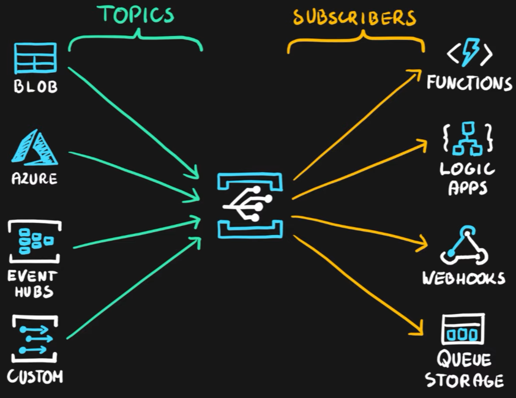

## **Soluciones DevOps**
**DevOps** es un conjunto de prácticas que combinan tanto el desarrollo (Dev) como las operaciones (Ops).  
DevOps tiene como objetivo **acortar el ciclo de vida del desarrollo** al proporcionar capacidades de **integración y entrega continuas** (CI/CD) al tiempo que garantiza una **alta calidad** de los entregables.

### **Azure DevOps**
- Colección de servicios para construir soluciones usando prácticas DevOps
- Servicios incluidos
  - Tableros: trabajo de seguimiento
  - Canalizaciones: creación de flujos de trabajo de CI/CD (creación, prueba e implementación de aplicaciones)
  - Repos: colaboración de código y control de versiones con Git
  - Planes de prueba: pruebas manuales y exploratorias
  - Artefactos: gestione los entregables del proyecto
- Ampliable con Marketplace: más de 1000 aplicaciones disponibles
- Evolucionado de TFS (Team Foundation Server), a través de VSTS (Visual Studio Team Services)

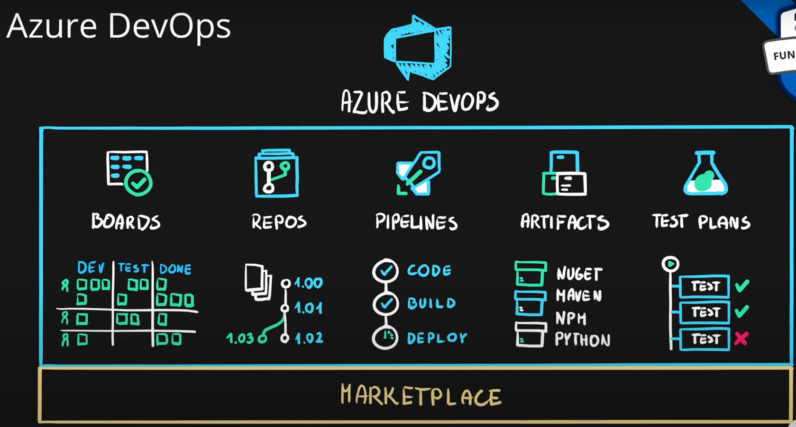

### **Azure DevTest Labs**
- Servicio de creación de entornos sandbox para desarrolladores/testers (PaaS)
- Configuración rápida de máquinas virtuales autogestionadas
- Plantillas preconfiguradas para máquinas virtuales
- Muchos artefactos adicionales (herramientas, aplicaciones, acciones personalizadas)
- Políticas de laboratorio (cuotas, tamaños, apagado automático)
- Comparta y automatice laboratorios a través de imágenes personalizadas
- Complementos/API/herramientas prefabricados para la automatización de canalización de CI/CD

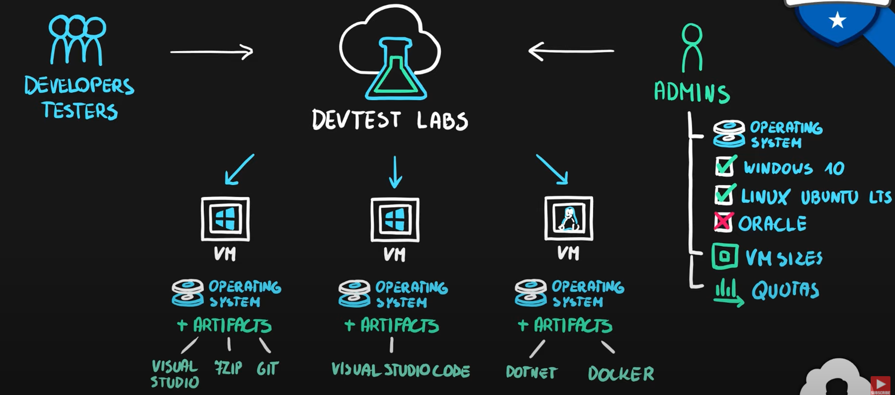

## **Azure Tools**
### **Azure Portal**
- Interfaz pública basada en web para la gestión de la plataforma Azure.
- Diseñado para el autoservicio.
- Personalizable.
- Tareas simples.
- Diseñado para proporcionar resiliencia y disponibilidad continua al estar presente en todos los centros de datos de Azure.

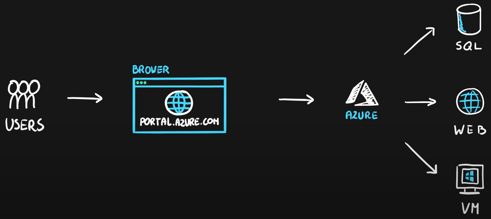

### **Azure PowerShell**
- PowerShell y módulo
- Diseñado para la automatización
- Multiplataforma con PowerShell Core
- Fácil de usar
  - Connect-AzAccount: inicie sesión en Azure
  - Get-AzResourceGroup: lista de grupos de recursos
  - New-AzResourceGroup: crear un nuevo grupo de recursos
  - New-AzVm: crear una máquina virtual

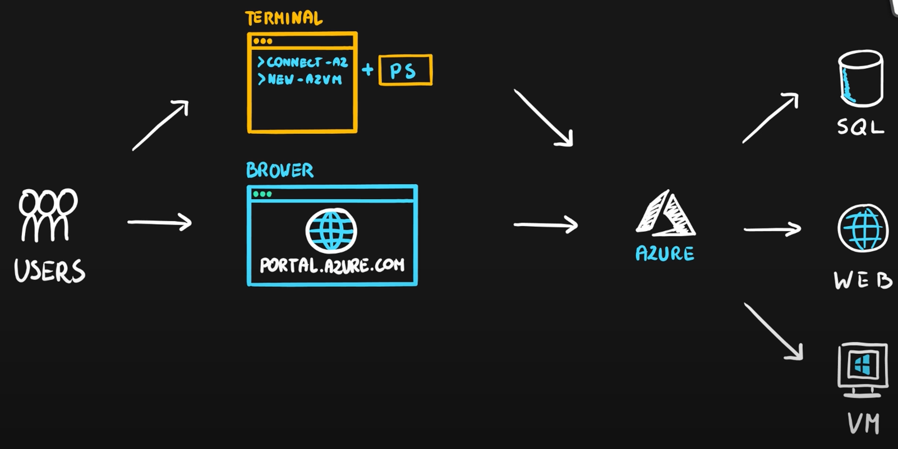

### **Azure CLI**
- Interfaz de línea de comandos para Azure
- Diseñado para la automatización
- Multiplataforma (Python)
- Fácil de usar
  - inicio de sesión az: inicie sesión en Azure
  - lista de grupos az: lista de grupos de recursos
  - az group create: crear un nuevo grupo de recursos
  - az vm create: crear una máquina virtual
- Native OS terminal scripting

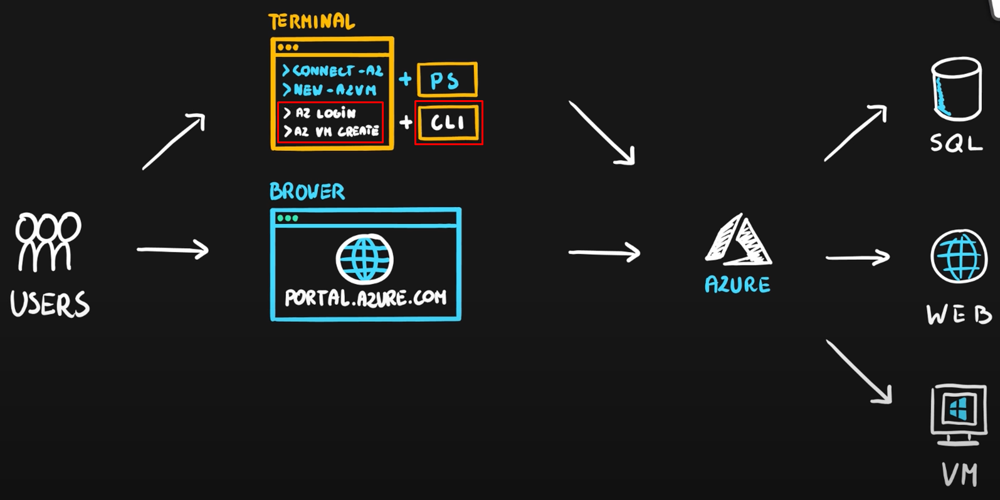

### **Azure Cloud Shell**
- Entorno de secuencias de comandos basado en la nube
- Completamente libre
- Admite Azure PowerShell y la CLI de Azure
- Docenas de herramientas adicionales
- Múltiples interfaces de cliente
  - Integración con Azure Portal (portal.azure.com)
  - Portal de Shell (shell.azure.com)
  - Extensión de código de Visual Studio
  - Terminal de Windows
  - Aplicación móvil de Azure
  - Integración con Microsoft Docs

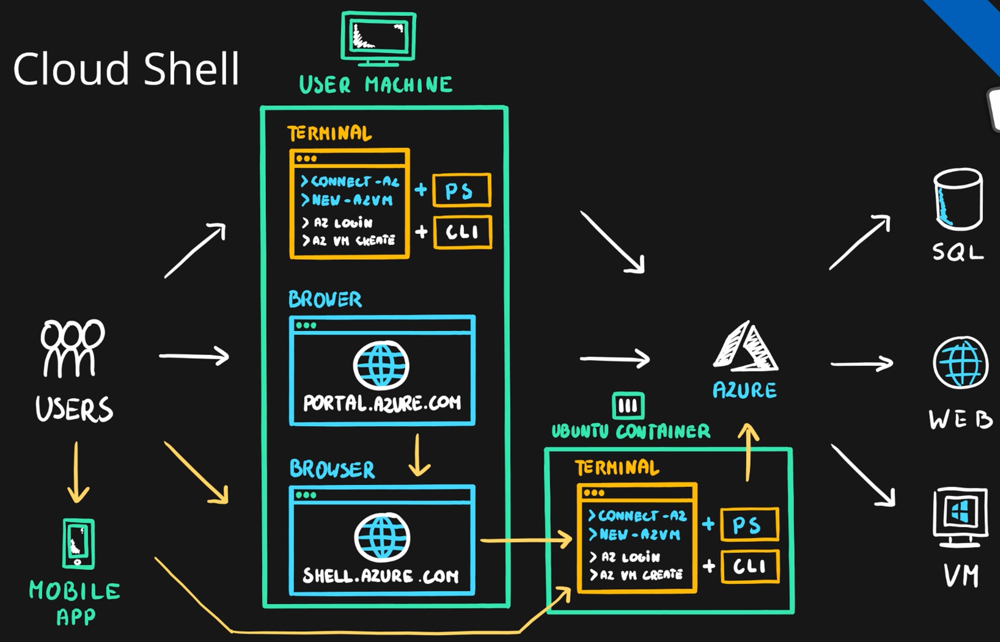

## **Azure Advisor**
- Servicio de **consultoria personalizada**
- Diseñado para proporcionar **recomendaciones** y **mejores prácticas** para
  - **Costo** (tamaños de SKU, servicios inactivos, instancias reservadas, etc.)
  - **Seguridad** (configuración de MFA, configuración de vulnerabilidades, instalaciones de agentes, etc.)
  - **Fiabilidad** (configuración de redundancia, eliminación suave en blobs, etc.)
  - **Rendimiento** (tamaños de SKU, versiones de SDK, limitación de E/S, etc.)
  - **Excelencia operativa** (salud del servicio, límites de suscripción, etc.)
- Recomendaciones **procesables**
- **¡Gratis!**

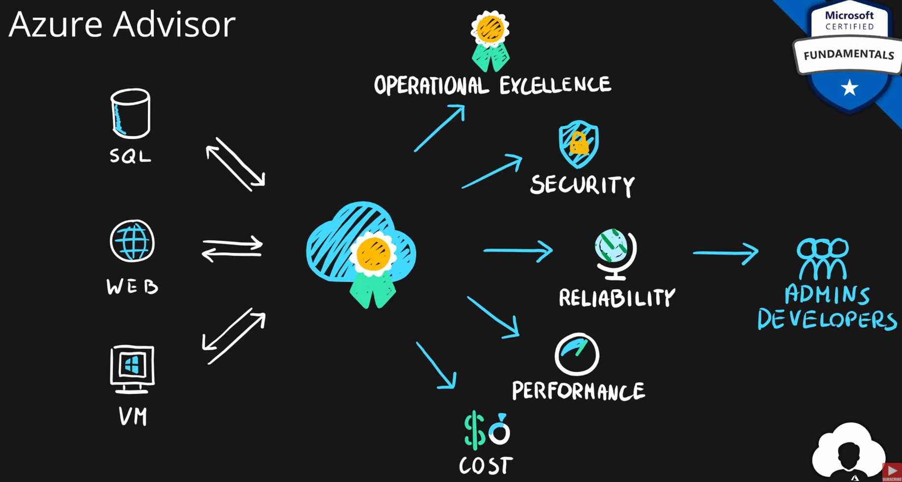

## **Grupos de seguridad Azure**
### **Grupos de seguridad de red**
- Diseñado para filtrar el tráfico hacia (entrante) y desde (saliente) los recursos de Azure ubicados en Azure Virtual Network
- Filtrado controlado por reglas
- Posibilidad de tener múltiples reglas de entrada y salida
- Las reglas se crean especificando
  - Origen/Destino (direcciones IP, etiquetas de servicio, grupos de seguridad de aplicaciones)
  - Protocolo (TCP, UDP, cualquiera)
  - Puerto (o intervalos de puertos, por ejemplo, 3389 – RDP, 22 – SSH, 80 HTTP, 443 HTTPS)
  - Dirección (entrante o saliente)
  - Prioridad (orden de evaluación)

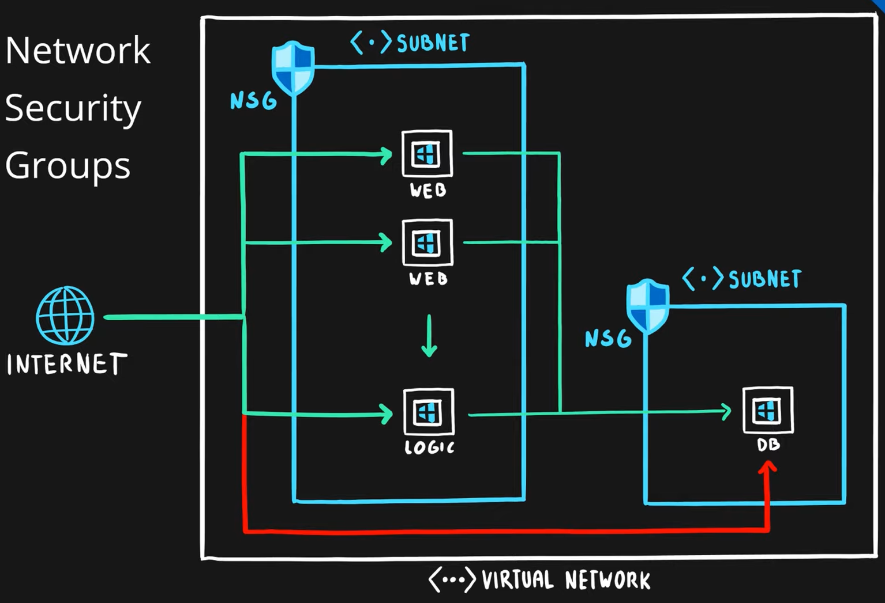

### **Grupos de seguridad de aplicaciones**
- Característica que permite la agrupación de máquinas virtuales ubicadas en la red virtual de Azure
- Diseñado para reducir el esfuerzo de mantenimiento (asigne ASG en lugar de la dirección IP explícita)

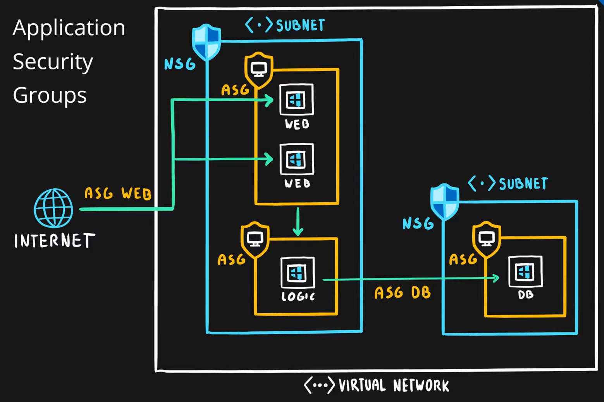

## **Rutas definidas por el usuario (UDR) con tablas de rutas**
### **Enrutamiento(Routing)**
Proceso de encontrar/seleccionar una ruta para el tráfico en una o varias redes.

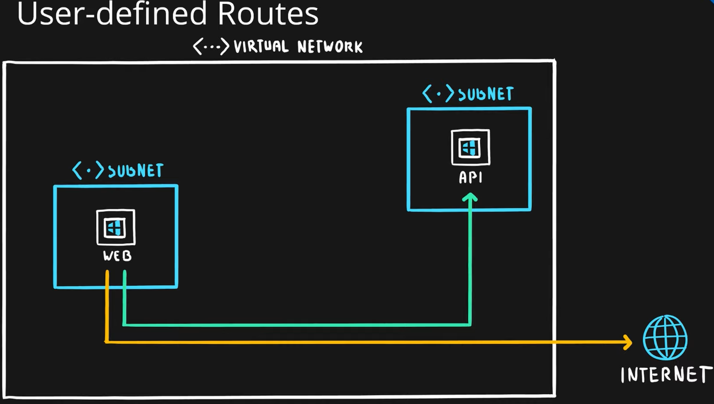

### **User-defined Routes(UDR)**
- Rutas personalizadas (definidas por el usuario, estáticas) (UDR)
- Diseñado para anular el enrutamiento predeterminado de Azure o agregar nuevas rutas
- Administrado a través del recurso Azure Route Table
- Asociado con cero o más subredes de red virtual

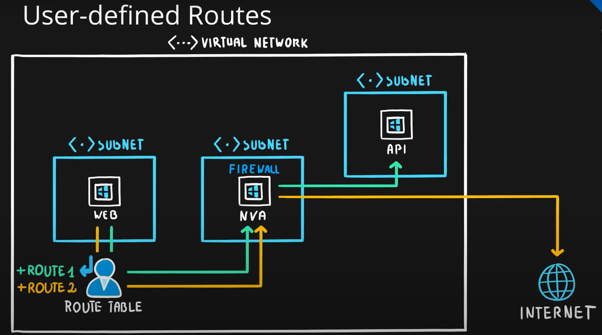

## **Azure Firewall**
Firewall es un servicio de seguridad de red que monitorea y controla el tráfico entrante y saliente.

- Servicio de firewall administrado basado en la nube (PaaS, Firewall como servicio)
- Alta disponibilidad integrada
- Altamente escalable
- Reglas de filtrado de tráfico entrante y saliente
- Compatibilidad con FQDN (Nombre de dominio completo), ej. microsoft.com
- Totalmente integrado con Azure monitor para registro y análisis

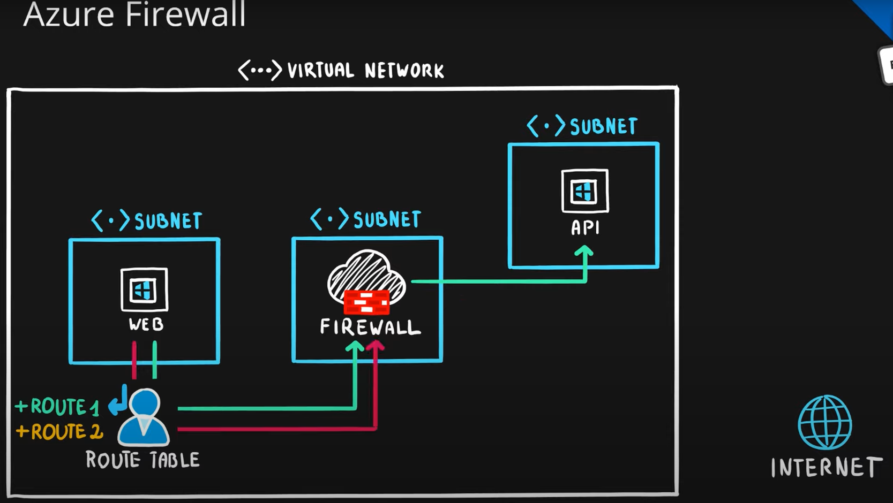

## **Azure DDoS Protección**
**DoS - Denegación de servicio**  
Ciberataque con la intención de causar una interrupción temporal o indefinida del servicio

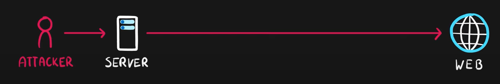

**DDoS - Denegación de servicio distribuida**  
Ataque DoS que se origina en múltiples servidores

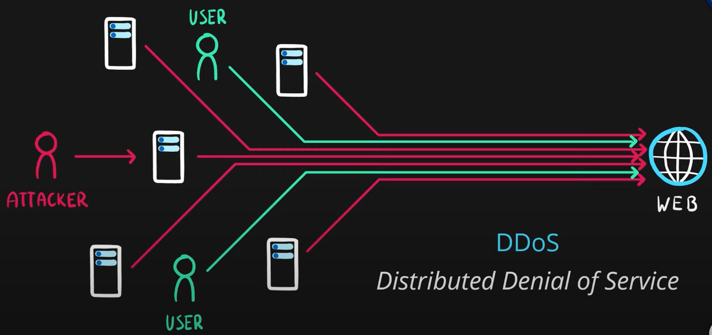

**Azure DDoS Protection**
- Servicio de protección DDoS en Azure
- Diseñado para
  - Detecte el tráfico malicioso y bloquéelo mientras permite que los usuarios legítimos se conecten
  - Evite costos adicionales para entornos de escalado automático
- dos niveles
  - Básico: habilitado automáticamente para la plataforma Azure
  - Estándar: capacidades adicionales de mitigación y supervisión para los recursos de Azure Virtual Network
- El nivel estándar utiliza el aprendizaje automático para analizar los patrones de tráfico para una mayor precisión

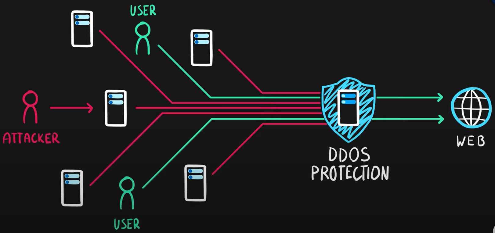

## **Azure Identity Services**
### **Identidad**
La identidad en general significa el hecho de ser alguien o algo. Por ejemplo, nuestras cuentas de usuario se consideran identidad.
- Un usuario con username y password.
- También aplicaciones u otros servidores con claves secretas o certificados.
- El hecho de ser algo o alguien.

### **Autenticación**
El proceso de verificación/afirmación de identidad

### **Autorización**
Después de la autenticación empieza el proceso de autorización.  
El proceso de garantizar que solo las identidades autenticadas obtengan acceso a los recursos para los que se les ha otorgado acceso.

### **Gestión de Acceso**
El proceso de controlar, verificar, rastrear y administrar el acceso a usuarios y aplicaciones autorizados.

### **Azure AD**
- Servicio de Gestión de Identidad y Acceso en Azure
- Gestión de identidades: usuarios, grupos, aplicaciones
- Gestión de acceso: suscripciones, grupos de recursos, funciones, asignaciones de funciones, - configuración de autenticación y autorización, etc.
- Utilizado por múltiples plataformas en la nube de Microsoft
  - Azure
  - microsoft 365
  - Office 365
  - Servicios de Live.com (Skype, OneDrive, etc.)

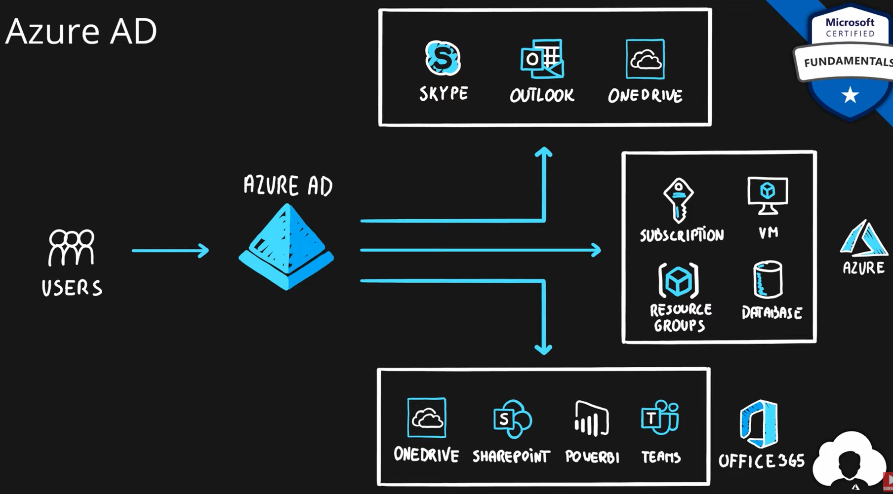

### **Autenticación multifactor (MFA)**
- Proceso de autenticación usando más de un factor (evidencia) para probar la identidad
- Tipos de factores
  - Factor de conocimiento: "Algo que sabes", ej. contraseña, pin
  - Factor de posesión – “Algo que tienes”, ej. teléfono, ficha, tarjeta, llave
  - Factor de característica física – “Algo que eres”, ej. huella dactilar, voz, rostro, iris del ojo
  - Factor de ubicación – “En algún lugar donde estés”, ej. ubicación gps
- Compatible con Azure AD de forma predeterminada (simple interruptor de encendido y apagado)

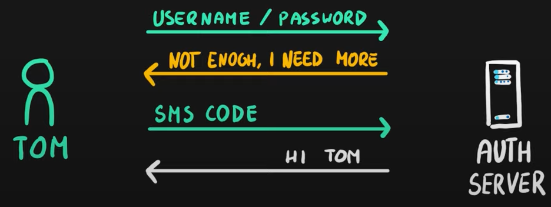

## **Azure Security Center**
- Servicio de administración de seguridad de plataforma e infraestructura centralizada/unificada
- Integrado de forma nativa en los servicios de Azure
- Integrado con Azure Advisor
- dos niveles
  - Gratis (Azure Defender APAGADO): incluido en todos los servicios de Azure, proporciona evaluaciones continuas, puntuación de seguridad y recomendaciones de seguridad procesables
  - Pagado (Azure Defender ON): seguridad híbrida,
alertas de protección contra amenazas, análisis de vulnerabilidades, acceso a máquinas virtuales justo a tiempo (JIT), etc.

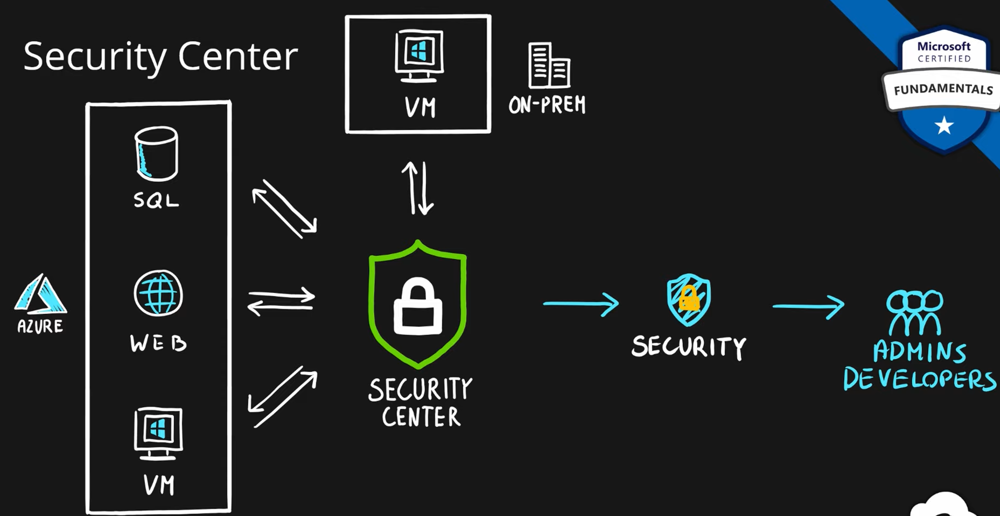
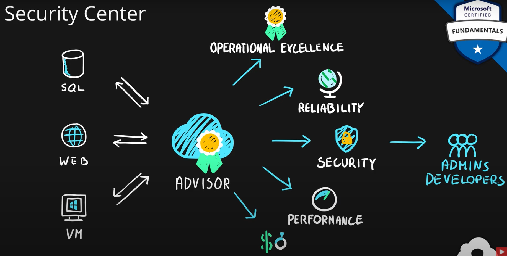
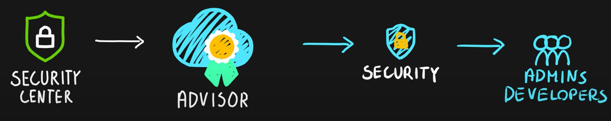

[Video explicativo](https://youtu.be/tyztKP9rszU?list=PLGjZwEtPN7j-Q59JYso3L4_yoCjj2syrM)

## **Azure Sentinel**
Recopilar datos de seguridad de muchos orígenes diferentes mediante Azure Sentinel y tomar medidas conforme a ellos.

## **Azure Key Vault**
- Servicio administrado para asegurar información sensible (aplicación/plataforma) (PaaS)
- Servicio de almacenamiento seguro para
  - Keys,
  - Secrets y
  - Certificados
- Altamente integrado con otros servicios de Azure (VM, Logic Apps, Data Factory, Web Apps, etc.)
- Centralización
- Supervisión y registro de acceso

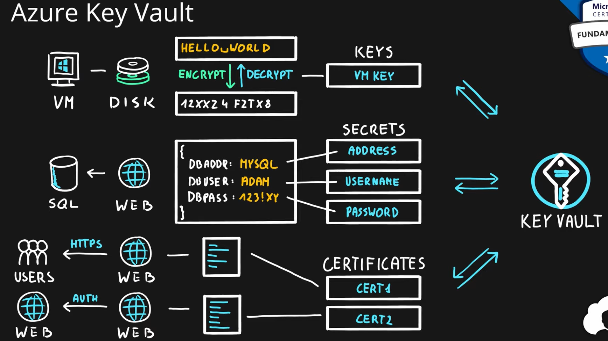

## **Azure Dedicated Host**
Administrar servidores físicos dedicados para hospedar máquinas virtuales de Azure para Windows y Linux mediante Azure Dedicated Host.

## **Azure Role-based Access Control (RBAC)**
**¿Qué es un rol?**  
El rol (definición de rol) es una colección de acciones que la identidad asignada podrá realizar.  
La definición de roles es una respuesta a la pregunta "¿Qué se puede hacer?"  

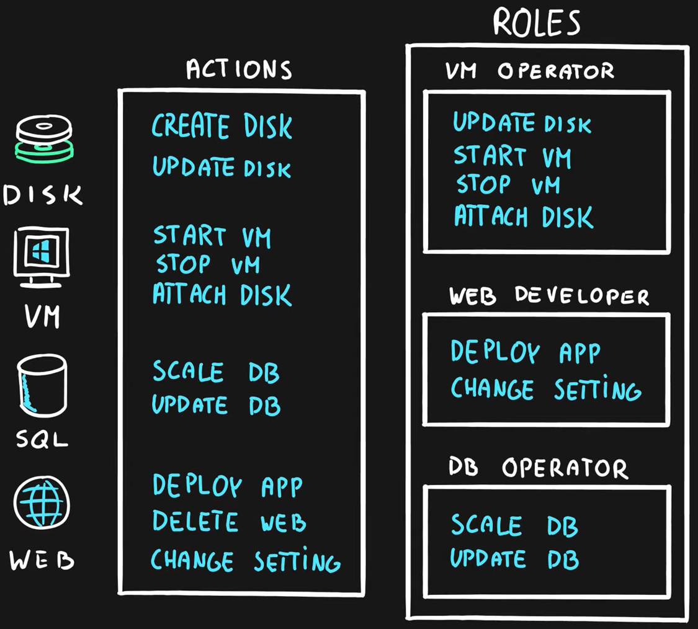

**¿Qué es un principal de seguridad?**
Security Principal es un objeto de Azure (identidad) que se puede asignar a un rol (por ejemplo, usuarios, grupos o aplicaciones).  
La asignación del director de seguridad es una respuesta a la pregunta "¿Quién puede hacerlo?"  

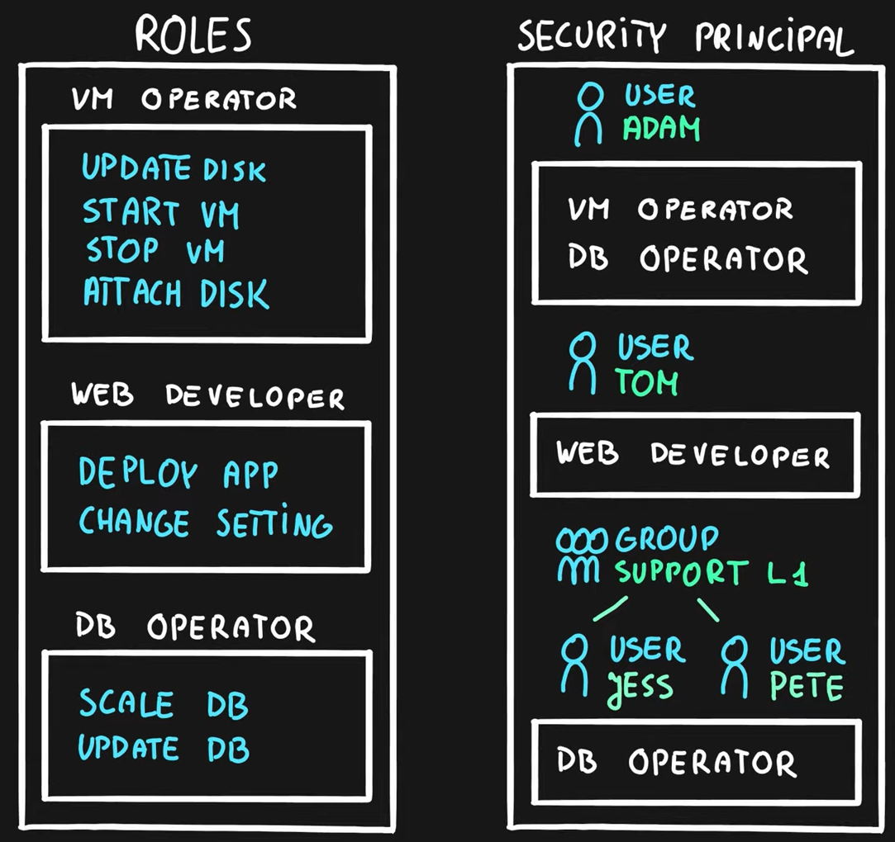

**¿Qué es un alcance?**
El ámbito es uno o más recursos de Azure a los que se aplica el acceso.  
La asignación de alcance es una respuesta a la pregunta "¿Dónde se puede hacer?"  

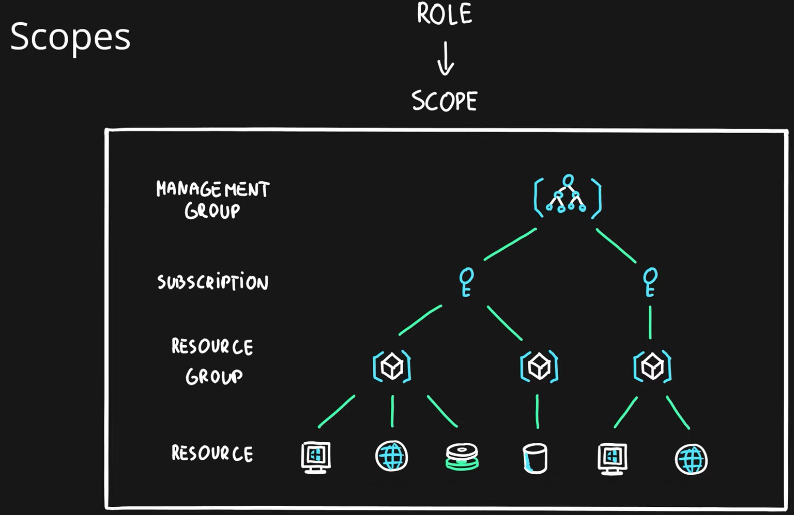

**¿Qué es una asignación de roles?**  
La asignación de funciones es una combinación de la definición de funciones, la entidad de seguridad y el ámbito.  

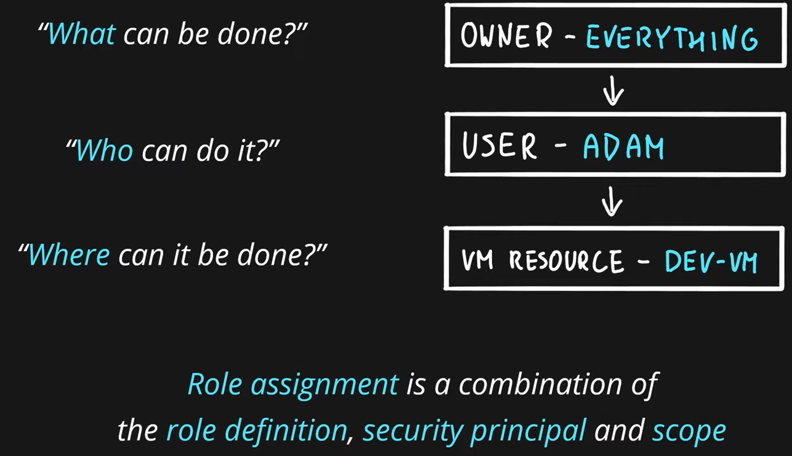

**Características**  
- Sistema de autorización integrado en Azure Resource Manager (ARM)
- Diseñado para la gestión de acceso detallada de los recursos de Azure
- La asignación de roles es una combinación de
  - Definición de roles: lista de permisos como crear VM, eliminar SQL, asignar permisos, etc.
  - Principal de seguridad: usuario, grupo, entidad de servicio e identidad administrada y
  - Ámbito: recurso, grupos de recursos, suscripción, grupo de administración
- Jerárquico
  - Grupos de administración > Suscripciones > Grupos de recursos > Recursos
- Se admiten funciones integradas y personalizadas

## **Azure Resource Locks**
- Diseñado para evitar la eliminación y/o modificación accidental
- Usado junto con RBAC
- Dos tipos de cerraduras
  - Solo lectura (ReadOnly): solo se permiten acciones de lectura
  - Eliminar (CanNotDelete): todas las acciones excepto eliminar están permitidas
- Los ámbitos son jerárquicos (heredados)
  - Suscripciones > Grupos de recursos > Recursos
- Los grupos de administración no se pueden bloquear
- Solo las funciones de propietario y administrador de acceso de usuario pueden administrar bloqueos (funciones integradas)

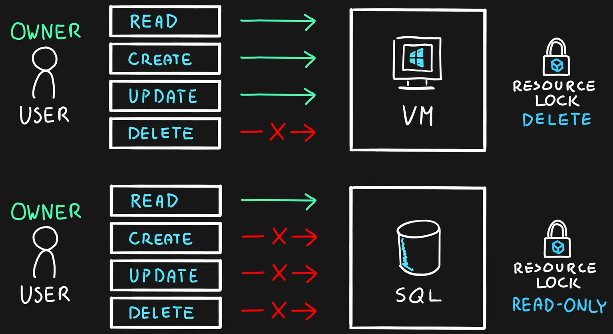
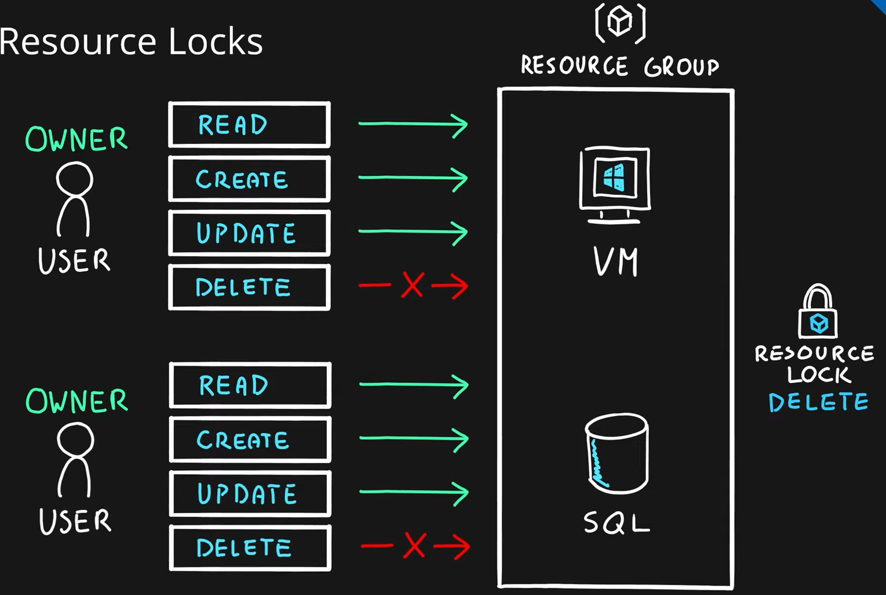

## **Azure Resource Tags**
- Las etiquetas son simples pares Nombre (clave) - Valor
- Diseñado para ayudar con la organización de los recursos de Azure
- Se utiliza para la gestión de recursos, la seguridad, la gestión de operaciones, la gestión de costes, la automatización, etc.
- Estrategias típicas de etiquetado
  - Funcional – marcar por función (ej: entorno = producción)
  - Clasificación: marca por políticas utilizadas (por ejemplo: clasificación = restringido)
  - Finanzas/Contabilidad: marca para fines de facturación (por ejemplo, departamento = finanzas)
  - Asociación: marca por asociación de usuarios/grupos (p. ej., propietario = adam)
- Aplicable para recursos, grupos de recursos y suscripciones
- NO se hereda por defecto

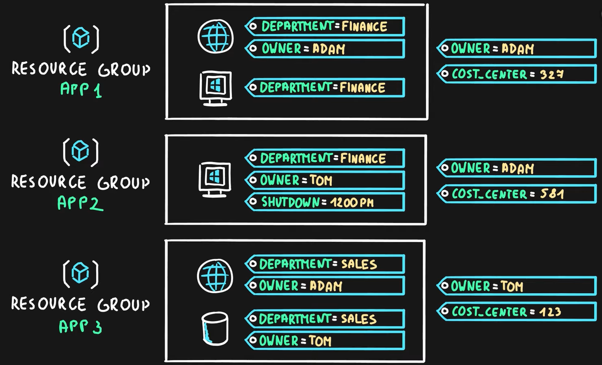

## **Azure Policy**
- Diseñado para ayudar con la gestión de recursos, la seguridad, el cumplimiento, la gestión de costes, etc.
- Las políticas se centran en las propiedades de los recursos (RBAC se centra en las acciones del usuario)
- Definición de política: define lo que debería suceder
  - Defina la condición (if/else) y el efecto (denegar, auditar, agregar, modificar, etc.)
  - Los ejemplos incluyen tipos de recursos permitidos, ubicaciones permitidas, SKU permitidos, heredar etiquetas de recursos
- Se admiten políticas integradas y personalizadas
- Iniciativa de política: un grupo de definiciones de política
- Asignación de política: asignación de una definición/iniciativa de política a un ámbito
- Los alcances se pueden asignar a
  - grupos de gestión,
  - suscripciones,
  - grupos de recursos y
  - recursos
- Las políticas permiten exclusiones de alcances
- Comprobado durante la creación o actualización de recursos y los existentes con tareas de remediación

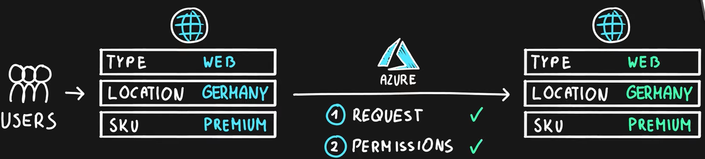
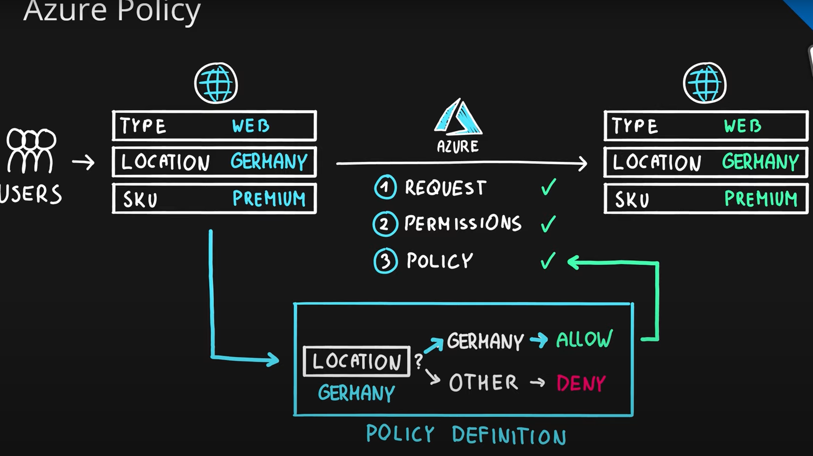

## **Azure Blueprints**
Un blueprint es una guía,patrón o diseño para realizar algo

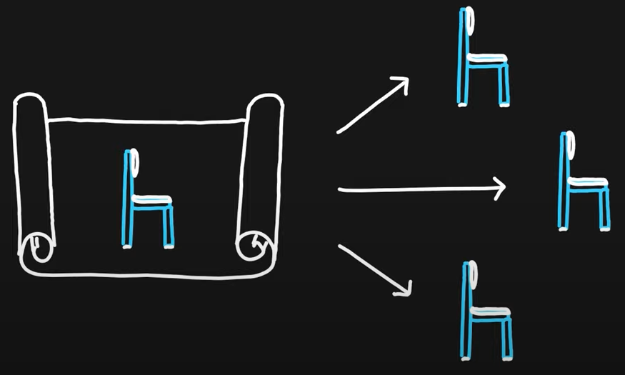

- Paquete de varios componentes de Azure (artefactos)
  - Grupos de recursos
  - Plantillas ARM
  - Asignaciones de políticas
  - Asignaciones de roles
- Almacenamiento centralizado para patrones de diseño aprobados por la organización
- Definición de plano: describe lo que debería suceder (paquete reutilizable)
- Asignación de blueprint: describe dónde debería suceder (implementación del paquete)

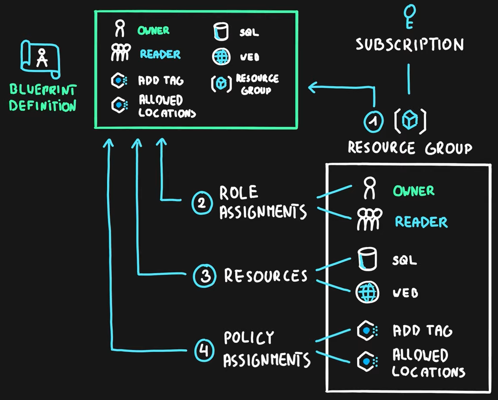
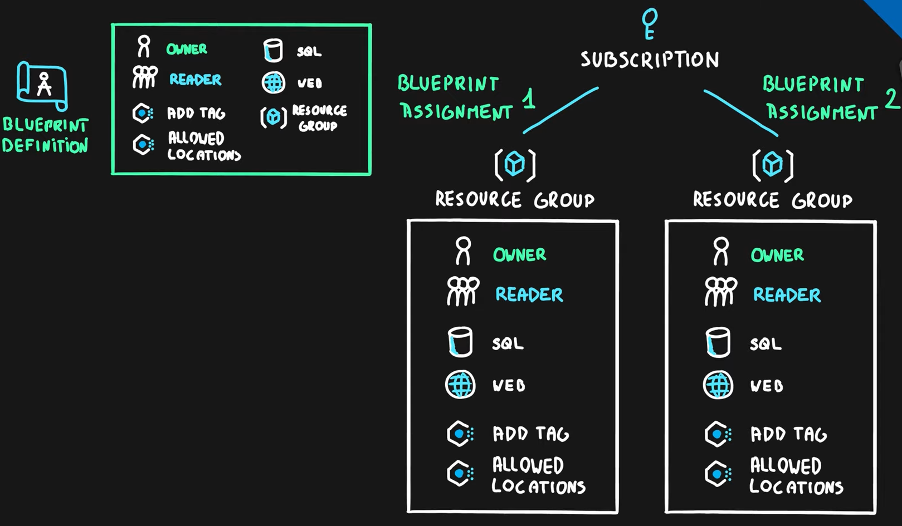

## **Cloud Adoption Framework for Azure** 
### **Adopción de la nube**
La adopción de la nube es un movimiento estratégico de una organización para aprovechar la nube en su negocio

### **Marco de adopción de la nube**
Cloud Adoption Framework for Azure es un conjunto de
  - herramientas,
  - mejores prácticas,
  - directrices y
  - documentación
preparado por Microsoft para ayudar a las empresas en su proceso de adopción de la nube.

### **Estrategía**
1. Comprende tu motivación
- Responde a la pregunta ¿POR QUÉ MOVERSE?
- Los desencadenantes comunes de la motivación incluyen
  - Migración
    - Ahorro de costos en infraestructura
    - Reducción de la complejidad
    - Optimización de operaciones
    - Mayor agilidad empresarial
  - Innovación
    - Alcanzando una escala global
    - Mejoras en la experiencia del cliente
    - Transformación de productos o servicios
    - Interrupción del mercado
2. Resultado comercial
- Responde a la pregunta ¿QUÉ MEDIR?
- Resultado definido, conciso y observable capturado por una medida específica, por ejemplo
  - Aumento de los ingresos
  - Aumento de la ganancia
  - Reducción de costo
  - Acceso global a los clientes
  - Llegar a nuevos mercados
3. Justificación comercial
- Responda a la pregunta ¿CUÁL ES MI RENTABILIDAD DE LA INVERSIÓN?
- Desarrolle un caso de negocios para validar el modelo financiero que respalda sus - motivaciones y resultados
- Las herramientas que apoyan este proceso son
  - Calculadora de TCO (costo total de propiedad) de Azure: calcule los costos locales actuales
  - Calculadora de precios de Azure: calcule los costos futuros de Azure
  - Administración de costos de Azure: vea los costos actuales de Azure
4. Primer Proyecto
- Elija el primer proyecto para validar su estrategia (Prueba de concepto - POC) basado en
  - Criterios de negocio
    - Operando actualmente
    - Propietario dedicado
    - Fuerte motivación para moverse.
  - Criterios Técnicos
    - Dependencias y activos mínimos

### **Plan**
1. Digital Estate (INVENTARIO DE ACTIVOS)
  - Revise el panorama actual y enumere todos los proyectos/soluciones (activos digitales)
  - Elija una de las cinco (5) R de racionalización
    - Rehost: muévase como está; típicamente en contenedores o IaaS (máquinas virtuales)
    - Refactorización: realice pequeños cambios en el código y pase a PaaS (por ejemplo, Azure SQL, Azure App Service, etc.)
    - Rearquitectura - realice cambios de código complejos para introducir nuevas funciones o reparar aplicaciones incompatibles
    - Reconstruir: cree una nueva aplicación usando el primer diseño de la nube
    - Reemplazar: revise las soluciones SaaS disponibles y reemplace las aplicaciones heredadas o innecesarias
2. Alineación inicial de la organización
  - Alinee a las personas para que apoyen su plan de adopción
  - Asignar personas a capacidades
3. Plan de preparación de habilidades
  - Revisar las habilidades actuales y abordar las brechas
4. Plan de adopción de la nube: combine todo, desde los pasos 1 a 3 en un solo plan de adopción de la nube

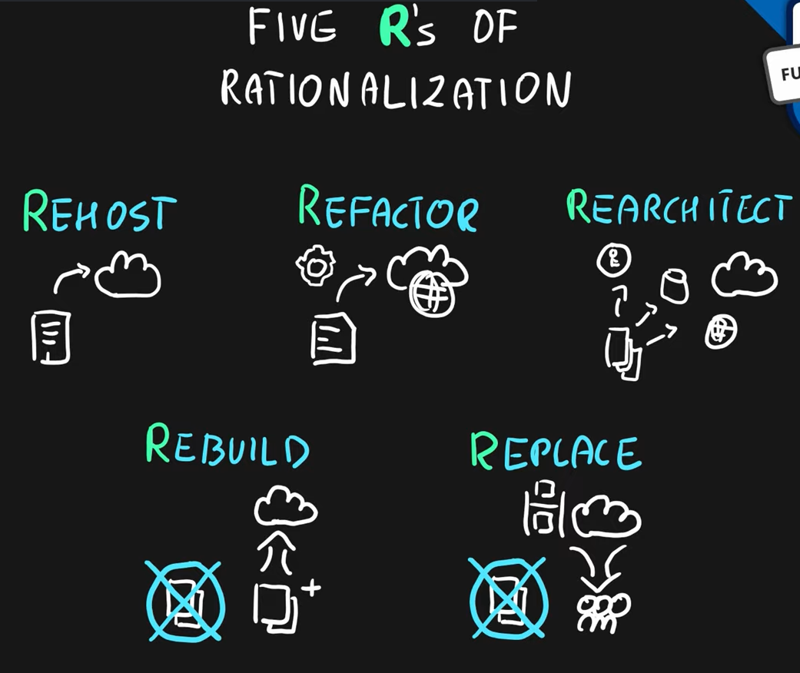

### **Comienzo**
1. Guía de configuración de Azure: revise la guía de configuración de Azure para familiarizarse con las herramientas y los enfoques que debe usar para crear una zona de aterrizaje.
2. Azure Landing Zone: elija un tipo de suscripción de Azure adecuado que mejor se adapte a sus necesidades y establezca un entorno de Azure inicial.
3. Ampliar zona de aterrizaje -
Amplíe la zona de aterrizaje inicial para que se ajuste a las necesidades de su empresa.
4. Mejores prácticas: revise todo y asegúrese de que se sigan las mejores prácticas.

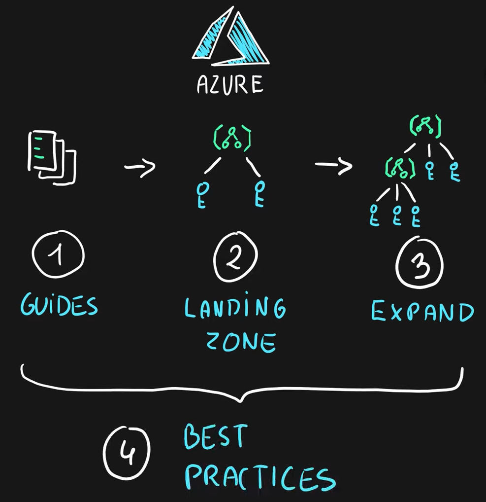

### **Adopción**
**Emigrar**  
1. Primera migración: migre su primera aplicación para familiarizarse con la nube, las pautas y las herramientas
2. Escenarios de migración: revise y prepare escenarios/directrices de migración para su empresa
  - Máquinas virtuales: Linux, Windows, etc.
  - Aplicaciones: aplicaciones web Java, .NET, NodeJS, etc.
  - Datos: SQL Server, PostreSQL, servidores de archivos, etc.
  - Otro - VMware, Azure Stack, etc.
3. Mejores prácticas: aborde las necesidades comunes de migración mediante la aplicación de mejores prácticas coherentes.
4. Mejoras de procesos: una parte importante de esta actividad intensa de proceso es identificar cuellos de botella y mejorar con cada migración
  
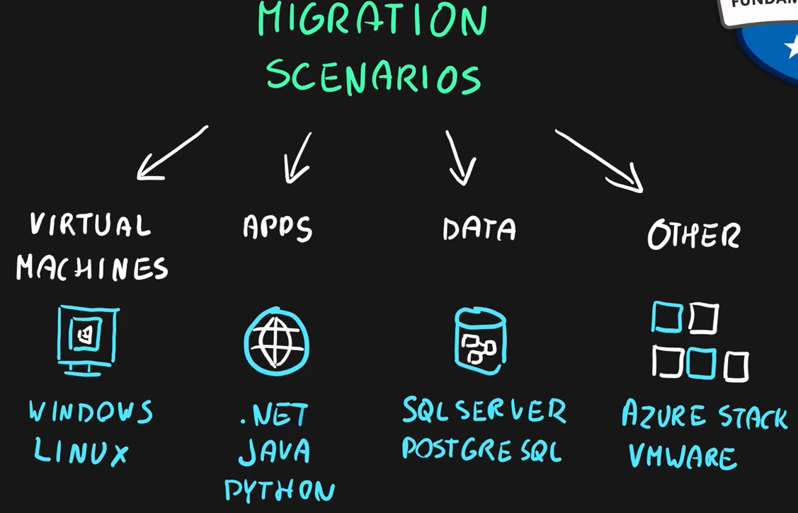

**Innovar**
1. Consenso de valor comercial (VALOR A LA ESTRATEGIA)
  - Crear una necesidad hipotética del cliente
  - Decide la solución que lo solucione
  - Asigne esto a su estrategia
2. Guía de innovación (HERRAMIENTAS): elija las herramientas de Azure disponibles que lo ayudarán a crear esta aplicación
3. Mejores prácticas: verifique que se sigan las mejores prácticas para todas las herramientas en la cadena de herramientas
4. Mejoras de Procesos - recopilar comentarios de los usuarios y clientes para mejorar las decisiones arquitectónicas y los productos futuros

### **Gobierno y Administración**
1. Defina soluciones de gobierno: elija soluciones para mantener el cumplimiento, la seguridad y garantizar el control total del entorno.
  - Esas soluciones deben centrarse en
    - Abordar las necesidades comerciales
    - Proporcionar agilidad
    - Riesgos de control
2. Administrar el entorno de la nube (OPERACIONES EN LA NUBE): entregue las soluciones y el entorno al equipo de operaciones de la nube para su mantenimiento.
El equipo debe garantizar que la estabilidad y los costos estén siempre en perfecto equilibrio para cumplir con los compromisos comerciales. El equipo debe permitir que el entorno crezca, evolucione y se adapte a las necesidades comerciales cambiantes

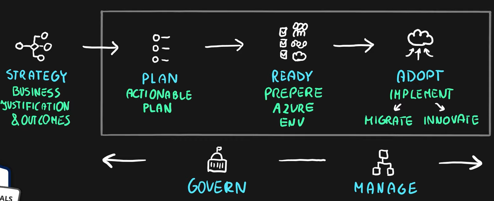
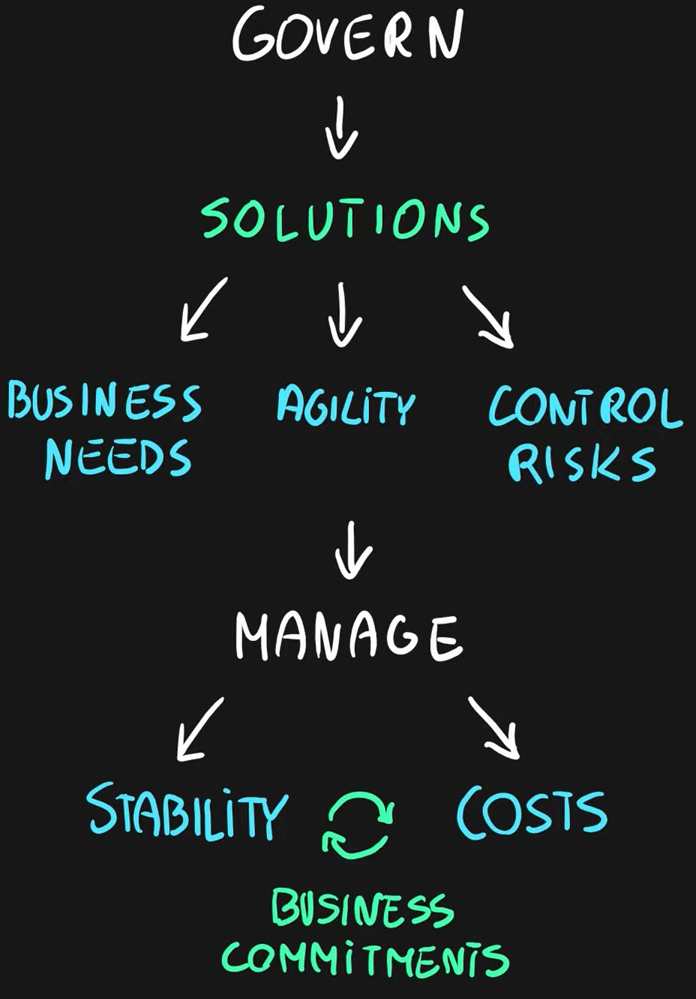

### **Organizar**
Asegúrese de que todos sepan qué hacer y cuándo hacerlo en cada etapa de este proceso. Una de las formas de lograr esto es a través de la matriz RACI (Responsable, Responsable, Consultado e Informado).

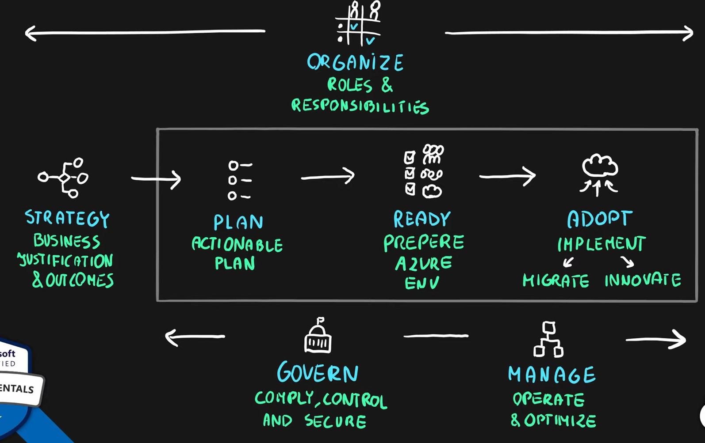

## **Core tenets of Security,Privacy,Compliance(Trust Center,DPA,OST y más)**

Document/Website | Diagrama | Info | Ofertas | Audiencia
---|---|---|---|---
Microsoft Privacy Statement| 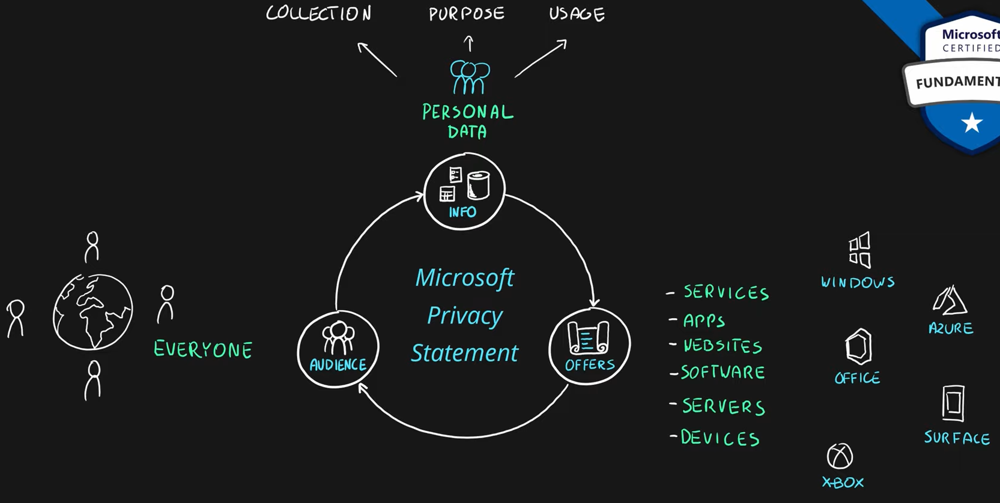 |Recopilación, Propósito y Uso de Datos Personales|Todas las ofertas de Microsoft, incluidos servicios, aplicaciones, sitios web, software, servidores, dispositivos|Todos - clientes finales o empresas 
Online Services Terms (OST)|  |Términos de licencia (acuerdo legal): derechos de uso sobre los servicios de Azure. Lo que se puede hacer y lo que está prohibido.|Servicios en línea de Microsoft como Azure, servicios de Microsoft 365, Bing Maps, etc.|Organizaciones - equipos legales
Data Protection Addendum| 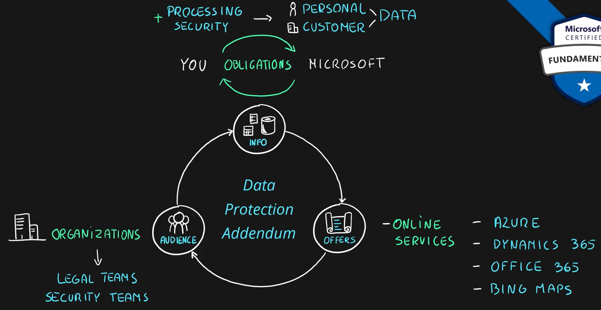|Anexo al OST que describe las obligaciones de ambas partes (Microsoft y usted) con respecto al procesamiento de datos personales y del cliente|Servicios en línea de Microsoft como Azure, servicios de Microsoft 365, Bing Maps, etc.|Organizaciones - equipos legales, equipos de seguridad
Trust Center|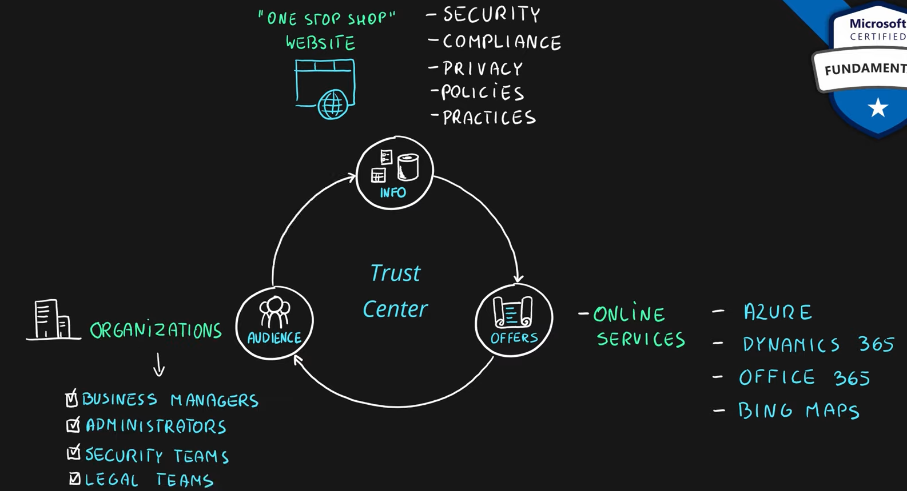|Portal web de ventanilla única para todo lo relacionado con seguridad, cumplimiento, privacidad, políticas, mejores prácticas, etc.|Servicios en línea de Microsoft como Azure, servicios de Microsoft 365, Bing Maps, etc.|Organizaciones: equipos legales, equipos de seguridad, gerentes comerciales, administradores
Azure Compliance Documentation|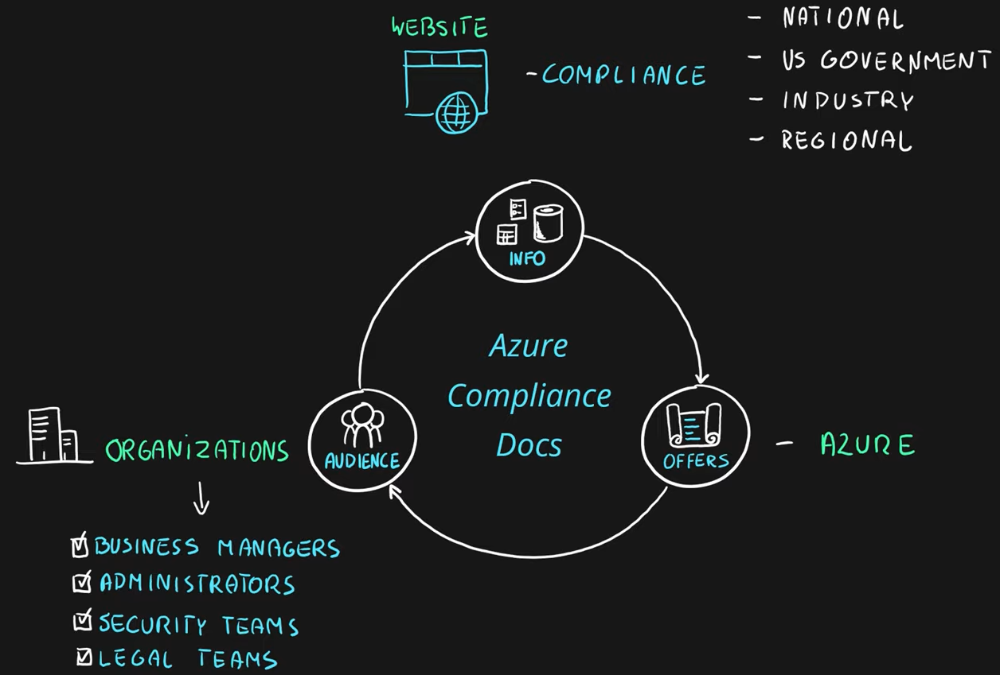|Portal web que se centra en las ofertas de cumplimiento en Azure, similar al centro de confianza pero reducido|Azure|Organizaciones: equipos legales, equipos de seguridad, gerentes comerciales, administradores de Azure

### **Regiones soberanas de Azure**
Azure Sovereign Regions proporciona servicios de Azure en mercados con requisitos normativos muy estrictos.  
- Azure Government diseñado para el gobierno de EE. UU.
  - Instancia separada de Azure (ciclo de vida, servicios, portal, etc.)
  - Aislado físicamente de otras regiones de Azure
  - Solo el personal escaneado autorizado puede tener acceso
- Azure China diseñado para el mercado chino
  - Instancia separada de Azure (ciclo de vida, servicios, portal, etc.)
  - Aislado físicamente de otras regiones de Azure
  - Operado por una empresa de telecomunicaciones china llamada 21Vianet

## **Cost Affecting Factors**
- Costo base
  - Tipos de recursos: todos los servicios de Azure (recursos) tienen modelos de precios específicos de recursos. Por lo general, consta de una o más métricas.

  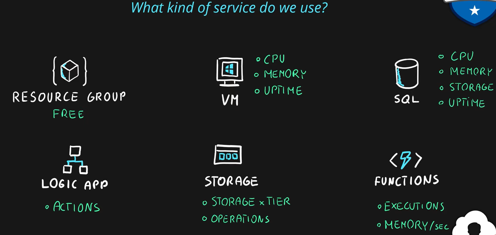

  - Servicios: las ofertas específicas de Azure (Enterprise, Web Direct, CSP, etc.) tienen diferentes costos y componentes de facturación, como prepagos, ciclos de facturación, descuentos, etc.

  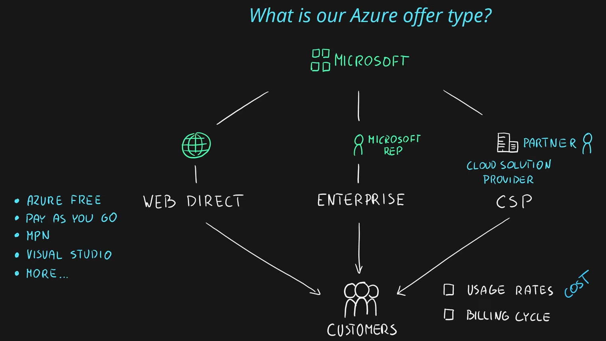

  - Ubicación: la ejecución de los servicios de Azure varía entre las regiones de Azure

  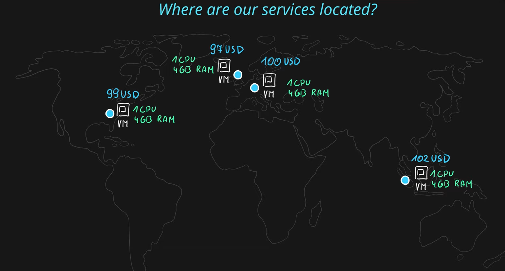

  - Ancho de banda: tráfico de red al cargar (entrante/ingreso) datos a Azure o al descargar (saliente/egreso) desde Azure

  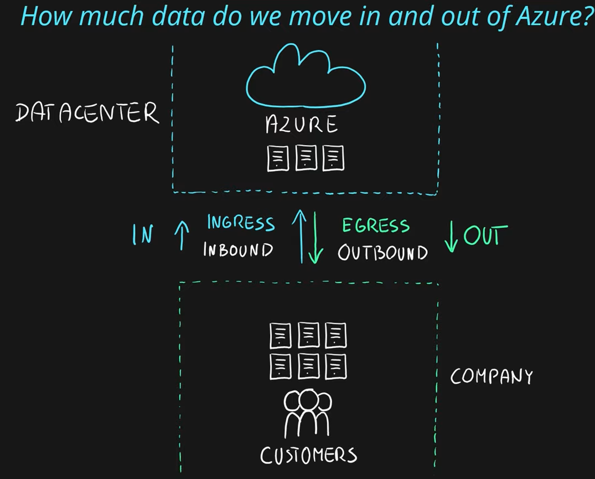

- Savings
  - Instancias reservadas
  - Beneficios Híbridos

## **Cost Reduction Methods, Reservations, Hybrid benefit, Spot VM, Pricing y TCO**
### **Reservaciones en Azure**
Adquiera los servicios de Azure con 1 o 3 años de anticipación con importantes descuentos
  - Instancias reservadas: Azure Virtual Machines
  - Capacidad reservada: Azure Storage, núcleos virtuales de SQL Database, DBU de Databricks, RU de Cosmos DB
  - Planes de software: Red Hat, Red Hat OpenShift, SUSE Linux, etc.
  - Las reservas se hacen para 1 o 3 años

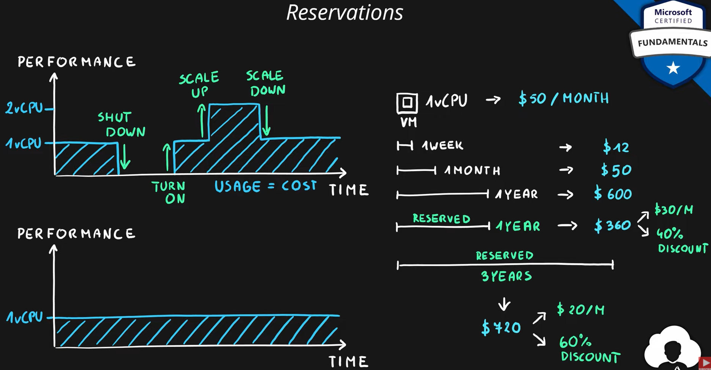

### **Máquinas virtuales al contado de Azure**
Compre capacidad de máquina virtual no utilizada para obtener un descuento significativo  
- Cómo funciona
  - Descuento significativo para máquinas virtuales de Azure
  - La capacidad se puede retirar en cualquier momento.
  - El cliente puede establecer el precio máximo después del descuento para mantener o desalojar la máquina
- Lo mejor para cargas de trabajo interrumpibles (procesamiento por lotes, entornos de desarrollo/prueba, grandes cargas de trabajo informáticas, tareas no críticas,
etc)

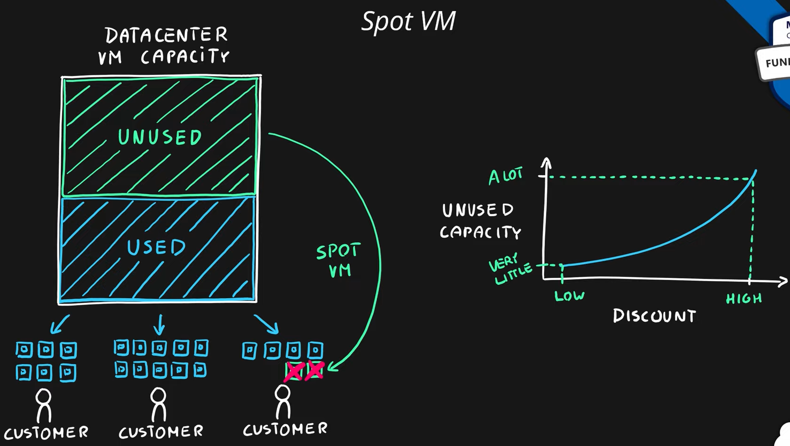

### **Beneficio de uso híbrido**
Usar licencias existentes en la nube
  - Usar licencias existentes en Azure
    - Windows Server
      - Azure VM
    - Red Hat
      - Azure VM 
    - SUSE Linux
      - Azure VM 
    - SQL Server
      - Azure SQL Database
      - Azure SQL Managed Instance
      - Azure SQL Server on VM
      - Azure Data Factory SQL Server Integration Services

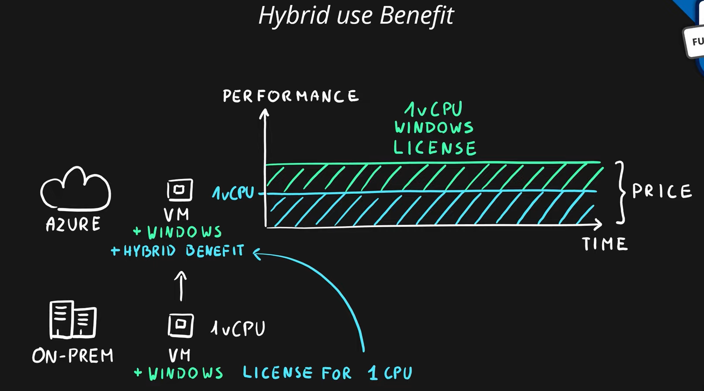

### **Herramientas**
- Calculadora de precios: calcule el costo de los servicios de Azure
  - Seleccionar servicio
  - Ajustar parámetros (uso)
  - ver el precio
- Calculadora de costo total de propiedad (TCO): calcule y compare el costo de ejecutar cargas de trabajo en el centro de datos versus Azure
  - Defina sus cargas de trabajo
  - Ajustar suposiciones
  - Ver el informe

## **Azure Cost Managment**
### **Administración de costos de Azure**
- Un servicio centralizado para generar informes sobre el uso y la facturación del entorno de Azure
- Capacidades de exploración de costos de autoservicio
- Presupuestos y alertas
- Recomendaciones de costos
- Exportaciones automatizadas

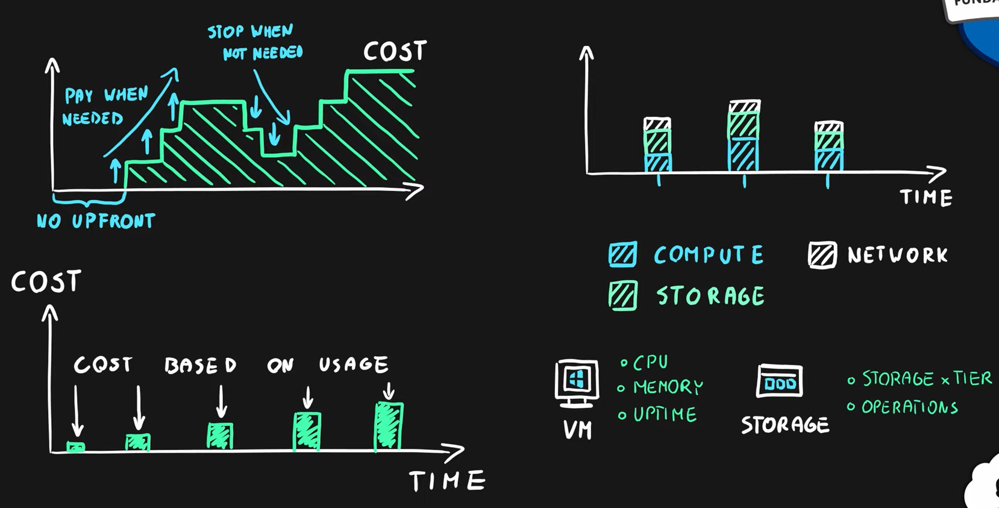

### **Minimización de costos en Azure**
- Calculadora de precios de Azure para elegir la región de bajo costo
  - Buena latencia
  - Todos los servicios requeridos están disponibles.
  - Soberanía de datos/requisitos de cumplimiento
- Beneficio de uso híbrido y reservas de Azure
- Supervisión, presupuestos, alertas y recomendaciones de Azure Cost Management
- Comprenda el ciclo de vida del servicio y automatice los entornos
- Utilice las funciones de escalado automático a su favor
- Azure Monitor para encontrar y reducir recursos infrautilizados
- Use etiquetas y políticas para una gobernanza eficaz

## **SLA y Composite SLA en Azure**
**SLA**  
El Acuerdo de nivel de servicio (SLA) es un acuerdo formal entre un proveedor de servicios y un cliente.  
SLA es una promesa de disponibilidad de un servicio (tiempo de actividad y conectividad). La disponibilidad es una medida del tiempo que un servicio permanece operativo.  
  - Cada Servicio tiene su propio SLA
  - Rangos de 99% a 99.999%
  - Los servicios gratuitos normalmente no tienen un SLA
  - SLA roto significa devolución de crédito de servicio (descuento)

SLA | Tiempo de inactividad mensual
---|---
99%|7h 18m 17s
99.5%|3h 39m 8s
99.9%|43m 49s
99.95%|21m 54s
99.99%|4m 22s
99.999%|26s

### **Formulas**
**AND lógico - agregando dependencia**
Disponibilidad de **S1 AND S2** = Disponibilidad (S1) * Disponibilidad (S2)  
Escenario: sitio web de Azure con base de datos back-end de SQL
  - Disponibilidad = Disponibilidad (web) aplicación * Disponibilidad (sql)
  - Disponibilidad = 99,95 % * 99,95 %
  - Disponibilidad = 0,9995 * 0,9995
  - Disponibilidad = 0.99900025
  - Disponibilidad ~ 99,9%

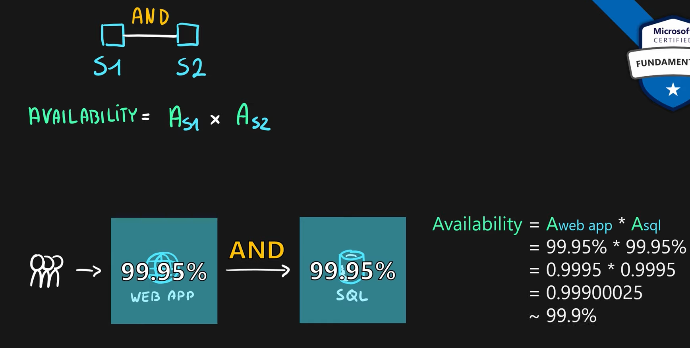

**OR lógico: agregando redundancia**
Disponibilidad de **S1 OR S2** = 100 % - ( Indisponibilidad (S1) * Indisponibilidad (S2) )  
Escenario: dos aplicaciones web redundantes detrás de un balanceador de carga
  - Disponibilidad (ambos-web) = 100% - ( Indisponibilidad (web1) * Indisponibilidad (web2))
  - Disponibilidad (ambos-web) = 100% - ( 0.05% * 0.05% )
  - Disponibilidad (ambos-web) = 1 – ( 0.0005 * 0.0005 )
  - Disponibilidad (ambos-web) = 1 – 0.00000025
  - Disponibilidad (ambos-web) = 0.99999975
  - Disponibilidad (ambos-web) ~ 99.9999%

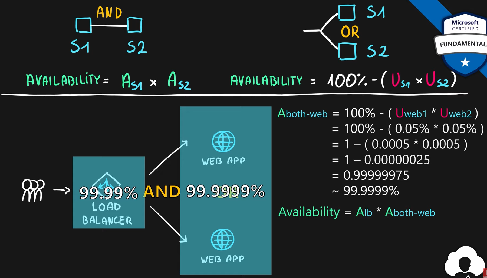

### **Elementos clave**
- Acuerdo formal entre Microsoft y el cliente
- Calculado como un porcentaje de la disponibilidad del servicio (tiempo de actividad y conectividad) (una promesa)
- Romper el SLA proporciona un descuento de la factura mensual final (Crédito de servicio)
- Los servicios de nivel superior ofrecen mejores SLA
- Los servicios gratuitos normalmente no tienen SLA (0% SLA)
- Los servicios de vista previa no tienen SLA
- SLA compuesto es un SLA combinado de todos los componentes de la aplicación

## **Ciclo de vida de un servicio en Azure | Public preview and General availability**
### **Ciclo de vida del servicio**
- Cada servicio en Azure sigue su propio ciclo de vida de servicio
- La vista previa pública es una etapa 'beta' del servicio disponible para el uso del público en general
- Las características también pueden estar en etapas de vista previa
- Diseñado para pruebas, no para soluciones de producción.
- La disponibilidad general es una versión de "producción" del servicio

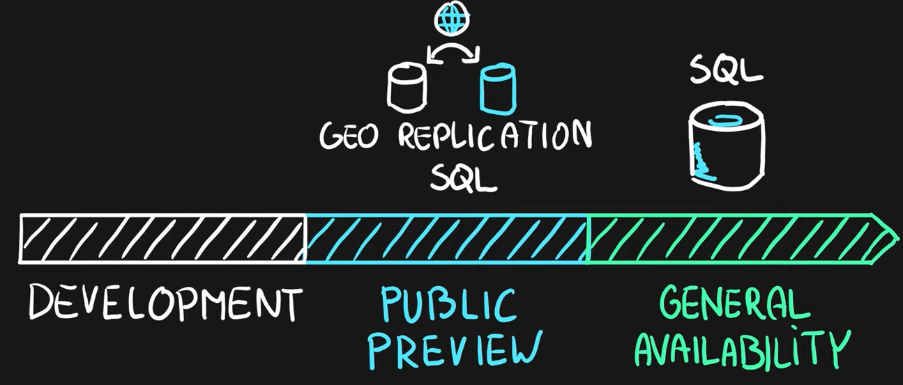
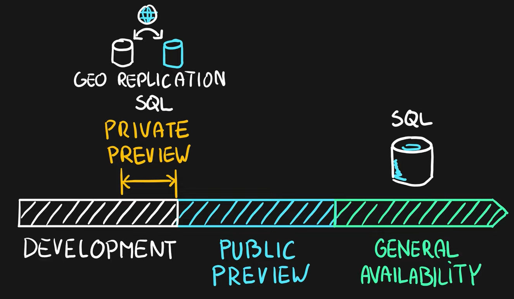

### **Información clave de vista previa pública**
- Sin SLA
- Algunos servicios no tienen cobertura de soporte
- Disponibilidad de región limitada
- funcionalidad limitada
- Cambios de precios
- Cambios de dirección
- Vistas previas de Azure Portal (https://preview.portal.azure.com)
