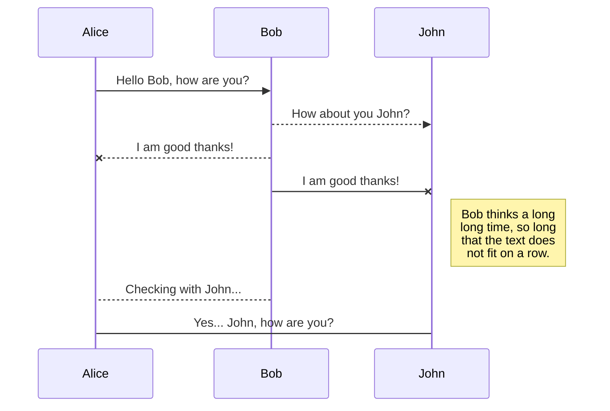
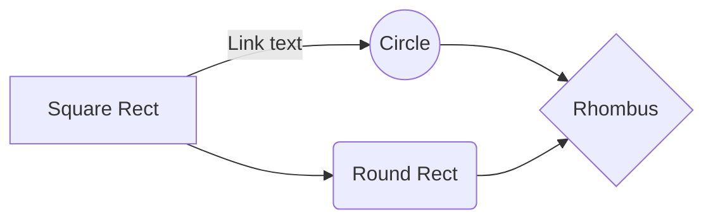

# Markdown - Guía

## Elementos de bloque

### Párrafos y saltos de línea

Los párrafos se separan por una línea.  
Saltos de línea requieren dos espacios en blanco y luego ir a la siguiente linea.  

### Encabezados

Se usa la `#` para crear una jerarquía de encabezados.  

### Citas

Se usa `>` al comienzo del bloque de texto.  
Si son varios párrafos, a cada uno colocar `>`

### Listas

#### Listas desordenadas

Se usa `*` , `-` o `+`

#### Listas ordenadas

Se usan números `1.`

### Códigos de bloque

Se encierran los párrafos entre dos líneas formadas por tres `~` virgulillas

### Reglas horizontales

Se debe incluir 3 de uno de los siguientes elementos:`*`, `-` o `_`

## Elementos de línea

### Énfasis

`*palabra*` resulta en cursiva  
`**palabra**` resulta en negrita

### Links o enlaces

`[]` Nombre del enlace  
`()` Enlace  
Ejemplo  
Markdown : `[Google](www.google.com.pe)`  
Resultado : [Google](www.google.com.pe)  

Se puede agregar un enlace como variable global :  
`[Nombre del enlace][Referencia de enlace]`  
[Referencia de enlace] : <https://www.google.com.pe>

Esta referencia puede estar en cualquier parte del documento.

### Código

Puede insertar etiquetas HTML  
También con código pequeño se inserta `

### Imágenes

Similar a link,solo que se agrega `!` antes  
``  
El texto alternativo se muestra si no carga la imágen.

## Elementos varios

### Links automáticos

Si no se quiere brindar un nombre al enlace, el enlace va solo con :  
`<Enlace>`  
`<https://www.google.com.pe>`

### Omitir Markdown

Con la barra vertical invertida `\` precedida

## Multimarkdown - Guía

No todas las aplicaciones soportan Multimarkdown

### Abreviaciones

De la siguiente forma:

`MMD ofrece muchas más posibilidades que MD.  
*[MMD]: Abreviación para Multimarkdown  
*[MD]: Abreviación para Markdown`

### Tablas

Especificar los elementos de la cabecera de cada columna:  

`|Primera columna|Segunda columna|Tercera columna|  
|--|--|--|
|Dato11|Dato21|Dato31|
|Dato12|Dato22|Dato32|`

## Sintaxis extendida

Table of Contents
1. [Example](#example)
2. [Example2](#example2)
3. [Third Example](#third-example)

### Example
### Example2
### Third Example

## StackEdit

Enlace [aquí](https://stackedit.io/app#)

### Tips
Lorem ipsum dolor sit amet, consectetur adipiscing elit. Phasellus ornare.
- Lista. *Cursiva*, **Negrita**.
	> Nota.
	
Link : [clic en el enlace](http://handlebarsjs.com/)

### Tablas
||ASCII|HTML|
|---|---|---|
|Dashes|`--- dash`|--- dash|

### KaTeX
Funcion gamma:  $\Gamma(n) = (n-1)!\quad\forall n\in\mathbb N$ 
$$
\Gamma(z) = \int_0^\infty t^{z-1}e^{-t}dt\,.
$$
> Mas información [aquí](http://meta.math.stackexchange.com/questions/5020/mathjax-basic-tutorial-and-quick-reference).

### UML diagrams
Renderizar diagramas UML usando [Mermaid](https://mermaidjs.github.io/). 

#### Diagrama de secuencias

#### Diagrama de flujo
