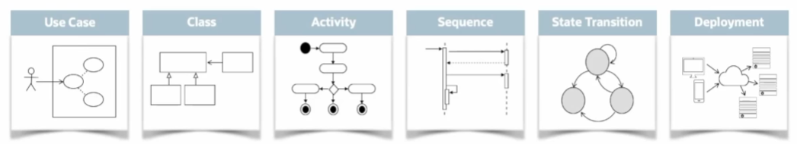
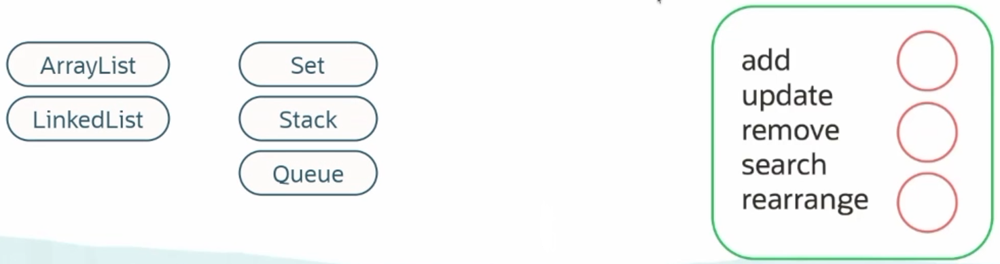
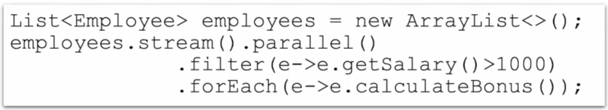
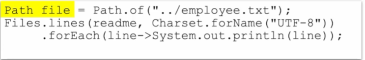
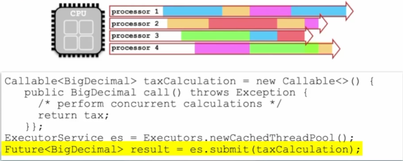
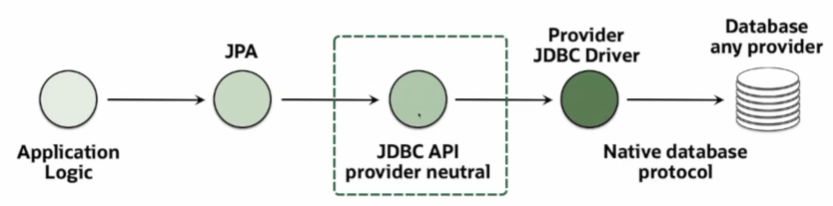
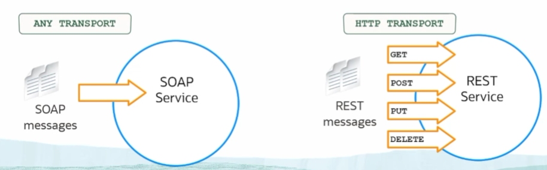
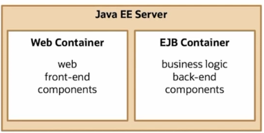
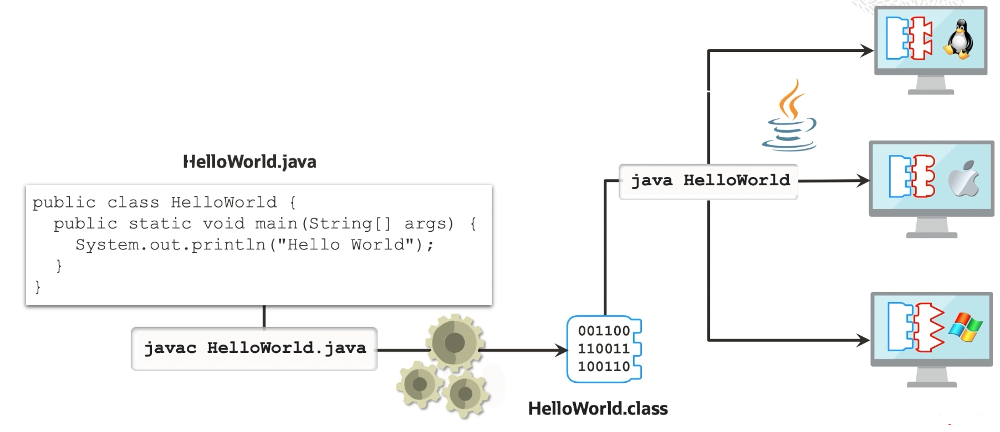

# **Java Explorer Training**

## **Origen y Ecosistema de Java**
### **Origen y Evolución de Java**
Diseñado en 1995 para usarse en electrónica para consumidores.
- Lenguaje de programación general similar a C y C++.
- Orientado a objetos e independiente de la plataforma.
### **Ecosistema Java**
- Java Card - Adición de tarjetas inteligentes y se puede usar con tarjetas SIM
- Java ME Micro-Edition - Puede trabajar con **cosas** como los televisores inteligentes, los cuadros set-top y los dispositivos incrustados.
- Java SE Standard-Edition
- Java MP Micro-Profile - Se utiliza con los servicios de micro y permite definir, para un servidor, cómo se debe desplegar y ejectuar la aplicación como microservicio.
- Java EE Enterprise-Edition - Soporta la creación de aplicaciones para empresas. Incluye servicios web, transferencia de mensajes asincronos y JavaBeans, Servlets,etc. 
### **Java es multi-plataforma**
Los programas de Java se ejecutan dentro de un software denominado **Máquina virtual de Java(JVM)**. La **JVM** emula la CPU real y la computadora en la que se ejecuta el software, y convierte los códigos de byte creados por el compilador en el código ejecutable real necesario para esa computadora.

## **Lenguaje de Java**
**Estructura de código en Java**  
### **Class**
- Unidad básica de código
- Describe los datos y la lógica del programa
### **Package**
- Agregación de código lógico intermedio
- Agrupa las clases lógicamente relacionadas

### **Módulo**
Con **Java 9** se presenta esto.
- Agregación de código físico de alto nivel y permite sustituir la agregación de código de nivel inferior del paquete y elegir de forma explícita qué partes del código desea exponer para reutilizarse y acceder

## **Diseño en Java**
- Trabajamos con **clases**(concepto y maquetado de algo) y **objetos**(instancia especifica de una clase)
- Reutilizar código a través de la herencia
- Capacidad de Java de llamar en tiempo de ejecución al comportamiento correcto según el tipo de objeto se denomina **Polimorfismo**
- El diseño flexible también es logrado con 
  - **Interfaces** - Abstraen comportamiento común entre clases
  - **Enumerations** - Crean constantes definidas por el usuario
  - **Generics** - Transferir información de tipo específica al compilador

### **Analisis,Diseño y Arquitectura**
Notación de modelado que 
- permite analizar nuestros requisitos de negocio,
- modelar nuestras estructuras de código y 
- describir el despliegue de aplicaciones  

- **Use Case** - Por lo general, empezamos con un cao de uso que describe la interacción entre un usuario final y el sistema.
- **Class** - Usamos diagramas de clase para representar las diferentes clases que necesitamos, además de documentar sus comportamientos, atributos y relaciones entre sí.
- **Activity** - Tenemos diagramas de actividad para describir el flujo de control.
- **Sequence** - Diagramas de secuencia para mostrar cómo un objeto puede llamar a otro objeto y cómo se transfieren los datos hacia atrás y hacia adelante.
- **State Transition** - Tenemos diagramas de transición de estado si necesitamos documentar que un determinado objeto queda en un estado (por ejemplo, activar o desactivar algo).
- **Deployment** - Tenemos diagramas de despliegue que indica cómo se puede desplegar la aplicación

## **Java API´s**
Java incluye una serie de aplicaciones de programas de interfaces que permiten hacer cosas útiles en el lenguaje.
- **Java Collections API** - Permite trabajar con estructuras de datos más complejas que un Array.  
  

- **Java Streams API** - Permite filtrar,asignar y reducir de forma eficaz grandes secuencias de datos.  
Realizan estas acciones en los datos con expresiones lambda, estas constituyen una forma de programación funcional en Java.  
  

- **Java IO API** - Java incluye una API de E/S. Esta permite transferir datos mediante una serie de flujos interconectados.  
Podemos leer información de varios orígenes, normalmente un archivo plano y podemos escribir información en varios destinos.  
  

- **Java Concurrency API** - Aprovecha las arquitectura multi-core de la CPU.  
  

- **Java Persistence API** - Protocolo de conectividad a bases de datos, JDBC, que permite conectarse a bases de datos de proveedores y ejecutar sentencias SQL.  
Java Persistence API(JPA), tiene un código que permite escribir objetos Java en bases de datos relacionales y datos SQL relacionales que se van a leer en dichas bases de datos, consultar dichas bases de datos,obtener información y crear objetos Java como resultado. Esto se denomina **object-relational mappings**.  
  

## **Java en Empresas**
Es en realidad donde Java se utiliza actualmente, en el procesamiento de **backend**. Por lo tanto, uno de las cosas con las que trabajamos en el **backen** son los **servicios web**.  
Los **servicios web** nos permiten exponer el código a la empresa para volver a utilizarlo de forma controlada y estandarizada, de forma básica el envio de mensajes a través de transportes HTTP, aunque algunos tipos de servicios web, como SOAP, pueden funcionar con cualquier transporte, pero normalmente estamos hablando por **Internet**

Estas capacidades de servicio web incluyen la capacidad de trabajar con asignaciones de objetos XML, y pueden convertir objetos Java en XML para transmisión, así como de recibir la parte posterior de los datos XML y convertirlos en un objeto Java.  
Pueden hacer lo mismo con **JavaScript Object Notation (JSON)**.  
Por lo tanto,las capacidades incorporadas y las API incorporadas que convertirían objetos Java en XML o JSON, se enviarán a otro servicio web y devolverán el resultado a Java.

La API de JAX-WS permite la implementación del servicio SOAP, donde podemos definir nuestra propia interfaz y nuestros tipos de métodos que admitimos.  
La API de JAX-RS permite la implementación de servicios REST que aprovecha el transporte HTTP y las operaciones disponibles en HTTP, y puede trabajar con distintos tipos de datos.  
SOAP solo puede trabajar con servicios de XML, pero REST puede trabajar con cualquier tipo de dato que desee, **XML, JSON, texto sin formato, etc**.

**Enterprise Java**  
Las aplicaciones Java EE se despliegan realmente en un servidor para su ejecución, mientras que las aplicaciones Java SE se pueden ejecutar desde la línea de comandos ,las aplicaciones de Java EE se deben desplegar en un servidor como WebLogic o WebSphere, JBoss o Tomcat.  
Estos tipos de servidores o contenedores alojan aplicaciones de Java EE.

Proporcionan soporte para Enterprise Java Bean, que implementa la lógica reutilizable y los contenedores web. En la imágen vemos el contenedor web que soporta componentes front-end como **servlets, java server pages y java server faces** y el contenedor EJB soporta la lógica de negocio y los componentes de backend.

El contenedor proporciona seguridad, simultaneidad, gestión de transacciones y gestión del ciclo de vida para que el desarrollador no tenga que hacer esto.

## **¿Qué es un Programa Java?**
Recordemos que el código Java se escribe como código fuente a un nivel superior en texto sin formato en los archivos de extensión **.java**.  
A continuación, compilamos ese código de origen en **bytecode**, y esto se guarda en un archivo con una extensión **.class**.  
Luego este archivo puede ser ejecutado por la **JVM**. La **JVM** debe ser instalada en una computadora y depende de que tipo es, lo que hace que sea dependiente de la plataforma, pero esta razón de ser, hace que el **bytecode** pueda ser independiente de la plataforma.

